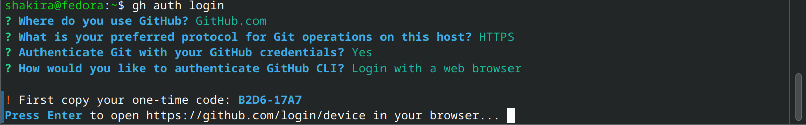

---
## Front matter
lang: ru-RU
title: Лабораторная работа №2
subtitle: Операционные системы
author:
  - Гасанова Ш. Ч.
institute:
  - Российский университет дружбы народов, Москва, Россия
date: 6 марта 2025

## i18n babel
babel-lang: russian
babel-otherlangs: english

## Formatting pdf
toc: false
toc-title: Содержание
slide_level: 2
aspectratio: 169
section-titles: true
theme: metropolis
header-includes:
 - \metroset{progressbar=frametitle,sectionpage=progressbar,numbering=fraction}
 - '\makeatletter'
 - '\beamer@ignorenonframefalse'
 - '\makeatother'
---

## Цель работы

Целью данной лабораторной работы являются изучение идеологии и применения средств контроля версий и освоение умений по работе с git.

## Задание

1. Создать базовую конфигурацию для работы с git.
2. Создать ключ SSH.
3. Создать ключ PGP.
4. Настроить подписи git.
5. Зарегистрироваться на Github.
6. Создать локальный каталог для выполнения заданий по предмету.

## Выполнение лабораторной работы

### Установка программного обеспечения

Устанавливаю программное обеспечение git и gh через терминал (рис. 1), (рис.  2).

{#fig:001 width=70%}

## Установка программного обеспечения

{#fig:002 width=70%}

## Базовая настройка git

Задаю в качестве имени и email владельца репозитория свои данные (рис. 3).

{#fig:003 width=70%}

## Базовая настройка git

Настраиваю utf-8 в выводе сообщений гит (рис. 4).

{#fig:004 width=70%}

## Базовая настройка git

Задаю имя начальной ветки, параметр autocrlf и параметр safecrlf (рис. 5).

{#fig:005 width=70%}

## Создание ключа SSH

Создаю ключи ssh по алгоритмам rsa с ключём размером 4096 бит и ed25519 (рис. 6), (рис. 7).

{#fig:006 width=70%}

## Создание ключа SSH

{#fig:007 width=70%}

## Создание ключа GPG

Создаю ключ gpg: выбираю нужный тип, задаю максимальную длину ключа и выбираю неограниченный срок действия (по умолчанию) (рис. 8).

{#fig:008 width=70%}

## Создание ключа GPG

Далее отвечаю на вопросы о личной информации и заполняю. После этого требуется ввести фразу-пароль, ввожу (рис. 9).

{#fig:009 width=70%}

## Регистрация на GitHub

У меня уже есть аккаунт на гитхабе, соответственно все основные данные я уже заполняла. Поэтому просто вхожу в аккаут (рис. 21).

{#fig:021 width=70%}

## Добавление ключа GPG в GitHub

Вывожу список ключей и копирую отпечаток приватного ключа (рис. 10).

{#fig:010 width=70%}

## Добавление ключа GPG в GitHub

Далее копирую сгенерированный PGP ключ в буфер обмена (рис. 22).

{#fig:022 width=70%}

## Добавление ключа GPG в GitHub

Перехожу в настройки гитхаб и вставляю скопированный ключ в поле создания gpg ключа (рис. 11).

{#fig:011 width=70%}

## Настройка автоматических подписей коммитов git

Настраиваю автоматические подписи коммитов git: используя введённый ранее email, указываю git использовать его при создании подписей коммитов (рис. 12).

{#fig:012 width=70%}

## Настройка gh

Авторизовываюсь в gh, отвечаю на вопрос (рис. 13).

{#fig:013 width=70%}

## Настройка gh

После ответов на все вопросы получаю одноразовый код, который копирую для дальнейших действий (рис. 14).

{#fig:014 width=70%}

## Настройка gh

Затем, после нажатия enter, перехожу в браузер на гитхаб, куда ввожу скопированный код для успешной авторизации (рис. 15), (рис. 16).

{#fig:015 width=70%}

## Настройка gh

{#fig:016 width=70%}

## Создание репозитория курса на основе шаблона

Приступаю к созданию репозитория на основе шаблона. Сначала создаю директорию с помощью утилиты mkdir, затем перехожу туда с помощью cd (рис. 17).

{#fig:017 width=70%}

## Создание репозитория курса на основе шаблона

Далее ввожу команду gh repo create study_2022-2023_os-intro --template=yamadharma/course-directory-student-template --public, чтобы создать репозиторий на основе шаблона курса, после чего клонирую его к себе в директорию (рис. 18).

{#fig:018 width=70%}

## Создание репозитория курса на основе шаблона

Перехожу в каталог курса, удаляю ненужный файл и создаю необходимые каталоги. Для этого требуется установить пакет "make" (рис. 19).

{#fig:019 width=70%}

## Создание репозитория курса на основе шаблона

После этого отправляю файлы на сервер с помощью соответствующих команд (рис. 20).

{#fig:020 width=70%}

## Выводы

При выполнении данной лабораторной работы я изучила идеологии и применения средств контроля версий и освоение умений по работе с git.

## Список литературы

1. Лабораторная работа №2 [Электронный ресурс] URL: https://esystem.rudn.ru/mod/page/view.php?id=1224371&forceview=1
