---
## Front matter
title: "Отчёт по лабораторной работе №2"
subtitle: "Операционные системы"
author: "Гасанова Шакира Чингизовна"

## Generic otions
lang: ru-RU
toc-title: "Содержание"

## Bibliography
bibliography: bib/cite.bib
csl: pandoc/csl/gost-r-7-0-5-2008-numeric.csl

## Pdf output format
toc: true # Table of contents
toc-depth: 2
lof: true # List of figures
lot: true # List of tables
fontsize: 12pt
linestretch: 1.5
papersize: a4
documentclass: scrreprt
## I18n polyglossia
polyglossia-lang:
  name: russian
  options:
	- spelling=modern
	- babelshorthands=true
polyglossia-otherlangs:
  name: english
## I18n babel
babel-lang: russian
babel-otherlangs: english
## Fonts
mainfont: PT Serif
romanfont: PT Serif
sansfont: PT Sans
monofont: PT Mono
mainfontoptions: Ligatures=TeX
romanfontoptions: Ligatures=TeX
sansfontoptions: Ligatures=TeX,Scale=MatchLowercase
monofontoptions: Scale=MatchLowercase,Scale=0.9
## Biblatex
biblatex: true
biblio-style: "gost-numeric"
biblatexoptions:
  - parentracker=true
  - backend=biber
  - hyperref=auto
  - language=auto
  - autolang=other*
  - citestyle=gost-numeric
## Pandoc-crossref LaTeX customization
figureTitle: "Рис."
tableTitle: "Таблица"
listingTitle: "Листинг"
lofTitle: "Список иллюстраций"
lotTitle: "Список таблиц"
lolTitle: "Листинги"
## Misc options
indent: true
header-includes:
  - \usepackage{indentfirst}
  - \usepackage{float} # keep figures where there are in the text
  - \floatplacement{figure}{H} # keep figures where there are in the text
---

# Цель работы

Целью данной лабораторной работы являются изучение идеологии и применения средств контроля версий и освоение умений по работе с git.

# Задание

1. Создать базовую конфигурацию для работы с git.
2. Создать ключ SSH.
3. Создать ключ PGP.
4. Настроить подписи git.
5. Зарегистрироваться на Github.
6. Создать локальный каталог для выполнения заданий по предмету.

# Теоретическое введение

Системы контроля версий (Version Control System, VCS) применяются при работе нескольких человек над одним проектом. Обычно основное дерево проекта хранится в локальном или удалённом репозитории, к которому настроен доступ для участников проекта. При внесении изменений в содержание проекта система контроля версий позволяет их фиксировать, совмещать изменения, произведённые разными участниками проекта, производить откат к любой более ранней версии проекта, если это требуется.

В классических системах контроля версий используется централизованная модель, предполагающая наличие единого репозитория для хранения файлов. Выполнение большинства функций по управлению версиями осуществляется специальным сервером. Участник проекта (пользователь) перед началом работы посредством определённых команд получает нужную ему версию файлов. После внесения изменений, пользователь размещает новую версию в хранилище. При этом предыдущие версии не удаляются из центрального хранилища и к ним можно вернуться в любой момент. Сервер может сохранять не полную версию изменённых файлов, а производить так называемую дельта-компрессию — сохранять только изменения между последовательными версиями, что позволяет уменьшить объём хранимых данных.

Системы контроля версий поддерживают возможность отслеживания и разрешения конфликтов, которые могут возникнуть при работе нескольких человек над одним файлом. Можно объединить (слить) изменения, сделанные разными участниками (автоматически или вручную), вручную выбрать нужную версию, отменить изменения вовсе или заблокировать файлы для изменения. В зависимости от настроек блокировка не позволяет другим пользователям получить рабочую копию или препятствует изменению рабочей копии файла средствами файловой системы ОС, обеспечивая таким образом, привилегированный доступ только одному пользователю, работающему с файлом.

Системы контроля версий также могут обеспечивать дополнительные, более гибкие функциональные возможности. Например, они могут поддерживать работу с несколькими версиями одного файла, сохраняя общую историю изменений до точки ветвления версий и собственные истории изменений каждой ветви. Кроме того, обычно доступна информация о том, кто из участников, когда и какие изменения вносил. Обычно такого рода информация хранится в журнале изменений, доступ к которому можно ограничить.

В отличие от классических, в распределённых системах контроля версий центральный репозиторий не является обязательным.

Среди классических VCS наиболее известны CVS, Subversion, а среди распределённых — Git, Bazaar, Mercurial. Принципы их работы схожи, отличаются они в основном синтаксисом используемых в работе команд.

# Выполнение лабораторной работы

## Установка программного обеспечения

Устанавливаю программное обеспечение git и gh через терминал (рис. fig:001), (рис. @fig:002).

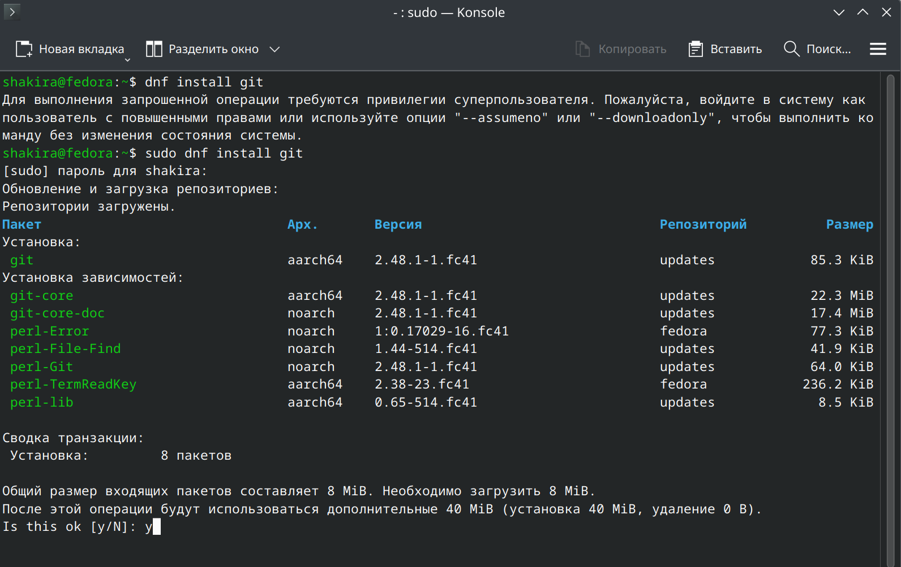{#fig:001 width=70%}

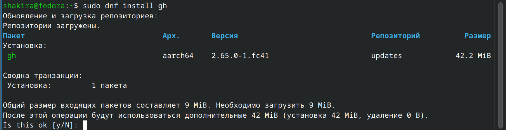{#fig:002 width=70%}

## Базовая настройка git

Задаю в качестве имени и email владельца репозитория свои данные (рис. @fig:003).

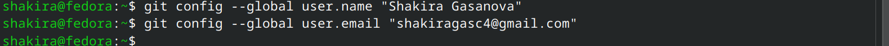{#fig:003 width=70%}

Настраиваю utf-8 в выводе сообщений гит (рис. @fig:004).

{#fig:004 width=70%}

Задаю имя начальной ветки, параметр autocrlf и параметр safecrlf (рис. @fig:005).

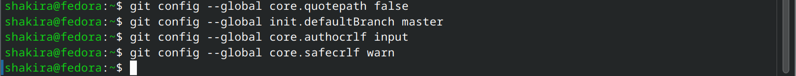{#fig:005 width=70%}

## Создание ключа SSH

Создаю ключи ssh по алгоритмам rsa с ключём размером 4096 бит и ed25519 (рис. @fig:006), (рис. @fig:007).

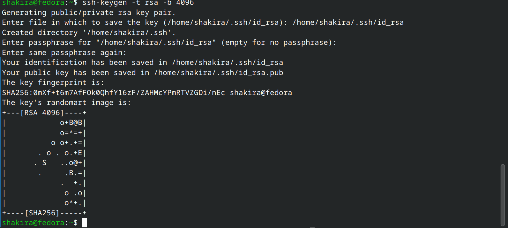{#fig:006 width=70%}

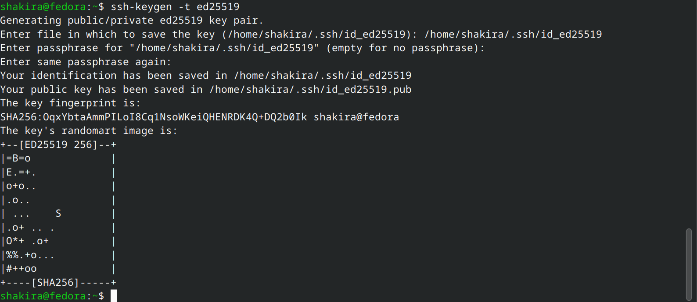{#fig:007 width=70%}

## Создание ключа GPG

Создаю ключ gpg: выбираю нужный тип, задаю максимальную длину ключа и выбираю неограниченный срок действия (по умолчанию) (рис. @fig:008).

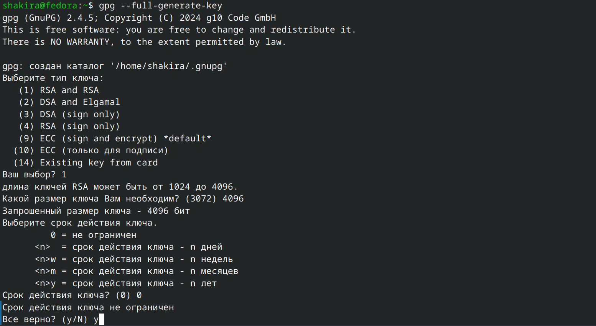{#fig:008 width=70%}

Далее отвечаю на вопросы о личной информации и заполняю. После этого требуется ввести фразу-пароль, ввожу (рис. @fig:009).

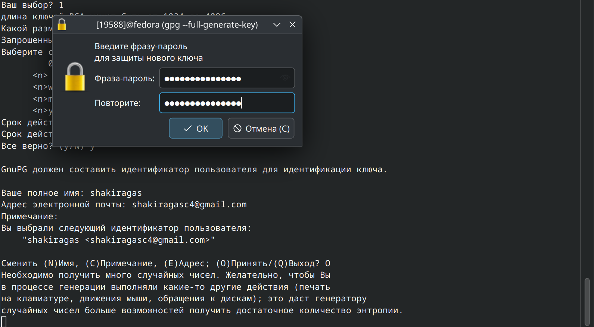{#fig:009 width=70%}

## Регистрация на GitHub

У меня уже есть аккаунт на гитхабе, соответственно все основные данные я уже заполняла. Поэтому просто вхожу в аккаут (рис. @fig:021).

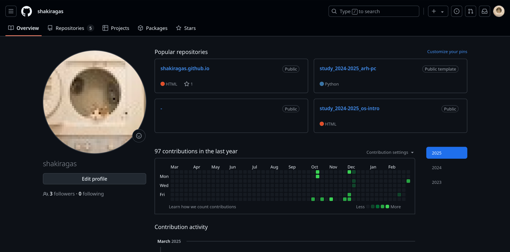{#fig:021 width=70%}

## Добавление ключа GPG в GitHub

Вывожу список ключей и копирую отпечаток приватного ключа (рис. @fig:010).

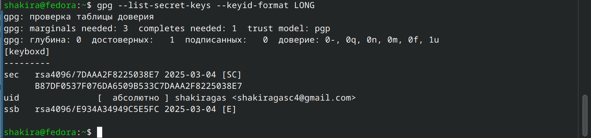{#fig:010 width=70%}

Далее копирую сгенерированный PGP ключ в буфер обмена (рис. @fig:022).

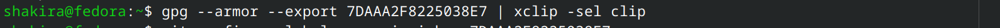{#fig:022 width=70%}

Перехожу в настройки гитхаб и вставляю скопированный ключ в поле создания gpg ключа (рис. @fig:011).

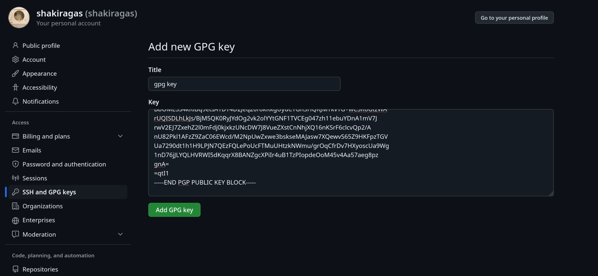{#fig:011 width=70%}

## Настройка автоматических подписей коммитов git

Настраиваю автоматические подписи коммитов git: используя введённый ранее email, указываю git использовать его при создании подписей коммитов (рис. @fig:012).

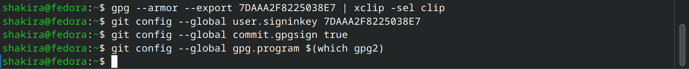{#fig:012 width=70%}

## Настройка gh

Авторизовываюсь в gh, отвечаю на вопрос (рис. @fig:013).

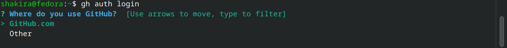{#fig:013 width=70%}

После ответов на все вопросы получаю одноразовый код, который копирую для дальнейших действий (рис. @fig:014).

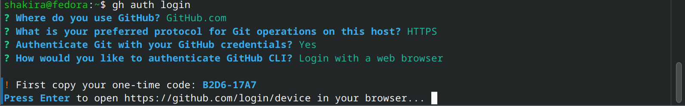{#fig:014 width=70%}

Затем, после нажатия enter, перехожу в браузер на гитхаб, куда ввожу скопированный код для успешной авторизации (рис. @fig:015), (рис. @fig:016).

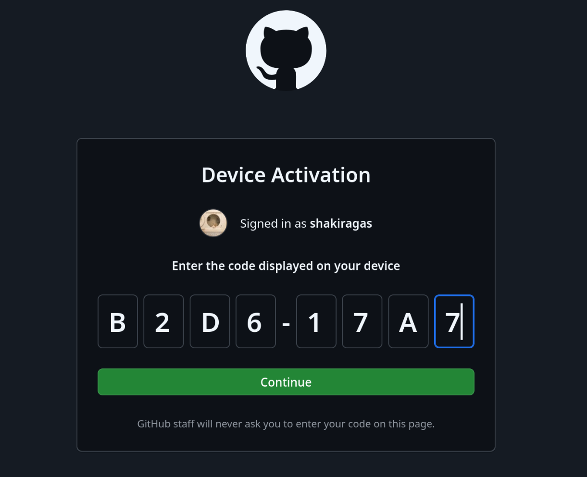{#fig:015 width=70%}

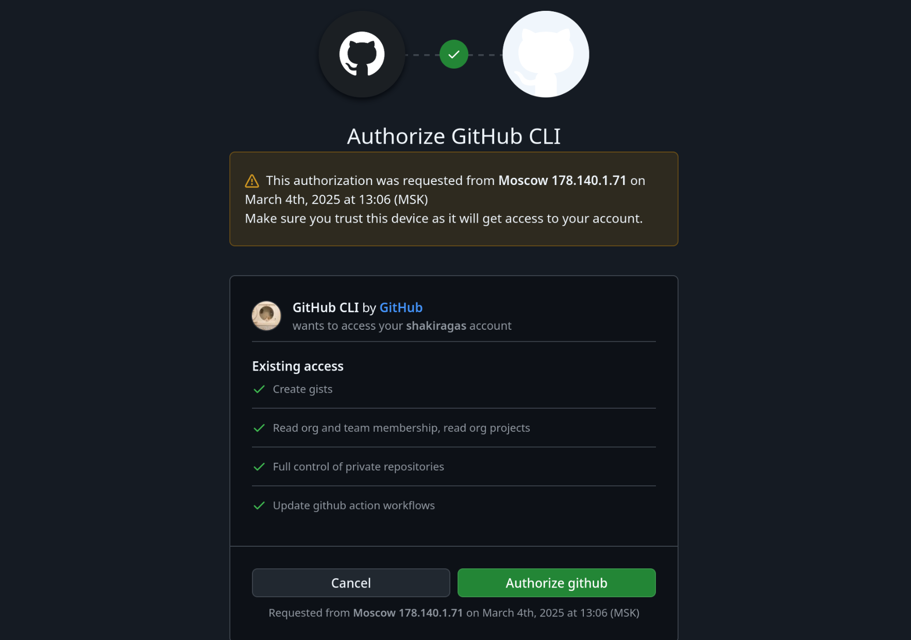{#fig:016 width=70%}

## Создание репозитория курса на основе шаблона

Приступаю к созданию репозитория на основе шаблона. Сначала создаю директорию с помощью утилиты mkdir, затем перехожу туда с помощью cd (рис. @fig:017).

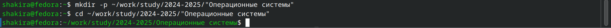{#fig:017 width=70%}

Далее ввожу команду gh repo create study_2022-2023_os-intro --template=yamadharma/course-directory-student-template --public, чтобы создать репозиторий на основе шаблона курса, после чего клонирую его к себе в директорию (рис. @fig:018).

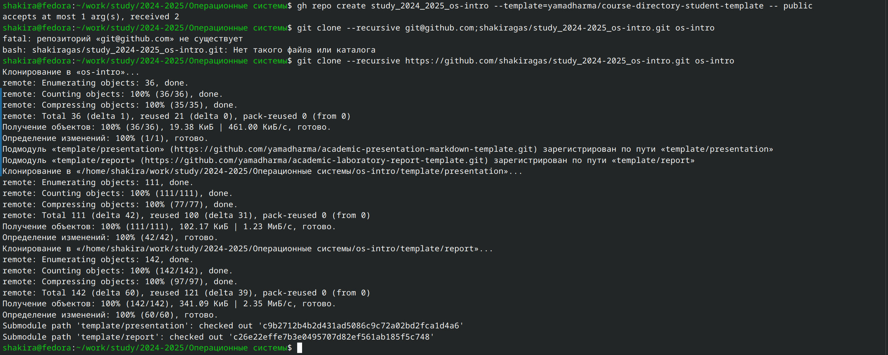{#fig:018 width=70%}

Перехожу в каталог курса, удаляю ненужный файл и создаю необходимые каталоги. Для этого требуется установить пакет "make" (рис. @fig:019).

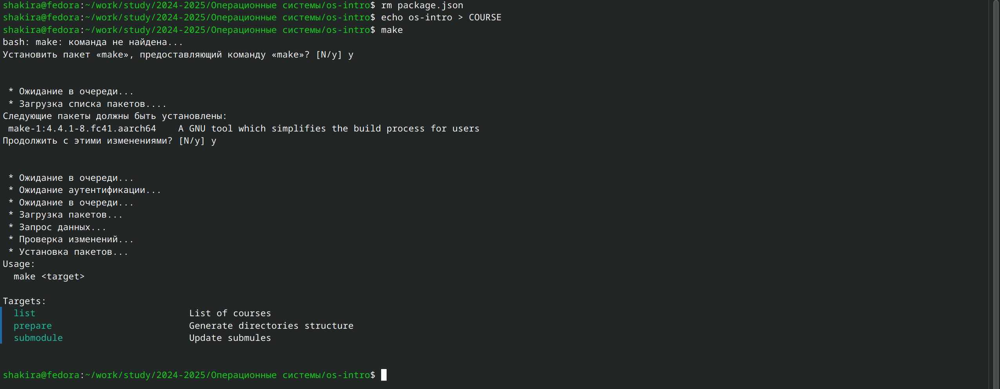{#fig:019 width=70%}

После этого отправляю файлы на сервер с помощью соответствующих команд (рис. @fig:020).

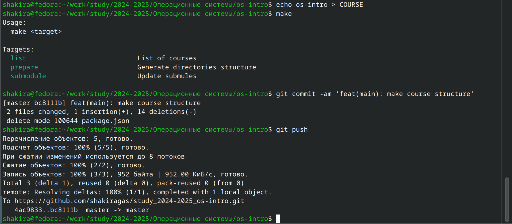{#fig:020 width=70%}

# Выводы

При выполнении данной лабораторной работы я изучила идеологии и применения средств контроля версий и освоение умений по работе с git.

# Ответы на контрольные вопросы.

1. Системы контроля версий (VCS) - программное обеспечение для облегчения работы с изменяющейся информацией. 
Они позволяют хранить несколько версий изменяющейся информации, 
одного и того же документа, может предоставить доступ к более ранним версиям документа. 
Используется для работы нескольких человек над проектом, позволяет посмотреть, кто и 
когда внес какое-либо изменение и т. д. VCS ррименяются для: Хранения понлой истории изменений, 
сохранения причин всех изменений, поиска причин изменений и совершивших изменение, совместной работы над проектами.

2. Хранилище - репозиторий, хранилище версий, в нем хранятся все документы, включая историю их изменения и прочей служебной информацией. 
commit - отслеживание изменений, сохраняет разницу в изменениях.
История - хранит все изменения в проекте и позволяет при необходимости вернуться/обратиться к нужным данным.
Рабочая копия - копия проекта, основанная на версии из хранилища, чаще всего последней версии.

3. Централизованные VCS (например: CVS, TFS, AccuRev) - одно основное хранилище всего проекта. Каждый пользователь копирует себе
необходимые ему файлы из этого репозитория, изменяет, затем добавляет изменения обратно в хранилище. Децентрализованные
VCS (например: Git, Bazaar) - у каждого пользователя свой вариант репозитория (возможно несколько вариантов), есть возможность добавлять
и забирать изменения из любого репозитория. В отличие от классических, в распределенных (децентралиованных)
системах контроля версий центральный репозиторий не является обязательным.

4. Сначала создается и подключается удаленный репозиторий, затем по мере изменения проекта эти изменения отправляются на сервер.

5. Участник проекта перед началом работы получает нужную ему версию проекта в хранилище, с помощью определенных команд, после внесения изменений пользователь размещает новую версию в хранилище. При этом предыдущие версии не удаляются. К ним можно вернуться в любой момент.

6. Хранение информации о всех изменениях в вашем коде, обеспечение удобства командной работы над кодом.

7. Создание основного дерева репозитория: git init

- Получение обновлений (изменений) текущего дерева из центрального репозитория: git pull
- Отправка всех произведённых изменений локального дерева в центральный репозиторий: git push
- Просмотр списка изменённых файлов в текущей директории: git status
- Просмотр текущих изменений: git diff
- Сохранение текущих изменений: добавить все изменённые и/или созданные файлы и/или каталоги: git add .
- Добавить конкретные изменённые и/или созданные файлы и/или каталоги: git add имена_файлов
- Удалить файл и/или каталог из индекса репозитория (при этом файл и/или каталог остаётся в локальной директории): git rm имена_файлов

Сохранение добавленных изменений:

- Сохранить все добавленные изменения и все изменённые файлы: git commit -am 'Описание коммита'
- Сохранить добавленные изменения с внесением комментария через встроенный редактор: git commit
- Создание новой ветки, базирующейся на текущей: git checkout -b имя_ветки
- Переключение на некоторую ветку: git checkout имя_ветки (при переключении на ветку, которой ещё нет в локальном репозитории, она будет создана и связана с удалённой)
- Отправка изменений конкретной ветки в центральный репозиторий: git push origin имя_ветки
- Слияние ветки с текущим деревом: git merge --no-ff имя_ветки

Удаление ветки:

- Удаление локальной уже слитой с основным деревом ветки: git branch -d имя_ветки
- Принудительное удаление локальной ветки: git branch -D имя_ветки
- Удаление ветки с центрального репозитория: git push origin :имя_ветки

8. git push -all отправляем из локального репозитория все сохраненные изменения в центральный репозиторий, предварительно создав локальный репозиторий и сделав предварительную конфигурацию.

9. Ветвление - один из параллельных участков в одном хранилище, исходящих из одной версии, обычно есть главная ветка. 
Между ветками, т. е. их концами возможно их слияние. Используются для разработки новых функций.

10. Во время работы над проектом могут создаваться файлы, которые не следуют добавлять в репозиторий. Например, временные файлы.
Можно прописать шаблоны игнорируемых при добавлении в репозиторий типов файлов в файл .gitignore с помощью сервисов.

# Список литературы

1. Лабораторная работа №2 [Электронный ресурс] URL: https://esystem.rudn.ru/mod/page/view.php?id=1224371&forceview=1
