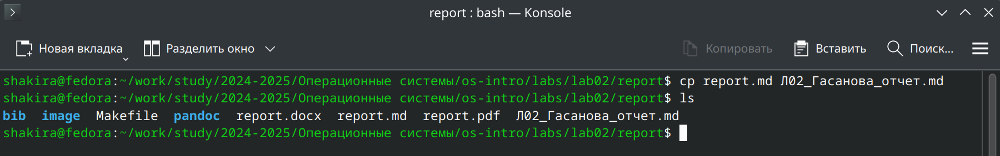
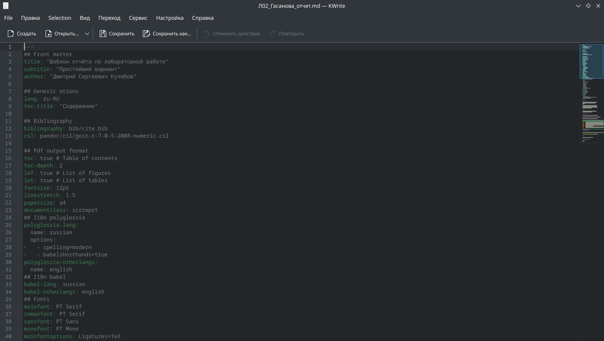
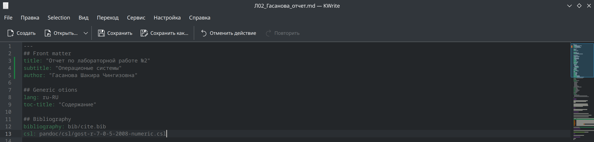
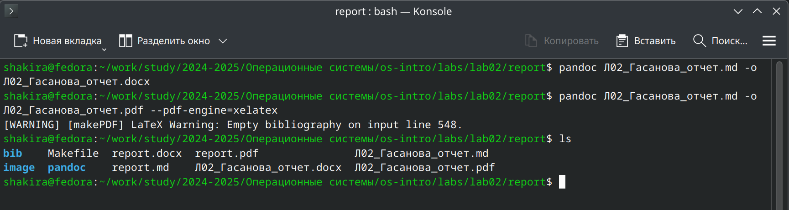
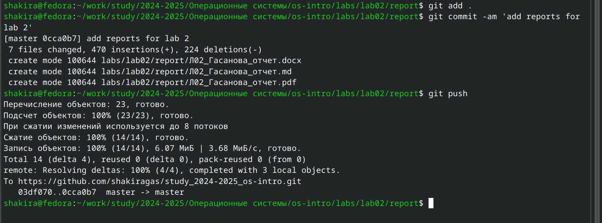

---
## Front matter
lang: ru-RU
title: Лабораторная работа №3
subtitle: Операционные системы
author:
  - Гасанова Ш. Ч.
institute:
  - Российский университет дружбы народов, Москва, Россия
date: 6 марта 2025

## i18n babel
babel-lang: russian
babel-otherlangs: english

## Formatting pdf
toc: false
toc-title: Содержание
slide_level: 2
aspectratio: 169
section-titles: true
theme: metropolis
header-includes:
 - \metroset{progressbar=frametitle,sectionpage=progressbar,numbering=fraction}
 - '\makeatletter'
 - '\beamer@ignorenonframefalse'
 - '\makeatother'
---

## Цель работы

Цель данной лабораторной работы - научиться оформлять отчёты с помощью легковесного языка разметки Markdown.

## Задание

1. Сделать отчёт по предыдущей лабораторной работе в формате Markdown.
2. Предоставить отчёт в 3 форматах: pdf, docx и md (в архиве,поскольку он должен содержать скриншоты, Makefile и т.д.)

## Теоретическое введение

Markdown - это облегчённый язык разметки, созданный с целью форматирования в простом тексте, с максимальным сохранением его читаемости и пригодный для машинного преобразования в языки для продвинутых публикаций.

## Выполнение лабораторной работы

### Создание отчёта

Перехожу в каталог, в котором находится шаблон для отчёта по лабораторной работе и создаю копию шаблона, в котором буду писать отчёт (рис. 1).

{#fig:001 width=70%}

## Создание отчёта

Начинаю работу с отчётом, изменяю данные на свои и начинаю писать содержимое (рис. 2, рис. 3).

{#fig:002 width=70%}

## Создание отчёта

{#fig:003 width=70%}

## Компиляция отчёта

После написания отчёта, возвращаюсь в директорию с отчётом и запускаю процесс компиляции (рис. 4).

{#fig:004 width=70%}

## Отправка файлов на репозиторий

Далее отправляю скомпилированные файлы на свой репозиторий на GitHub (рис. 5).

{#fig:005 width=70%}

## Выводы

При выполнении данной лабораторной работы я научилась оформлять отчёты с помощью легковесного языка разметки Markdown.

## Список литературы

1. Лабораторная работа №3 [Электронный ресурс] URL: https://esystem.rudn.ru/mod/page/view.php?id=1224371&forceview=1
