---
## Front matter
lang: ru-RU
title: Лабораторная работа №4
subtitle: Операционные системы
author:
  - Гасанова Ш. Ч.
institute:
  - Российский университет дружбы народов, Москва, Россия
date: 8 марта 2025

## i18n babel
babel-lang: russian
babel-otherlangs: english

## Formatting pdf
toc: false
toc-title: Содержание
slide_level: 2
aspectratio: 169
section-titles: true
theme: metropolis
header-includes:
 - \metroset{progressbar=frametitle,sectionpage=progressbar,numbering=fraction}
 - '\makeatletter'
 - '\beamer@ignorenonframefalse'
 - '\makeatother'
---

## Цель работы

Цель данной лабораторной работы - получение навыков правильной работы с репозиториями git.

## Задание

1. Выполнить работу для тестового репозитория.
2. Преобразовать рабочий репозиторий в репозиторий с git-flow и conventional commits.

## Выполнение лабораторной работы

### Установка программного обеспечения

Устанавливаю git-flow из приведённой коллекции репозиториев (рис. 1, рис. 2).

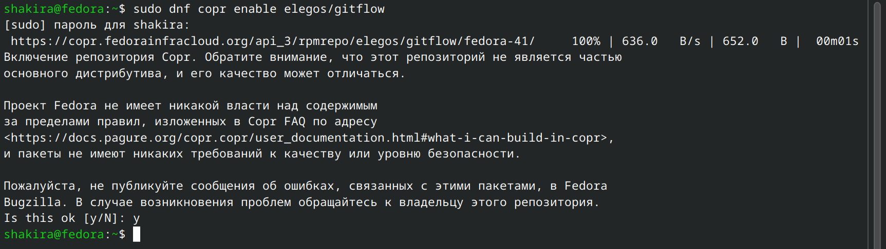{#fig:001 width=70%}

## Установка программного обеспечения

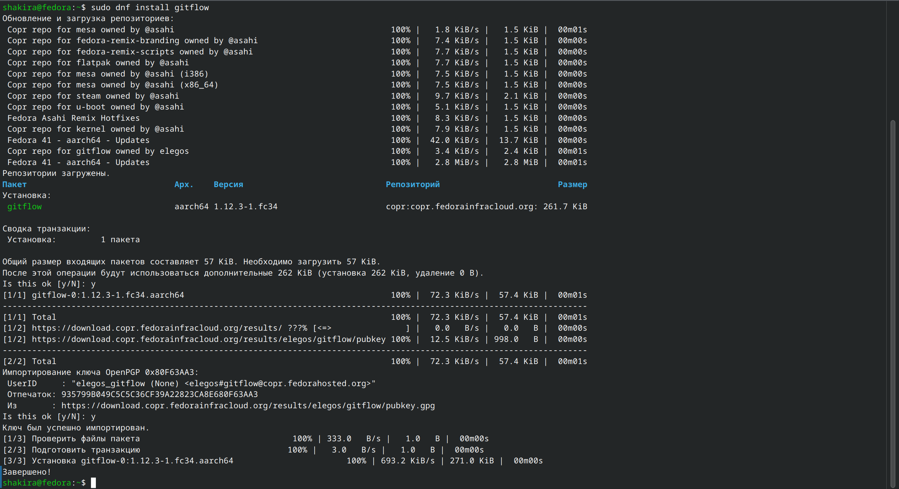{#fig:002 width=70%}

## Установка программного обеспечения

Устанавливаю Node.js. На нём базируется программное обеспечение для семантического версирования и общепринятых коммитов (рис. 3, рис. 4).

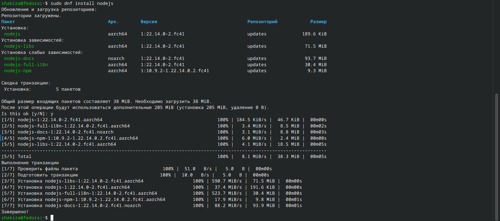{#fig:003 width=70%}

## Установка программного обеспечения

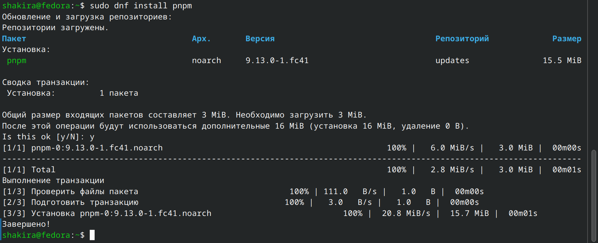{#fig:004 width=70%}

## Установка программного обеспечения

Для работы с Node.js добавляю каталог с исполняемыми файлами (рис. 5)

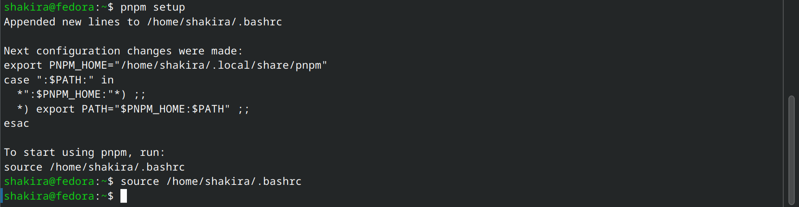{#fig:005 width=70%}

## Установка программного обеспечения

Ввожу команду pnpm add -g commitizen, чтобы форматировать коммиты (рис. 6)

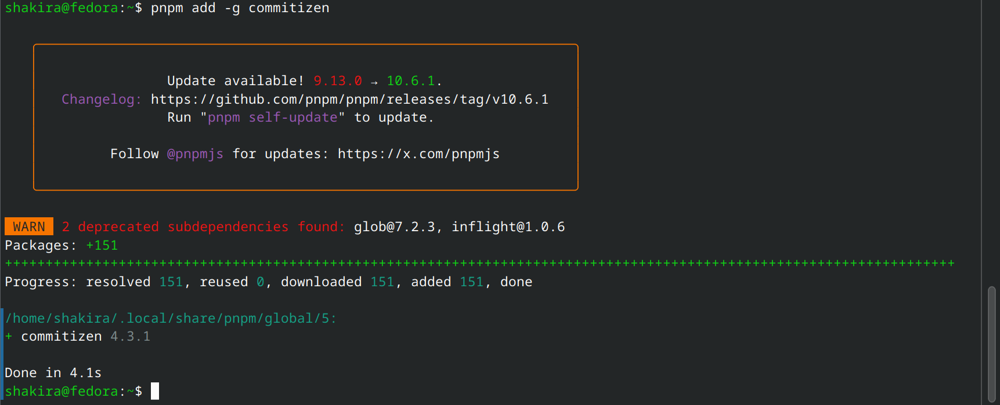{#fig:006 width=70%}

## Установка программного обеспечения

Использую следующую команду для помощи в создании логов (рис. 7)

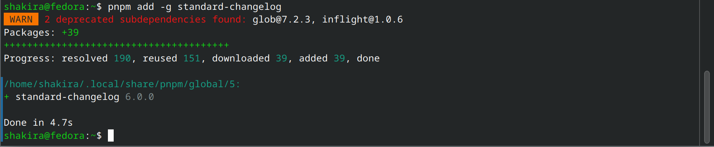{#fig:007 width=70%}

## Практический сценарий использования git

Создаю репозиторий на гитхаб (рис. 8)

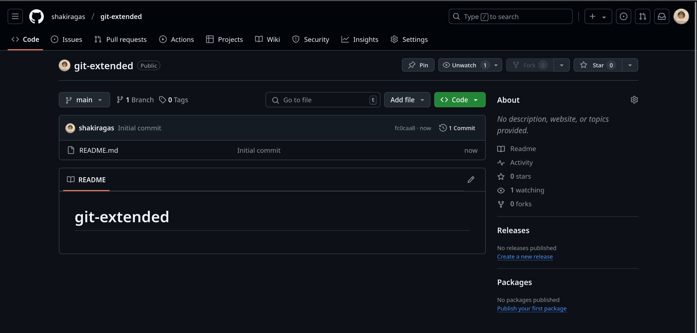{#fig:008 width=70%}

## Практический сценарий использования git

Добавляю файл, делаю первый коммит и выкладываю на гитхаб (рис. 9)

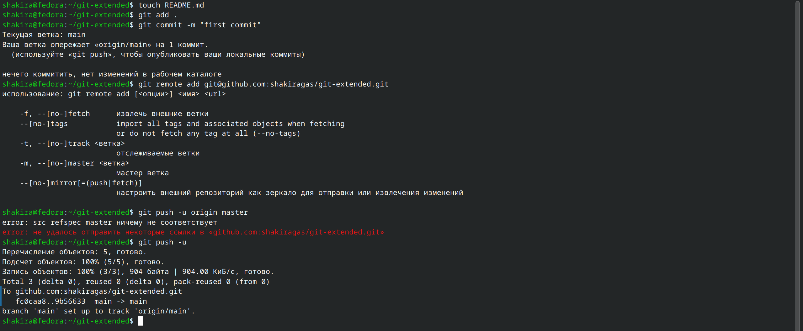{#fig:009 width=70%}

## Практический сценарий использования git

Ввожу команду pnpm init, затем перехожу в файловый менеджер для изменения конфигурации файла package.json (рис. 10)

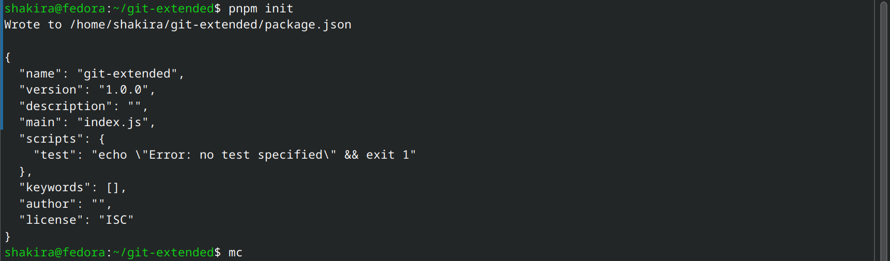{#fig:010 width=70%}

## Практический сценарий использования git

Редактирую файл, теперь он приобретает новый вид (рис. 11, рис. 12)

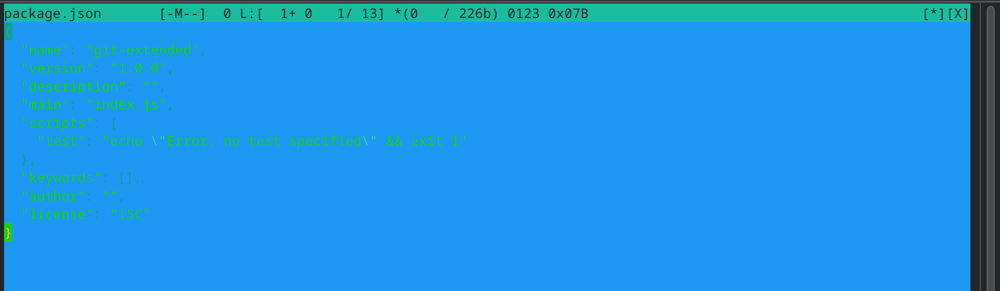{#fig:011 width=70%}

## Практический сценарий использования git

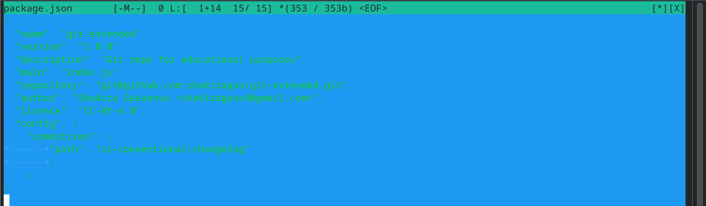{#fig:012 width=70%}

## Практический сценарий использования git

Добавляю новый файл, выполняю коммит и отправляю на гитхаб (рис. 13)

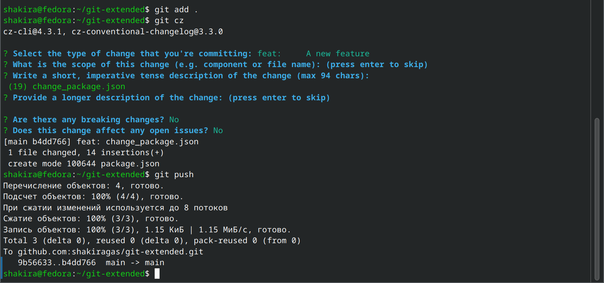{#fig:013 width=70%}

## Практический сценарий использования git

Инициализирую git-flow, префикс устанавливаю в v (рис. 14)

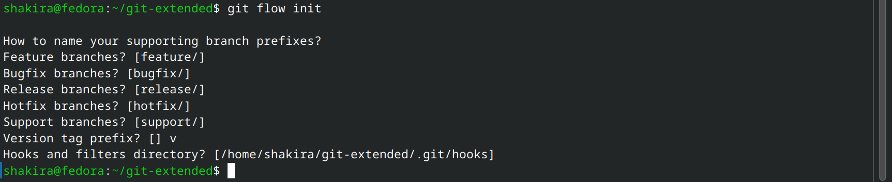{#fig:014 width=70%}

## Практический сценарий использования git

Проверяю, что нахожусь на ветке develop (рис. 15)

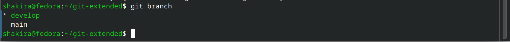{#fig:015 width=70%}

## Практический сценарий использования git

Загружаю весь репозиторий в хранилище (рис. 16)

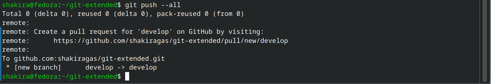{#fig:016 width=70%}

## Практический сценарий использования git

Устанавливаю внешнюю ветку как вышестоящую, создаю релиз с версией 1.0.0 и создаю журнал изменений для отслеживания версий (рис. 17)

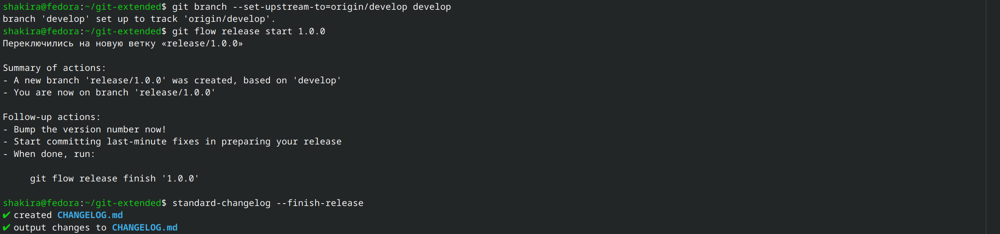{#fig:017 width=70%}

## Практический сценарий использования git

Добавляю журнал изменений в индекс и заливаю релизную ветку в основную (рис. 18)

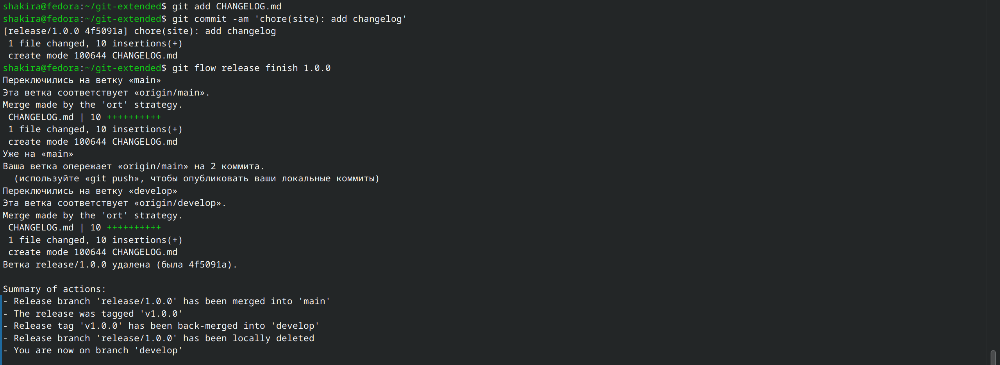{#fig:018 width=70%}

## Практический сценарий использования git

Отправляю все данные на github (рис. 19)

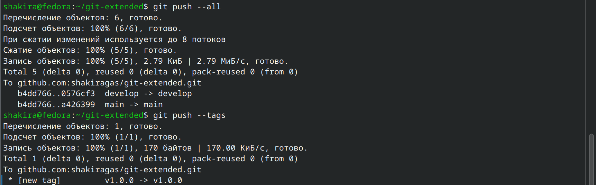{#fig:019 width=70%}

## Практический сценарий использования git

Создаю релиз на github (рис. 20)

{#fig:020 width=70%}

## Практический сценарий использования git

Создаю ветку для новой функциональности, по окончании работы объединяю эту ветку с develop (рис. 21)

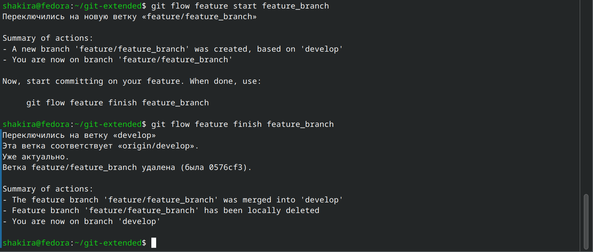{#fig:021 width=70%}

## Практический сценарий использования git

Создаю релиз с версией 1.2.3 (рис. 22)

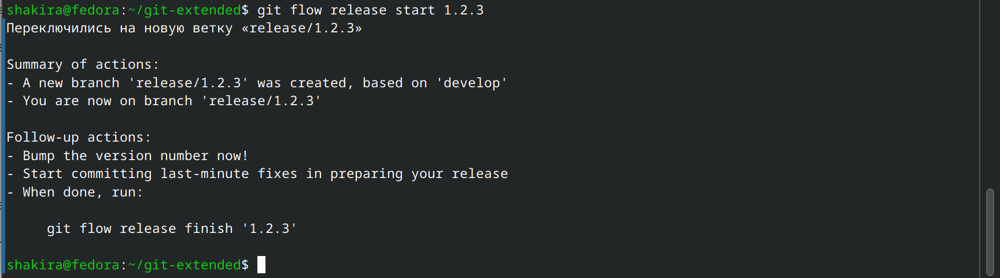{#fig:022 width=70%}

## Практический сценарий использования git

Обновляю номер версии в файле package.json на актуальную (рис. 23)

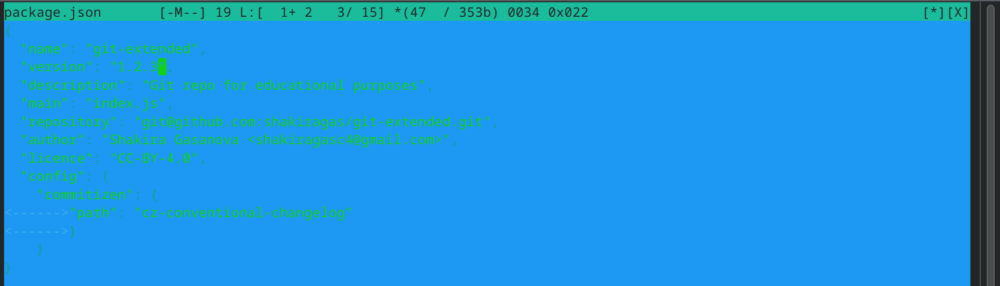{#fig:023 width=70%}

## Практический сценарий использования git

Создаю журнал изменений, добавляю в индекс (рис. 24)

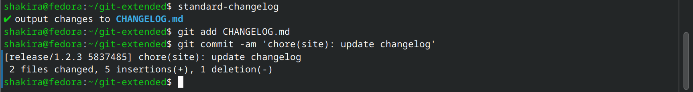{#fig:024 width=70%}

## Практический сценарий использования git

Заливаю релизную ветку в основную ветку (рис. 25)

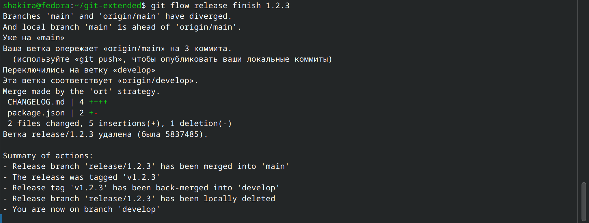{#fig:025 width=70%}

## Практический сценарий использования git

Отправляю данные на github (рис. 26)

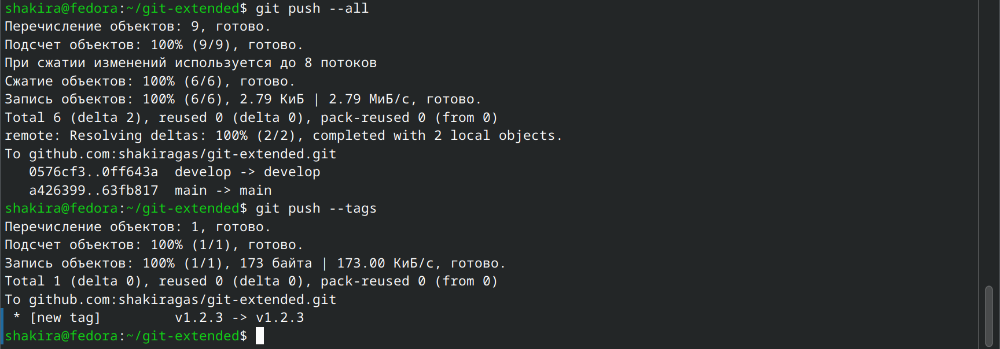{#fig:026 width=70%}

## Практический сценарий использования git

Создаю релиз на github с комментарием из журнала изменений (рис. 27)

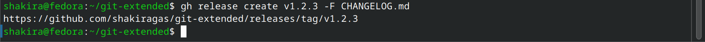{#fig:027 width=70%}

## Выводы

При выполнении данной лабораторной работы я получила навыки правильной работы с репозиториями git.

## Список литературы

1. Лабораторная работа №4 [Электронный ресурс] URL: https://esystem.rudn.ru/mod/page/view.php?id=1224375&forceview=1
