---
## Front matter
title: "Отчёт по лабораторной работе №4"
subtitle: "Операционные системы"
author: "Гасанова Шакира Чингизовна"

## Generic otions
lang: ru-RU
toc-title: "Содержание"

## Bibliography
bibliography: bib/cite.bib
csl: pandoc/csl/gost-r-7-0-5-2008-numeric.csl

## Pdf output format
toc: true # Table of contents
toc-depth: 2
lof: true # List of figures
lot: true # List of tables
fontsize: 12pt
linestretch: 1.5
papersize: a4
documentclass: scrreprt
## I18n polyglossia
polyglossia-lang:
  name: russian
  options:
	- spelling=modern
	- babelshorthands=true
polyglossia-otherlangs:
  name: english
## I18n babel
babel-lang: russian
babel-otherlangs: english
## Fonts
mainfont: PT Serif
romanfont: PT Serif
sansfont: PT Sans
monofont: PT Mono
mainfontoptions: Ligatures=TeX
romanfontoptions: Ligatures=TeX
sansfontoptions: Ligatures=TeX,Scale=MatchLowercase
monofontoptions: Scale=MatchLowercase,Scale=0.9
## Biblatex
biblatex: true
biblio-style: "gost-numeric"
biblatexoptions:
  - parentracker=true
  - backend=biber
  - hyperref=auto
  - language=auto
  - autolang=other*
  - citestyle=gost-numeric
## Pandoc-crossref LaTeX customization
figureTitle: "Рис."
tableTitle: "Таблица"
listingTitle: "Листинг"
lofTitle: "Список иллюстраций"
lotTitle: "Список таблиц"
lolTitle: "Листинги"
## Misc options
indent: true
header-includes:
  - \usepackage{indentfirst}
  - \usepackage{float} # keep figures where there are in the text
  - \floatplacement{figure}{H} # keep figures where there are in the text
---

# Цель работы

Цель данной лабораторной работы - получение навыков правильной работы с репозиториями git.

# Задание

1. Выполнить работу для тестового репозитория.
2. Преобразовать рабочий репозиторий в репозиторий с git-flow и conventional commits.

# Теоретическое введение

- Gitflow Workflow опубликована и популяризована Винсентом Дриссеном.
- Gitflow Workflow предполагает выстраивание строгой модели ветвления с учётом выпуска проекта.
- Данная модель отлично подходит для организации рабочего процесса на основе релизов.
- Работа по модели Gitflow включает создание отдельной ветки для исправлений ошибок в рабочей среде.
- Последовательность действий при работе по модели Gitflow:
  - Из ветки master создаётся ветка develop.
  - Из ветки develop создаётся ветка release.
  - Из ветки develop создаются ветки feature.
  - Когда работа над веткой feature завершена, она сливается с веткой develop.
  - Когда работа над веткой релиза release завершена, она сливается в ветки develop и master.
  - Если в master обнаружена проблема, из master создаётся ветка hotfix.
  - Когда работа над веткой исправления hotfix завершена, она сливается в ветки develop и master.

- Семантическое версионирование описывается в манифесте семантического версионирования.
- Кратко его можно описать следующим образом:
  - Версия задаётся в виде кортежа МАЖОРНАЯ_ВЕРСИЯ.МИНОРНАЯ_ВЕРСИЯ.ПАТЧ.
  - Номер версии следует увеличивать:
    - МАЖОРНУЮ версию, когда сделаны обратно несовместимые изменения API.
    - МИНОРНУЮ версию, когда вы добавляете новую функциональность, не нарушая обратной совместимости.
    - ПАТЧ-версию, когда вы делаете обратно совместимые исправления.
  - Дополнительные обозначения для предрелизных и билд-метаданных возможны как дополнения МАЖОРНАЯ.МИНОРНАЯ.ПАТЧ формату.

- Спецификация Conventional Commits:
  - Соглашение о том, как нужно писать сообщения commit'ов.
  - Совместимо с SemVer. Даже вернее сказать, сильно связано с семантическим версионированием.
  - Регламентирует структуру и основные типы коммитов.

# Выполнение лабораторной работы

## Установка программного обеспечения

Устанавливаю git-flow из приведённой коллекции репозиториев (рис. @fig:001, рис. @fig: 002).

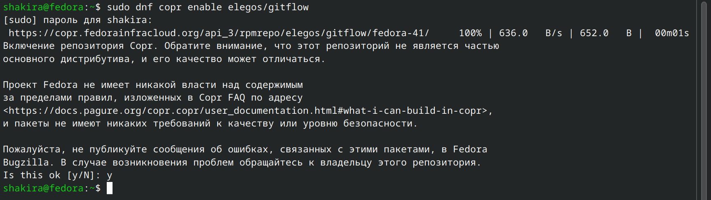{#fig:001 width=70%}

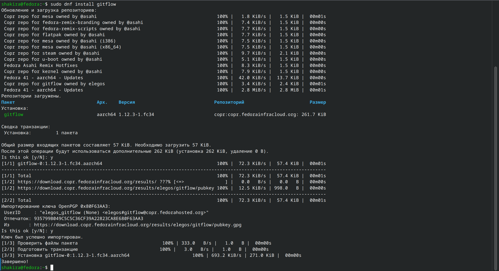{#fig:002 width=70%}

Устанавливаю Node.js. На нём базируется программное обеспечение для семантического версирования и общепринятых коммитов (рис. @fig:003, рис. @fig:004).

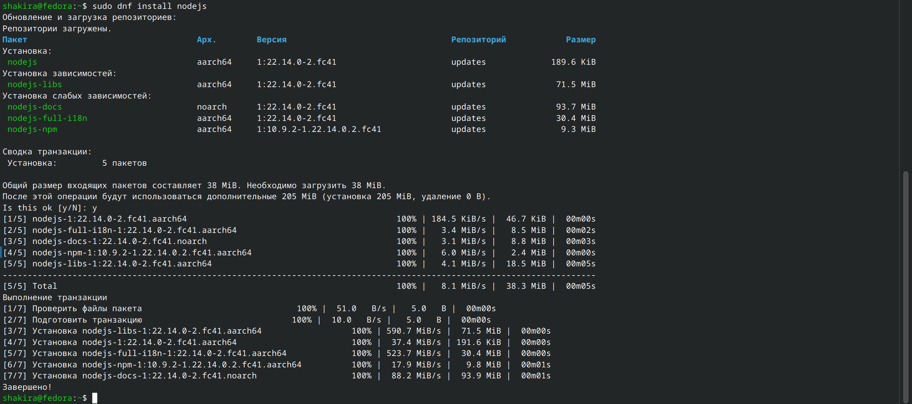{#fig:003 width=70%}

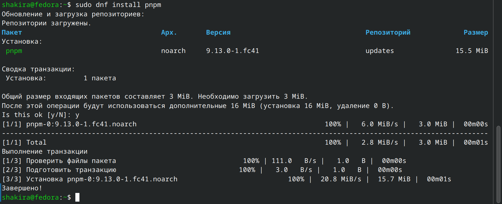{#fig:004 width=70%}

Для работы с Node.js добавляю каталог с исполняемыми файлами (рис. @fig:005)

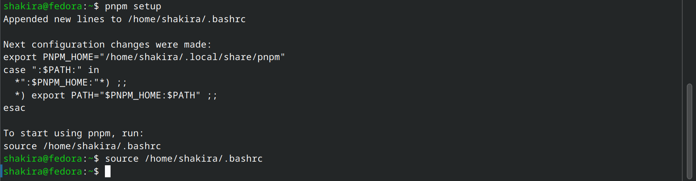{#fig:005 width=70%}

Ввожу команду pnpm add -g commitizen, чтобы форматировать коммиты (рис. @fig:006)

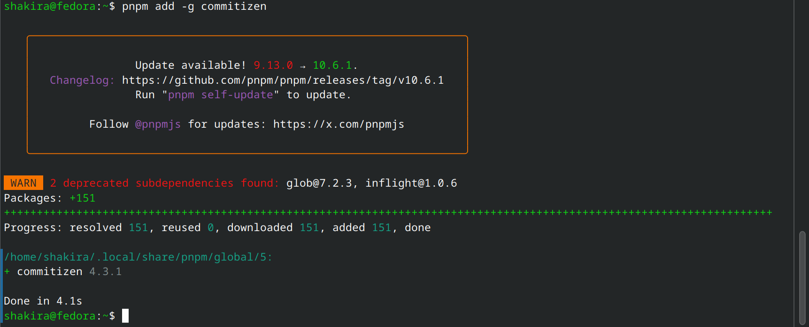{#fig:006 width=70%}

Использую следующую команду для помощи в создании логов (рис. @fig:007)

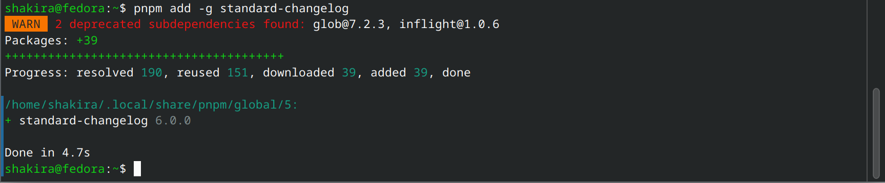{#fig:007 width=70%}

## Практический сценарий использования git

Создаю репозиторий на гитхаб (рис. @fig:008)

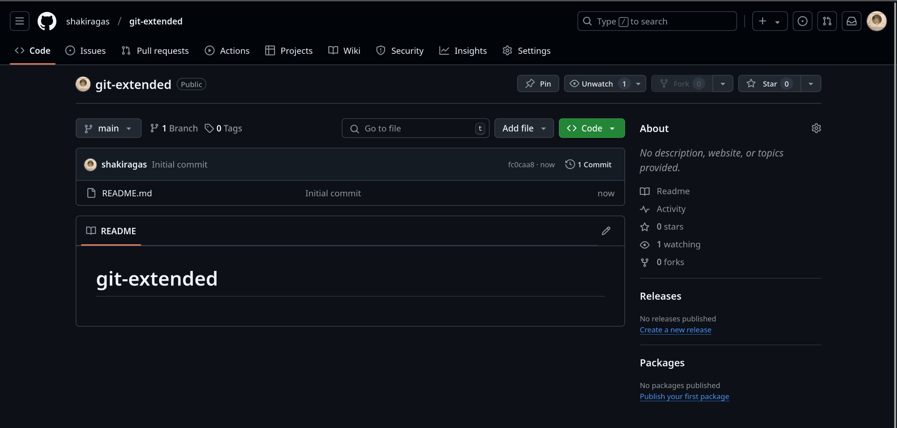{#fig:008 width=70%}

Добавляю файл, делаю первый коммит и выкладываю на гитхаб (рис. @fig:009)

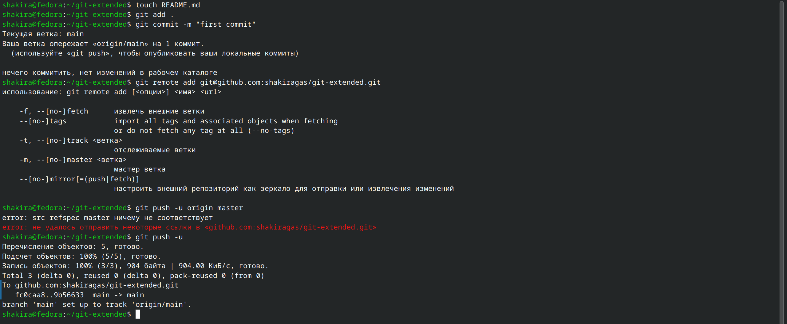{#fig:009 width=70%}

Ввожу команду pnpm init, затем перехожу в файловый менеджер для изменения конфигурации файла package.json (рис. @fig:010)

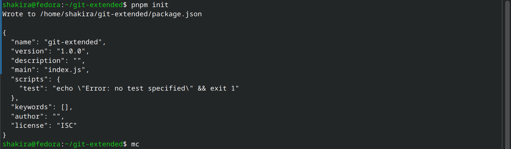{#fig:010 width=70%}

Редактирую файл, теперь он приобретает новый вид (рис. @fig:011, рис. @fig:012)

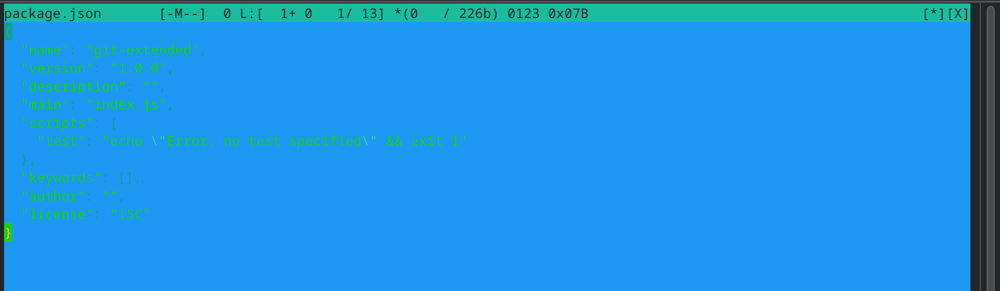{#fig:011 width=70%}

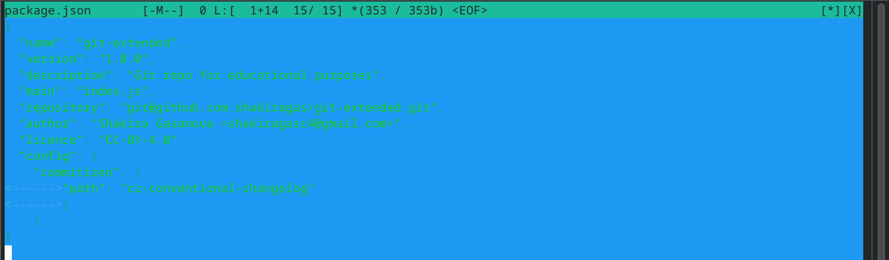{#fig:012 width=70%}

Добавляю новый файл, выполняю коммит и отправляю на гитхаб (рис. @fig:013)

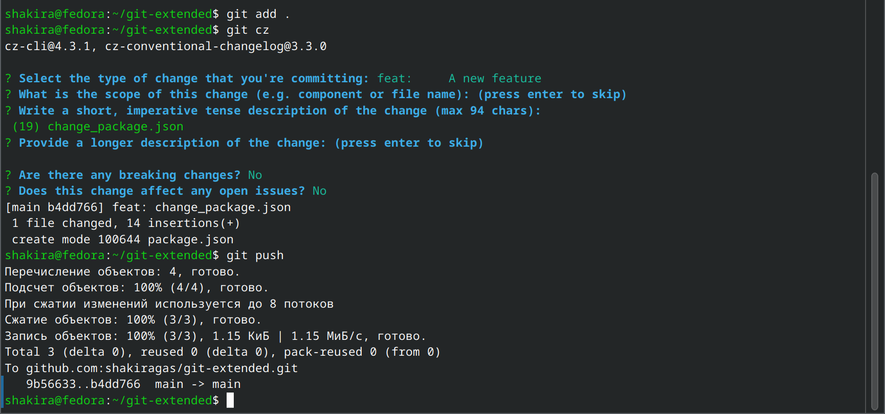{#fig:013 width=70%}

Инициализирую git-flow, префикс устанавливаю в v (рис. @fig:014)

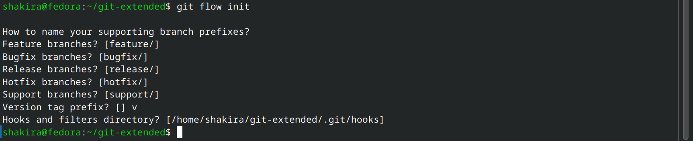{#fig:014 width=70%}

Проверяю, что нахожусь на ветке develop (рис. @fig:015)

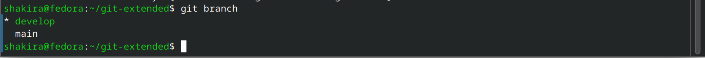{#fig:015 width=70%}

Загружаю весь репозиторий в хранилище (рис. @fig:016)

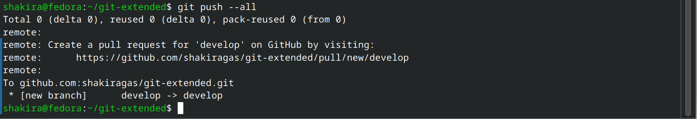{#fig:016 width=70%}

Устанавливаю внешнюю ветку как вышестоящую, создаю релиз с версией 1.0.0 и создаю журнал изменений для отслеживания версий (рис. @fig:017)

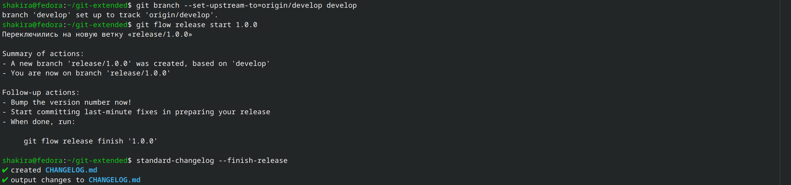{#fig:017 width=70%}

Добавляю журнал изменений в индекс и заливаю релизную ветку в основную (рис. @fig:018)

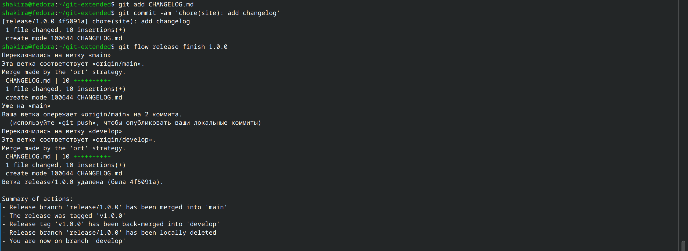{#fig:018 width=70%}

Отправляю все данные на github (рис. @fig:019)

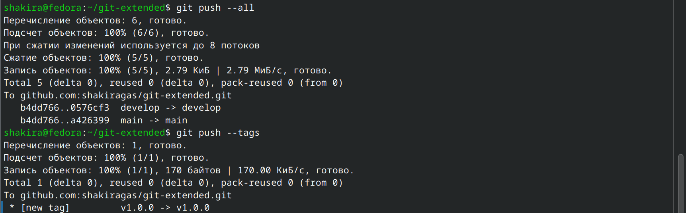{#fig:019 width=70%}

Создаю релиз на github (рис. @fig:020)

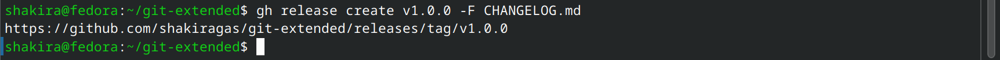{#fig:020 width=70%}

Создаю ветку для новой функциональности, по окончании работы объединяю эту ветку с develop (рис. @fig:021)

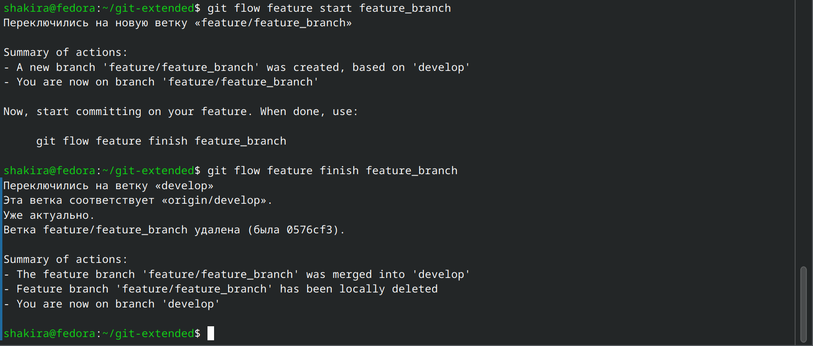{#fig:021 width=70%}

Создаю релиз с версией 1.2.3 (рис. @fig:022)

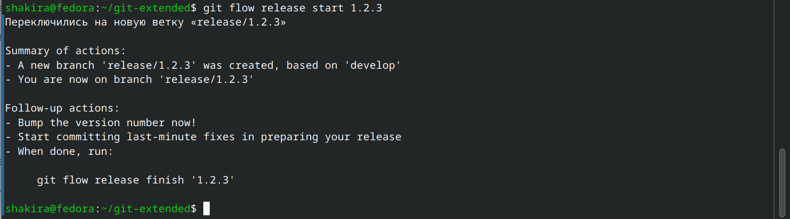{#fig:022 width=70%}

Обновляю номер версии в файле package.json на актуальную (рис. @fig:023)

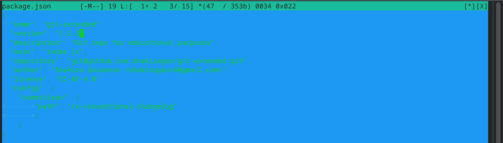{#fig:023 width=70%}

Создаю журнал изменений, добавляю в индекс (рис. @fig:024)

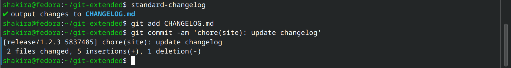{#fig:024 width=70%}

Заливаю релизную ветку в основную ветку (рис. @fig:025)

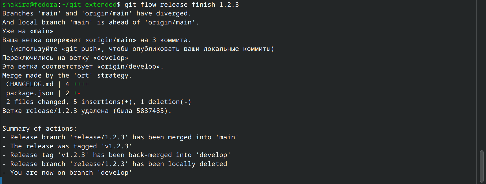{#fig:025 width=70%}

Отправляю данные на github (рис. @fig:026)

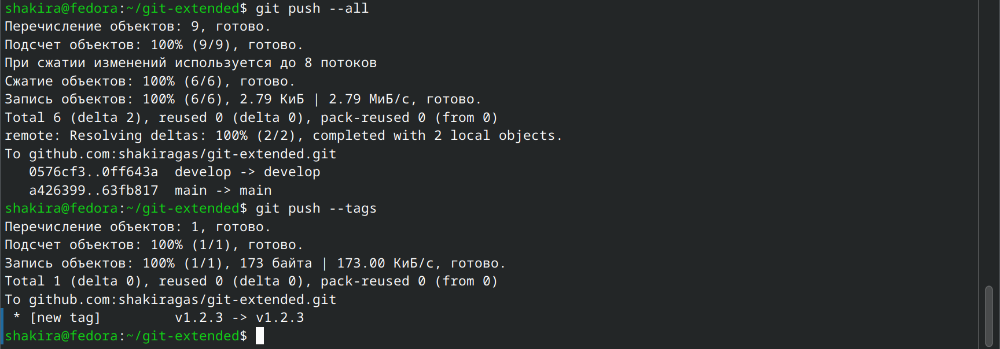{#fig:026 width=70%}

Создаю релиз на github с комментарием из журнала изменений (рис. @fig:027)

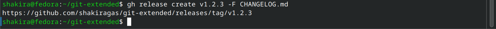{#fig:027 width=70%}

# Выводы

При выполнении данной лабораторной работы я получила навыки правильной работы с репозиториями git.

# Список литературы

1. Лабораторная работа №4 [Электронный ресурс] URL: https://esystem.rudn.ru/mod/page/view.php?id=1224375&forceview=1
