---
## Front matter
lang: ru-RU
title: Лабораторная работа №5
subtitle: Операционные системы
author:
  - Гасанова Ш. Ч.
institute:
  - Российский университет дружбы народов, Москва, Россия
date: 11 марта 2025

## i18n babel
babel-lang: russian
babel-otherlangs: english

## Formatting pdf
toc: false
toc-title: Содержание
slide_level: 2
aspectratio: 169
section-titles: true
theme: metropolis
header-includes:
 - \metroset{progressbar=frametitle,sectionpage=progressbar,numbering=fraction}
 - '\makeatletter'
 - '\beamer@ignorenonframefalse'
 - '\makeatother'
---

## Цель работы

Цель данной лабораторной работы - познакомиться с pass, gopass, native messaging и chezmoi. Научиться ими пользоваться и синхронизировать их с гит.

## Задание

1. Установка и настройка pass
2. Настройка интерфейса с браузером
3. Установка дополнительного ПО
4. Установка и настройка chezmoi
5. Настройка chezmoi на новой машине
6. Выполнение ежедневных операций с chezmoi

## Выполнение лабораторной работы

### Установка и настройка pass

Устанавливаю pass и gopass.

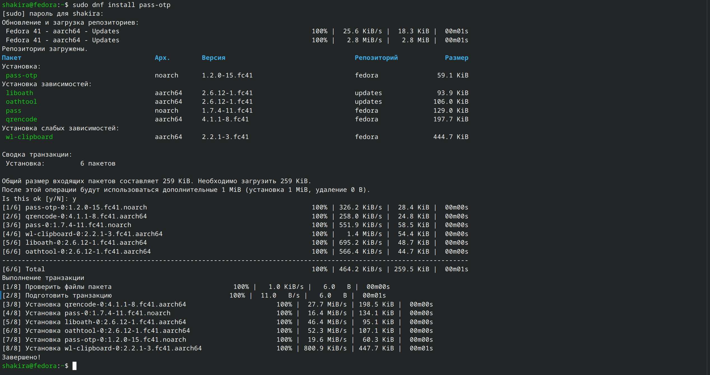{#fig:001 width=70%}

## Установка и настройка pass

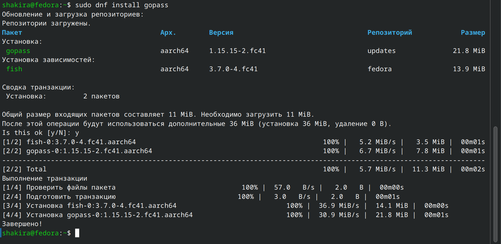{#fig:002 width=70%}

## Установка и настройка pass

Смотрю список ключей.

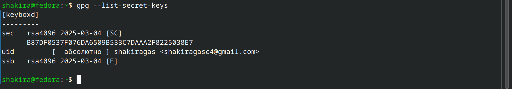{#fig:003 width=70%}

## Установка и настройка pass

Инициализирую хранилище.

{#fig:004 width=70%}

## Установка и настройка pass

Создаю структуру git.

{#fig:005 width=70%}

## Установка и настройка pass

Задаю адрес репозитория на хостинге и синхронизируюсь с git.

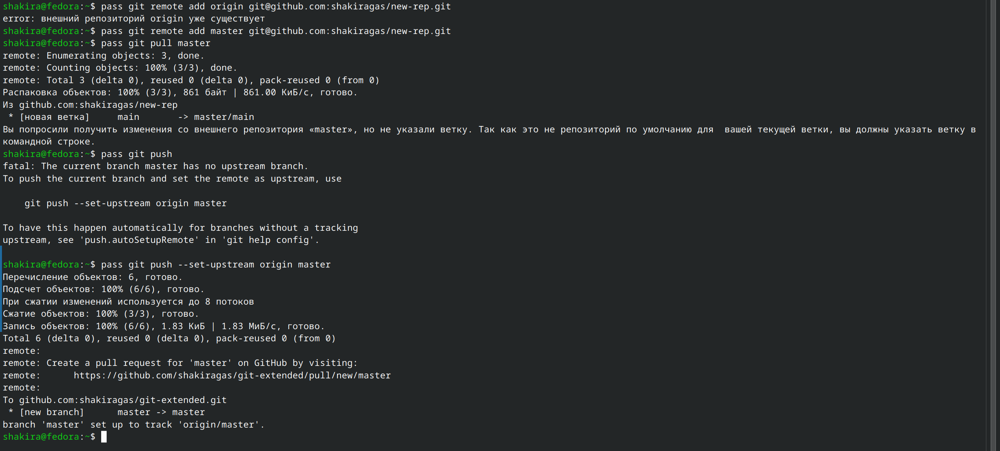{#fig:006 width=70%}

## Установка и настройка pass

Следует заметить, что отслеживаются только изменения, сделанные через сам gopass (или pass). Если изменения сделаны непосредственно на файловой системе, необходимо вручную закоммитить и выложить изменения, после чего проверить статус синхронизации командой pass git status.

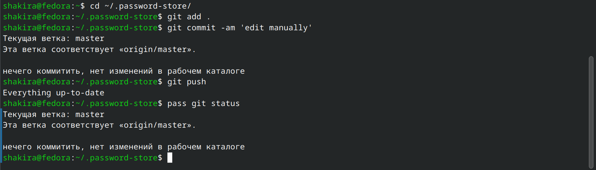{#fig:007 width=70%}

## Настройка интерфейса с браузером

Для взаимодействия с браузером используется интерфейс native messaging. Поэтому кроме плагина к браузеру устанавливается программа, обеспечивающая интерфейс native messaging. 

{#fig:008 width=70%}

## Настройка интерфейса с браузером

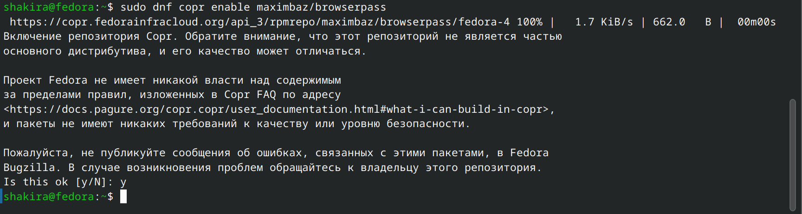{#fig:009 width=70%}

## Настройка интерфейса с браузером

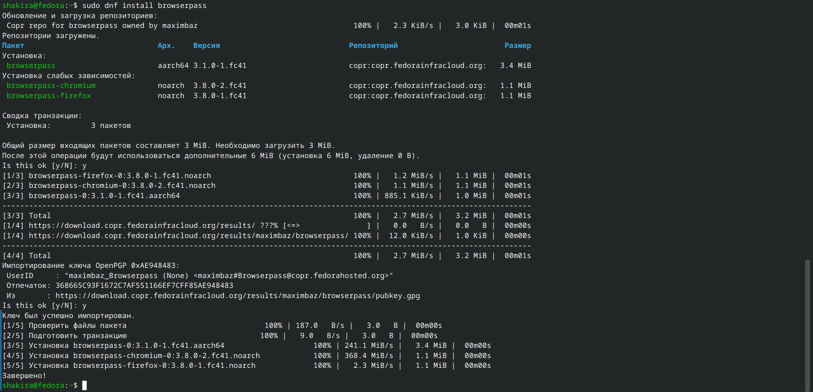{#fig:010 width=70%}

## Настройка интерфейса с браузером

Добавляю новый пароль.

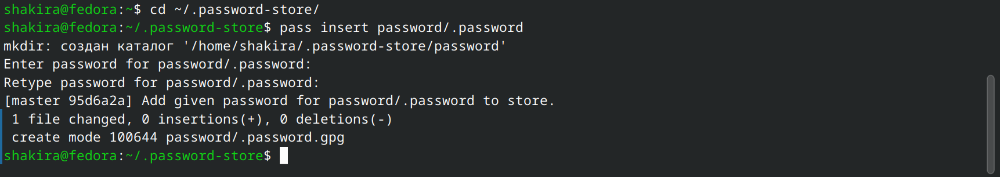{#fig:011 width=70%}

## Настройка интерфейса с браузером

Отображаю пароль для указанного имени файла и заменяю существующий пароль.

{#fig:012 width=70%}

## Установка дополнительного ПО

Устанавливаю дополнительное программное обеспечение.

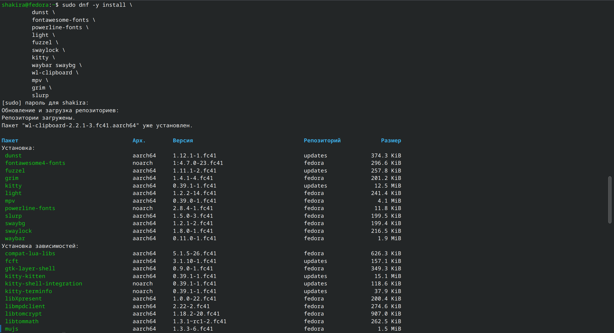{#fig:013 width=70%}

## Установка дополнительного ПО

Устанавливаю шрифты

{#fig:014 width=70%}

## Установка дополнительного ПО

Устанавливаю бинарный файл. Скрипт определяет архитектуру процессора и операционную систему и скачивает необходимый.

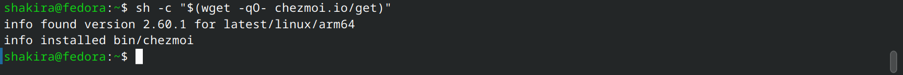{#fig:015 width=70%}

Создаю собственный репозиторий для конфигурационных файлов на основе шаблона.

{#fig:016 width=70%}

## Установка и настройка chezmoi

Инициализирую chezmoi с репозиторием dotfiles.

{#fig:017 width=70%}

Проверяю, какие изменения внесёт chezmoi в домашний каталог, затем подтверждаю изменения.

{#fig:018 width=70%}

{#fig:019 width=70%}

## Настройка chezmoi на новой машине

На второй машине инициализирую chezmoi с моим репозиторием dotfiles. Проверяю, какие изменения внесёт chezmoi в домашний каталог. Никаких изменений нет, т.к. он был настроен заранее. При существующем каталоге chezmoi можно получить и применить последние изменения из моего репозитория.

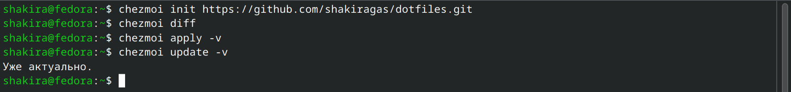{#fig:020 width=70%}

## Настройка chezmoi на новой машине

Устанавливаю свои dotfiles на новый компьютер с помощью одной команды.

{#fig:021 width=70%}

## Выполнение ежедневных операций с chezmoi

Извлекаю последние изменения из своего репозитория и смотрю, что изменится, фактически не применяя изменения. Применяю изменения.

{#fig:022 width=70%}

## Выполнение ежедневных операций с chezmoi

Можно автоматически фиксировать и отправлять изменения в исходный каталог в репозиторий. Для этого нужно добавить в файл конфигурации ~/.config/chezmoi/chezmoi.toml следующее:

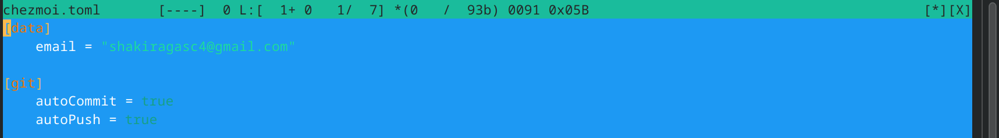{#fig:023 width=70%}

## Выводы

При выполнении данной лабораторной работы я познакомилась с pass, gopass, native messaging и chezmoi и научилась ими пользоваться и синхронизировать их с гит.

## Список литературы

1. Лабораторная работа №5 [Электронный ресурс] URL: https://esystem.rudn.ru/mod/page/view.php?id=1224377

