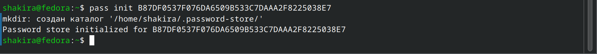
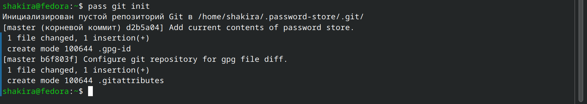
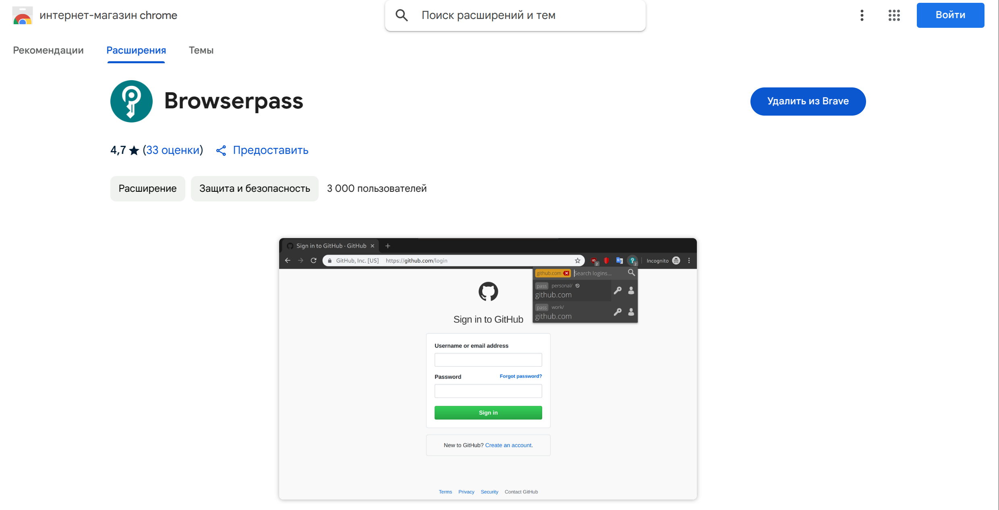
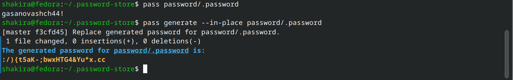
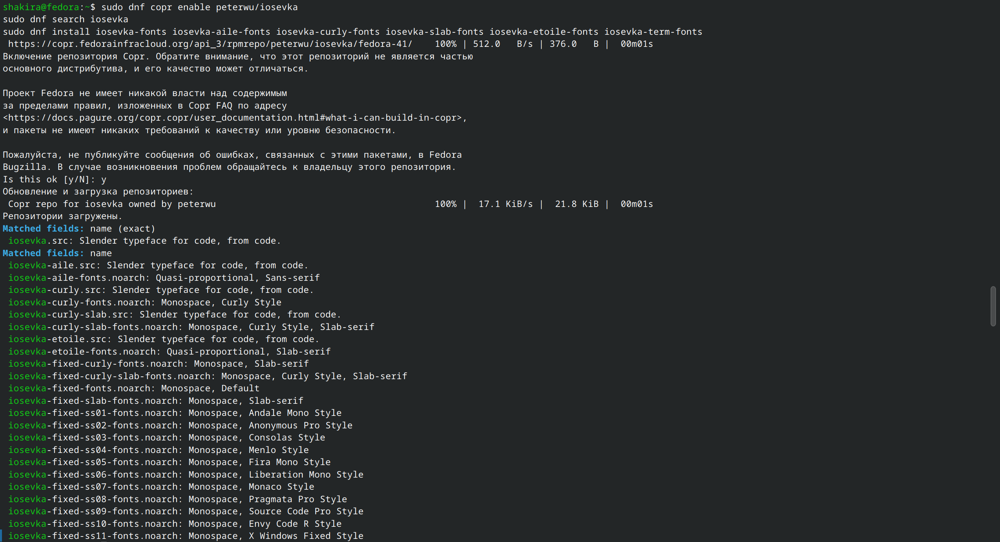
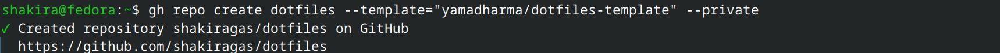
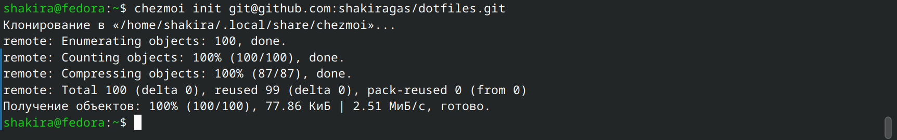
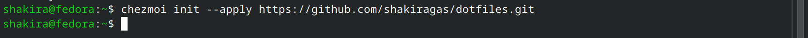
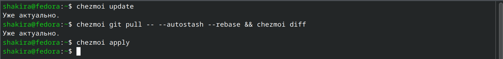

---
## Front matter
title: "Отчёт по лабораторной работе №5"
subtitle: "Операционные системы"
author: "Гасанова Шакира Чингизовна"

## Generic otions
lang: ru-RU
toc-title: "Содержание"

## Bibliography
bibliography: bib/cite.bib
csl: pandoc/csl/gost-r-7-0-5-2008-numeric.csl

## Pdf output format
toc: true # Table of contents
toc-depth: 2
lof: true # List of figures
lot: true # List of tables
fontsize: 12pt
linestretch: 1.5
papersize: a4
documentclass: scrreprt
## I18n polyglossia
polyglossia-lang:
  name: russian
  options:
	- spelling=modern
	- babelshorthands=true
polyglossia-otherlangs:
  name: english
## I18n babel
babel-lang: russian
babel-otherlangs: english
## Fonts
mainfont: PT Serif
romanfont: PT Serif
sansfont: PT Sans
monofont: PT Mono
mainfontoptions: Ligatures=TeX
romanfontoptions: Ligatures=TeX
sansfontoptions: Ligatures=TeX,Scale=MatchLowercase
monofontoptions: Scale=MatchLowercase,Scale=0.9
## Biblatex
biblatex: true
biblio-style: "gost-numeric"
biblatexoptions:
  - parentracker=true
  - backend=biber
  - hyperref=auto
  - language=auto
  - autolang=other*
  - citestyle=gost-numeric
## Pandoc-crossref LaTeX customization
figureTitle: "Рис."
tableTitle: "Таблица"
listingTitle: "Листинг"
lofTitle: "Список иллюстраций"
lotTitle: "Список таблиц"
lolTitle: "Листинги"
## Misc options
indent: true
header-includes:
  - \usepackage{indentfirst}
  - \usepackage{float} # keep figures where there are in the text
  - \floatplacement{figure}{H} # keep figures where there are in the text
---

# Цель работы

Цель данной лабораторной работы - познакомиться с pass, gopass, native messaging и chezmoi. Научиться ими пользоваться и синхронизировать их с гит.

# Задание

1. Установка и настройка pass
2. Настройка интерфейса с браузером
3. Установка дополнительного ПО
4. Установка и настройка chezmoi
5. Настройка chezmoi на новой машине
6. Выполнение ежедневных операций с chezmoi

# Теоретическое введение

Менеджер паролей pass — программа, сделанная в рамках идеологии Unix. Также носит название стандартного менеджера паролей для Unix (The standard Unix password manager). Данные хранятся в файловой системе в виде каталогов и файлов. Файлы шифруются с помощью GPG-ключа. Структура базы может быть произвольной, если Вы собираетесь использовать её напрямую, без промежуточного программного обеспечения. Тогда семантику структуры базы данных Вы держите в своей голове. Если же необходимо использовать дополнительное программное обеспечение, необходимо семантику заложить в структуру базы паролей.

# Выполнение лабораторной работы

## Установка и настройка pass

Устанавливаю pass и gopass (рис. @fig:001, рис. @fig: 002).

{#fig:001 width=70%}

{#fig:002 width=70%}

Смотрю список ключей (рис. @fig:003).

{#fig:003 width=70%}

Инициализирую хранилище (рис. @fig:004).

{#fig:004 width=70%}

Создаю структуру git (рис. @fig:005).

{#fig:005 width=70%}

Задаю адрес репозитория на хостинге и синхронизируюсь с git (рис. @fig:006).

{#fig:006 width=70%}

Следует заметить, что отслеживаются только изменения, сделанные через сам gopass (или pass). Если изменения сделаны непосредственно на файловой системе, необходимо вручную закоммитить и выложить изменения, после чего проверить статус синхронизации командой pass git status (рис. @fig:007).

{#fig:007 width=70%}

## Настройка интерфейса с браузером

Для взаимодействия с браузером используется интерфейс native messaging. Поэтому кроме плагина к браузеру устанавливается программа, обеспечивающая интерфейс native messaging. (рис. @fig:008, рис. @fig:009).

{#fig:008 width=70%}

{#fig:009 width=70%}

{#fig:010 width=70%}

Добавляю новый пароль (рис. @fig:011).

{#fig:011 width=70%}

Отображаю пароль для указанного имени файла и заменяю существующий пароль (рис. @fig:012).

{#fig:012 width=70%}

## Установка дополнительного ПО

Устанавливаю дополнительное программное обеспечение (рис. @fig:013).

{#fig:013 width=70%}

Устанавливаю шрифты (рис. @fig:014).

{#fig:014 width=70%}

Устанавливаю бинарный файл. Скрипт определяет архитектуру процессора и операционную систему и скачивает необходимый (рис. @fig:015).

{#fig:015 width=70%}

Создаю собственный репозиторий для конфигурационных файлов на основе шаблона (рис. @fig:016).

{#fig:016 width=70%}

## Установка и настройка chezmoi

Инициализирую chezmoi с репозиторием dotfiles (рис. @fig:017).

{#fig:017 width=70%}

Проверяю, какие изменения внесёт chezmoi в домашний каталог, затем подтверждаю изменения (рис. @fig:018, рис. @fig:019).

{#fig:018 width=70%}

{#fig:019 width=70%}

## Настройка chezmoi на новой машине

На второй машине инициализирую chezmoi с моим репозиторием dotfiles. Проверяю, какие изменения внесёт chezmoi в домашний каталог. Никаких изменений нет, т.к. он был настроен заранее. При существующем каталоге chezmoi можно получить и применить последние изменения из моего репозитория (рис. @fig:020).

{#fig:020 width=70%}

Устанавливаю свои dotfiles на новый компьютер с помощью одной команды (рис. @fig:021).

{#fig:021 width=70%}

## Выполнение ежедневных операций с chezmoi

Извлекаю последние изменения из своего репозитория и смотрю, что изменится, фактически не применяя изменения. Применяю изменения (рис. @fig:022).

{#fig:022 width=70%}

Можно автоматически фиксировать и отправлять изменения в исходный каталог в репозиторий. Для этого нужно добавить в файл конфигурации ~/.config/chezmoi/chezmoi.toml следующее: (рис. @fig:023).

{#fig:023 width=70%}

# Выводы

При выполнении данной лабораторной работы я познакомилась с pass, gopass, native messaging и chezmoi и научилась ими пользоваться и синхронизировать их с гит.

# Список литературы

1. Лабораторная работа №5 [Электронный ресурс] URL: https://esystem.rudn.ru/mod/page/view.php?id=1224377

