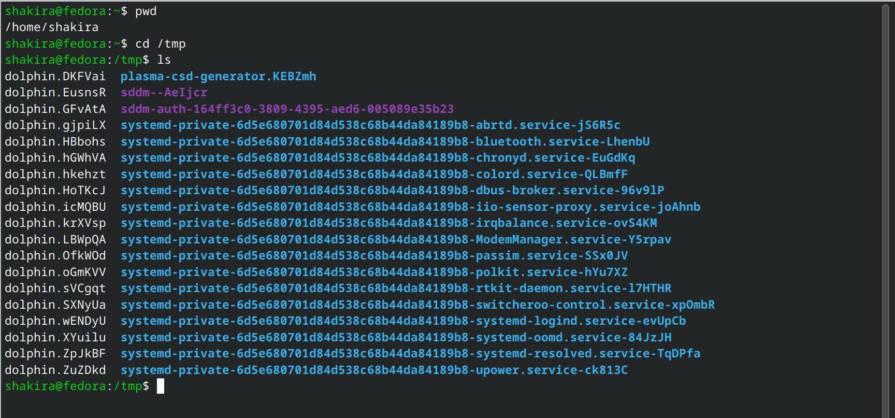
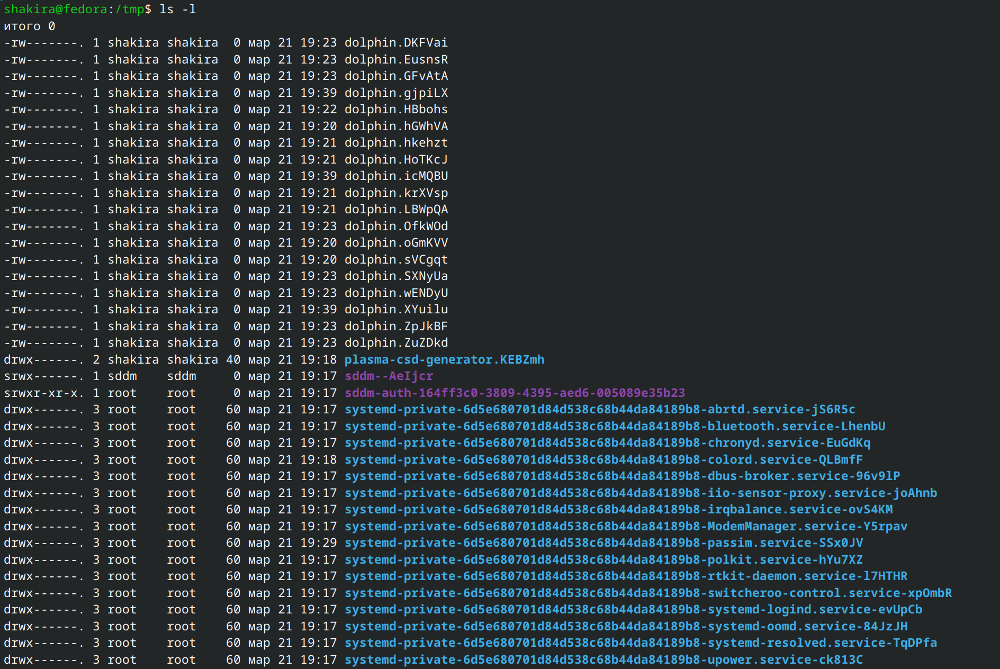
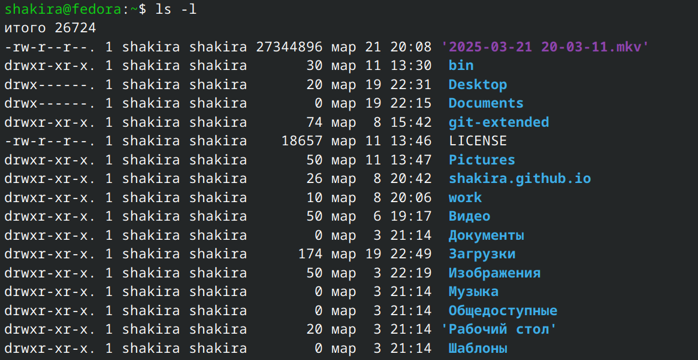
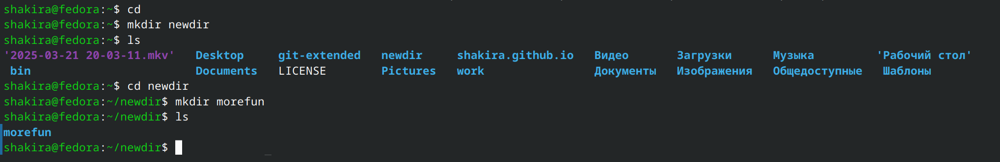
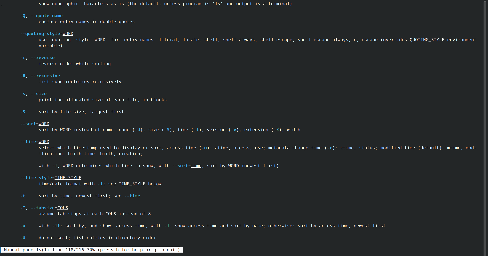
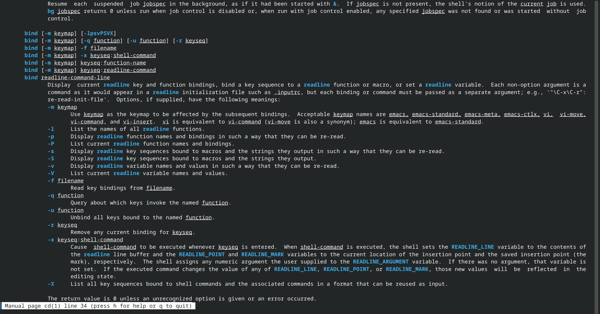
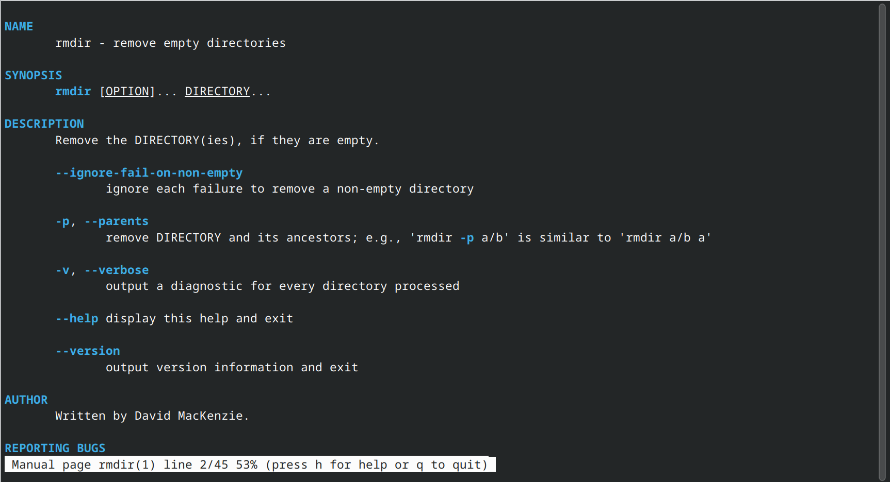
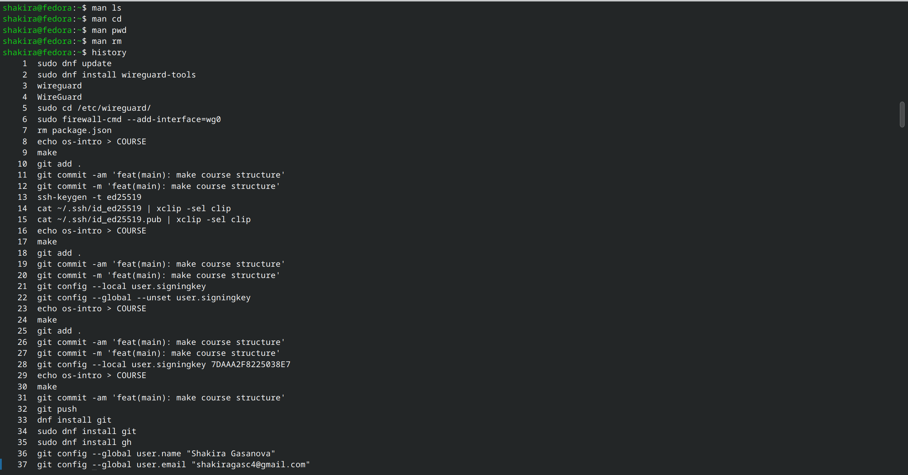
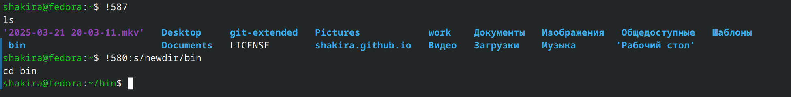
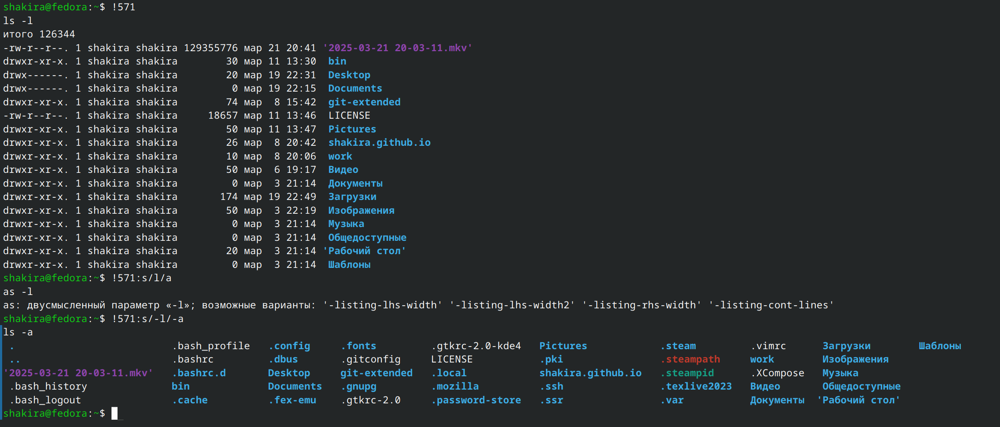

---
## Front matter
lang: ru-RU
title: Лабораторная работа №6
subtitle: Операционные системы
author:
  - Гасанова Ш. Ч.
institute:
  - Российский университет дружбы народов, Москва, Россия
date: 22 марта 2025

## i18n babel
babel-lang: russian
babel-otherlangs: english

## Formatting pdf
toc: false
toc-title: Содержание
slide_level: 2
aspectratio: 169
section-titles: true
theme: metropolis
header-includes:
 - \metroset{progressbar=frametitle,sectionpage=progressbar,numbering=fraction}
 - '\makeatletter'
 - '\beamer@ignorenonframefalse'
 - '\makeatother'
---

## Цель работы

Целью данной лабораторной работы является приобретение практических навыков взаимодействия пользователя с системой посредством командной строки.

## Задание

1. Определение полного имени домашнего каталога. Работа с каталогоми /tmp, /var/spool и домашним.
2. Создание каталогов и удаление.
3. Определение опций, набора опций команды ls с помощью команды man.
4. Просмотр описания команд: cd, pwd, mkdir, rmdir, rm.
5. Модификация и исполнение нескольких команд из буфера команд.

## Выполнение лабораторной работы

### Определение полного имени домашнего каталога. Работа с каталогоми /tmp, /var/spool и домашним

Определяю полное имя домашнего каталога. Далее относительно этого каталога будут выполняться последующие упражнения. Перехожу в каталог /tmp и вывожу его содержимое (рис. 1).

{#fig:001 width=70%}

## Определение полного имени домашнего каталога. Работа с каталогоми /tmp, /var/spool и домашним

Далее использую команду ls с различными опциями. Отображаю имена скрытых файлов с помощью опции a (рис. 2).

{#fig:002 width=70%}

## Определение полного имени домашнего каталога. Работа с каталогоми /tmp, /var/spool и домашним

Вывожу на экран подробную информацию о файлах. Для этого использую опцию l (рис. 3).

{#fig:003 width=70%}

## Определение полного имени домашнего каталога. Работа с каталогоми /tmp, /var/spool и домашним

Определяю, есть ли в каталоге /var/spool подкаталог с именем cron. В моём случае он есть (рис. 4).

{#fig:004 width=70%}

## Определение полного имени домашнего каталога. Работа с каталогоми /tmp, /var/spool и домашним

Перехожу в домашний каталог и вывожу на экран его содержимое. Владельцем файлов и подкаталогов являюсь я (рис. 5).

{#fig:005 width=70%}

## Создание каталогов и удаление

Создаю в домашнем каталоге новый каталог с именем newdir, а затем в нём создаю новый каталог с именем morefun (рис. 6).

{#fig:006 width=70%}

## Создание каталогов и удаление

Далее создаю одной командой три новых каталога, после чего удаляю их тоже одной камандой (рис. 7).

{#fig:007 width=70%}

## Создание каталогов и удаление

Удаляю ранее созданный каталог ~/newdir и проверяю, что он удалился. Удалите каталог ~/newdir/morefun из домашнего каталога. Проверяю, был ли каталог удалён (рис. 8).

{#fig:008 width=70%}

## Определение опций, набора опций команды ls с помощью команды man

С помощью команды man определяю, какую опцию команды ls нужно использовать для просмотра содержимого не только указанного каталога, но и подкаталогов, входящих в него. С помощью команды man определяю набор опций команды ls, позволяющий отсортировать по времени последнего изменения выводимый список содержимого каталога с развёрнутым описанием файлов (рис. 9).

{#fig:009 width=70%}

## Определение опций, набора опций команды ls с помощью команды man

Использую команду man для просмотра описания следующих команд: cd, pwd, mkdir, rmdir, rm (рис. 10, рис. 11, рис. 12, рис. 13, рис. 14).

{#fig:010 width=70%}

## Определение опций, набора опций команды ls с помощью команды man

{#fig:011 width=70%}

## Определение опций, набора опций команды ls с помощью команды man

{#fig:012 width=70%}

## Определение опций, набора опций команды ls с помощью команды man

{#fig:013 width=70%}

## Определение опций, набора опций команды ls с помощью команды man

{#fig:014 width=70%}

## Модификация и исполнение нескольких команд из буфера команд

С помощью команды history получаю информацию о ранних действиях (рис. 15).

{#fig:015 width=70%}

## Модификация и исполнение нескольких команд из буфера команд

Выполняю модификацию и исполнение нескольких команд из буфера команд (рис. 16, рис. 17).

{#fig:016 width=70%}

## Модификация и исполнение нескольких команд из буфера команд

{#fig:017 width=70%}

## Выводы

При выполнении данной лабораторной работы я приобрела практические навыки взаимодействия пользователя с системой посредством командной строки.

## Список литературы{.unnumbered}

1. Лабораторная работа №6 [Электронный ресурс]
