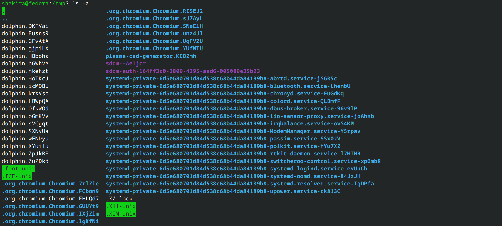
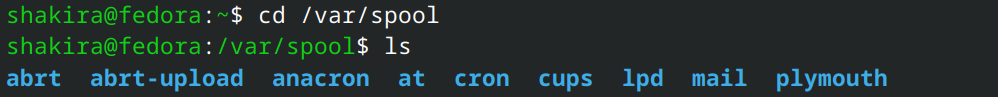
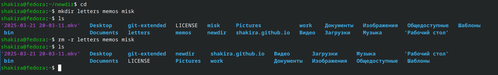
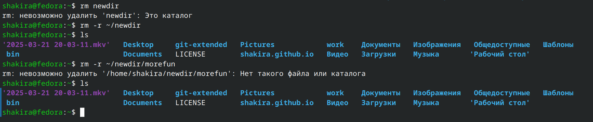
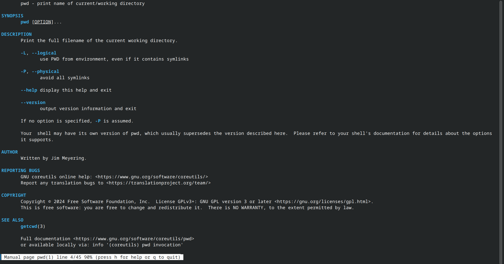
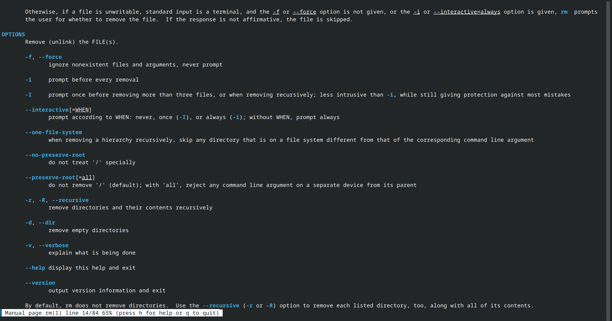
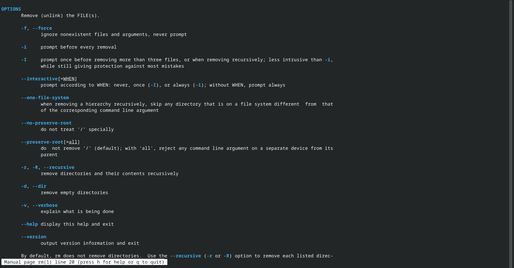

---
## Front matter
title: "Отчёт по лабораторной работе №6"
subtitle: "Операционные системы"
author: "Гасанова Шакира Чингизовна"

## Generic otions
lang: ru-RU
toc-title: "Содержание"

## Bibliography
bibliography: bib/cite.bib
csl: pandoc/csl/gost-r-7-0-5-2008-numeric.csl

## Pdf output format
toc: true # Table of contents
toc-depth: 2
lof: true # List of figures
lot: true # List of tables
fontsize: 12pt
linestretch: 1.5
papersize: a4
documentclass: scrreprt
## I18n polyglossia
polyglossia-lang:
  name: russian
  options:
	- spelling=modern
	- babelshorthands=true
polyglossia-otherlangs:
  name: english
## I18n babel
babel-lang: russian
babel-otherlangs: english
## Fonts
mainfont: PT Serif
romanfont: PT Serif
sansfont: PT Sans
monofont: PT Mono
mainfontoptions: Ligatures=TeX
romanfontoptions: Ligatures=TeX
sansfontoptions: Ligatures=TeX,Scale=MatchLowercase
monofontoptions: Scale=MatchLowercase,Scale=0.9
## Biblatex
biblatex: true
biblio-style: "gost-numeric"
biblatexoptions:
  - parentracker=true
  - backend=biber
  - hyperref=auto
  - language=auto
  - autolang=other*
  - citestyle=gost-numeric
## Pandoc-crossref LaTeX customization
figureTitle: "Рис."
tableTitle: "Таблица"
listingTitle: "Листинг"
lofTitle: "Список иллюстраций"
lotTitle: "Список таблиц"
lolTitle: "Листинги"
## Misc options
indent: true
header-includes:
  - \usepackage{indentfirst}
  - \usepackage{float} # keep figures where there are in the text
  - \floatplacement{figure}{H} # keep figures where there are in the text
---

# Цель работы

Целью данной лабораторной работы является приобретение практических навыков взаимодействия пользователя с системой посредством командной строки.

# Задание

1. Определение полного имени домашнего каталога. Работа с каталогоми /tmp, /var/spool и домашним.
2. Создание каталогов и удаление.
3. Определение опций, набора опций команды ls с помощью команды man.
4. Просмотр описания команд: cd, pwd, mkdir, rmdir, rm.
5. Модификация и исполнение нескольких команд из буфера команд.

# Теоретическое введение

В операционной системе типа Linux взаимодействие пользователя с системой обычно осуществляется с помощью командной строки посредством построчного ввода команд. При этом обычно используется командные интерпретаторы языка shell: /bin/sh; /bin/csh; /bin/ksh. Командой в операционной системе называется записанный по специальным правилам текст (возможно с аргументами), представляющий собой указание на выполнение какой-либо функций (или действий) в операционной системе. Обычно первым словом идёт имя команды, остальной текст — аргументы или опции, конкретизирующие действие. Общий формат команд можно представить следующим образом: <имя_команды><разделитель><аргументы>. Команда man. Команда man используется для просмотра (оперативная помощь) в диалоговом режиме руководства (manual) по основным командам операционной системы типа Linux.
Формат команды:
man <команда>
Пример (вывод информации о команде man):
man man
Для управления просмотром результата выполнения команды man можно использовать следующие клавиши:
– Space — перемещение по документу на одну страницу вперёд;
– Enter — перемещение по документу на одну строку вперёд;
– q — выход из режима просмотра описания.
Команда cd. Команда cd используется для перемещения по файловой системе операционной системы типа Linux.

# Выполнение лабораторной работы

## Определение полного имени домашнего каталога. Работа с каталогоми /tmp, /var/spool и домашним

Определяю полное имя домашнего каталога. Далее относительно этого каталога будут выполняться последующие упражнения. Перехожу в каталог /tmp и вывожу его содержимое (рис. @fig:001).

{#fig:001 width=70%}

Далее использую команду ls с различными опциями. Отображаю имена скрытых файлов с помощью опции a (рис. @fig:002).

{#fig:002 width=70%}

Вывожу на экран подробную информацию о файлах. Для этого использую опцию l (рис. @fig:003).

{#fig:003 width=70%}

Определяю, есть ли в каталоге /var/spool подкаталог с именем cron. В моём случае он есть (рис. @fig:004).

{#fig:004 width=70%}

Перехожу в домашний каталог и вывожу на экран его содержимое. Владельцем файлов и подкаталогов являюсь я (рис. @fig:005).

{#fig:005 width=70%}

## Создание каталогов и удаление

Создаю в домашнем каталоге новый каталог с именем newdir, а затем в нём создаю новый каталог с именем morefun (рис. @fig:006).

{#fig:006 width=70%}

Далее создаю одной командой три новых каталога, после чего удаляю их тоже одной камандой (рис. @fig:007).

{#fig:007 width=70%}

Удаляю ранее созданный каталог ~/newdir и проверяю, что он удалился. Удалите каталог ~/newdir/morefun из домашнего каталога. Проверяю, был ли каталог удалён (рис. @fig:008).

{#fig:008 width=70%}

## Определение опций, набора опций команды ls с помощью команды man

С помощью команды man определяю, какую опцию команды ls нужно использовать для просмотра содержимого не только указанного каталога, но и подкаталогов, входящих в него. С помощью команды man определяю набор опций команды ls, позволяющий отсортировать по времени последнего изменения выводимый список содержимого каталога с развёрнутым описанием файлов (рис. @fig:009).

{#fig:009 width=70%}

Использую команду man для просмотра описания следующих команд: cd, pwd, mkdir, rmdir, rm (рис. @fig:010, рис. @fig:011, рис. @fig:012, рис. @fig:013, рис. @fig:014).

{#fig:010 width=70%}

{#fig:011 width=70%}

{#fig:012 width=70%}

{#fig:013 width=70%}

{#fig:014 width=70%}

## Модификация и исполнение нескольких команд из буфера команд

С помощью команды history получаю информацию о ранних действиях (рис. @fig:015).

{#fig:015 width=70%}

Выполняю модификацию и исполнение нескольких команд из буфера команд (рис. @fig:016, рис. @fig:017).

{#fig:016 width=70%}

{#fig:017 width=70%}

# Выводы

При выполнении данной лабораторной работы я приобрела практические навыки взаимодействия пользователя с системой посредством командной строки.

## Ответы на контрольные вопросы

1. Командная строка - интерфейс пользователя для ввода команд и управления компьютером.
2. Команда pwd (print working directory) позволяет определить абсолютный путь текущего каталога.
3. Команда ls с опцией -l позволяет определить тип файлов и их имена.
4. Команда ls с опцией -a позволяет отобразить информацию о скрытых файлах.
5. Команды rm и rmdir можно использовать для удаления файлов и каталогов соответственно.
6. Команда history позволяет вывести информацию о последних выполненных пользователем командах.
7. Команда ! позволяет воспользоваться историей команд для их модифицированного выполнения.
8. Команды можно запускать в одной строке с помощью ; или &&.
9. Символы экранирования - это символы, которые имеют особое значение в командной строке и должны быть экранированы, чтобы быть восприняты как обычные символы.
10. Вывод информации на экран после выполнения команды ls с опцией l является длинным форматом списка файлов и каталогов, включающим информацию о владельце, группе, размере, время создания и другие данные.
11. Абсолютный путь к файлу - полный путь до файла, относительный путь к файлу - путь до файла, относительно текущего каталога. Пример: абсолютный путь /home/user/файл.txt, относительный путь файл.txt
12. Чтобы получить информацию об интересующей команде, используется команда man с именем команды. Пример: man ls
13. Для автоматического дополнения вводимых команд используется клавиша Tab.

# Список литературы{.unnumbered}

1. Лабораторная работа №6 [Электронный ресурс]
