---
## Front matter
lang: ru-RU
title: Лабораторная работа №7
subtitle: Операционные системы
author:
  - Гасанова Ш. Ч.
institute:
  - Российский университет дружбы народов, Москва, Россия
date: 29 марта 2025

## i18n babel
babel-lang: russian
babel-otherlangs: english

## Formatting pdf
toc: false
toc-title: Содержание
slide_level: 2
aspectratio: 169
section-titles: true
theme: metropolis
header-includes:
 - \metroset{progressbar=frametitle,sectionpage=progressbar,numbering=fraction}
 - '\makeatletter'
 - '\beamer@ignorenonframefalse'
 - '\makeatother'
---

## Цель 

Ознакомление с файловой системой Linux, её структурой, именами и содержанием
каталогов. Приобретение практических навыков по применению команд для работы
с файлами и каталогами, по управлению процессами (и работами), по проверке исполь-
зования диска и обслуживанию файловой системы.

## Задание

1. Выполните все примеры, приведённые в первой части описания лабораторной работы.
2. Выполните следующие действия, зафиксировав в отчёте по лабораторной работе
используемые при этом команды и результаты их выполнения:
  - Скопируйте файл /usr/include/sys/io.h в домашний каталог и назовите его
equipment. Если файла io.h нет, то используйте любой другой файл в каталоге
/usr/include/sys/ вместо него.
  - В домашнем каталоге создайте директорию ~/ski.plases.
  - Переместите файл equipment в каталог ~/ski.plases.
  - Переименуйте файл ~/ski.plases/equipment в ~/ski.plases/equiplist.
  - Создайте в домашнем каталоге файл abc1 и скопируйте его в каталог
~/ski.plases, назовите его equiplist2.
  - Создайте каталог с именем equipment в каталоге ~/ski.plases.
  - Переместите файлы ~/ski.plases/equiplist и equiplist2 в каталог
~/ski.plases/equipment.
  - Создайте и переместите каталог ~/newdir в каталог ~/ski.plases и назовите
его plans.
3. Определите опции команды chmod, необходимые для того, чтобы присвоить перечис-
ленным ниже файлам выделенные права доступа, считая, что в начале таких прав
нет:

## Задание

  - drwxr--r-- ... australia
  - drwx--x--x ... play
  - -r-xr--r-- ... my_os
  - -rw-rw-r-- ... feathers
При необходимости создайте нужные файлы.
4. Проделайте приведённые ниже упражнения, записывая в отчёт по лабораторной
работе используемые при этом команды:
  - Просмотрите содержимое файла /etc/password.
  - Скопируйте файл ~/feathers в файл ~/file.old.
  - Переместите файл ~/file.old в каталог ~/play.
  - Скопируйте каталог ~/play в каталог ~/fun.
  - Переместите каталог ~/fun в каталог ~/play и назовите его games.
  - Лишите владельца файла ~/feathers права на чтение.
  - Что произойдёт, если вы попытаетесь просмотреть файл ~/feathers командой
cat?
  - Что произойдёт, если вы попытаетесь скопировать файл ~/feathers?
  - Дайте владельцу файла ~/feathers право на чтение.
  - Лишите владельца каталога ~/play права на выполнение.
  - Перейдите в каталог ~/play. Что произошло?
  - Дайте владельцу каталога ~/play право на выполнение.
5. Прочитайте man по командам mount, fsck, mkfs, kill и кратко их охарактеризуйте,
приведя примеры.

## Выполнение лабораторной работы

1. Выполним все примеры, приведённые в первой части описания лабораторной работы.

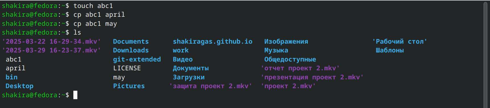{#fig:001 width=70%}

## Выполнение лабораторной работы

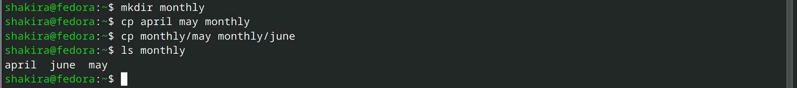{#fig:002 width=70%}

## Выполнение лабораторной работы

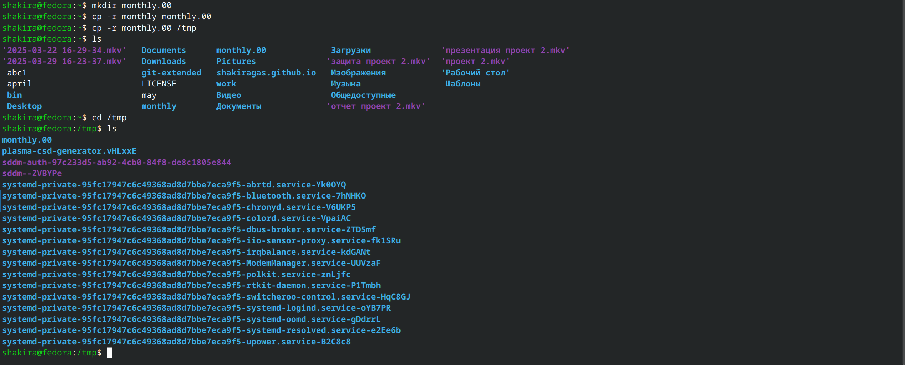{#fig:003 width=70%}

## Выполнение лабораторной работы

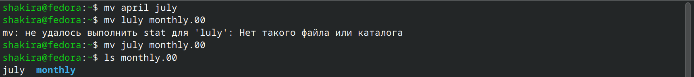{#fig:004 width=70%}

## Выполнение лабораторной работы

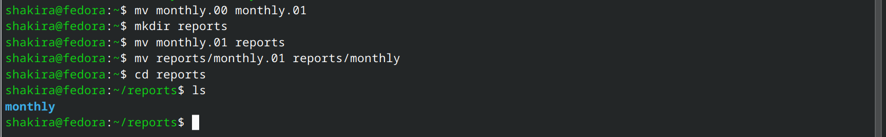{#fig:005 width=70%}

## Выполнение лабораторной работы

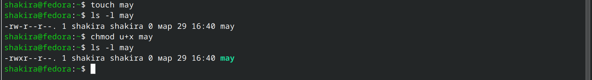{#fig:006 width=70%}

## Выполнение лабораторной работы

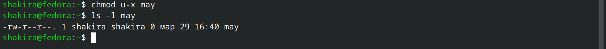{#fig:007 width=70%}

## Выполнение лабораторной работы

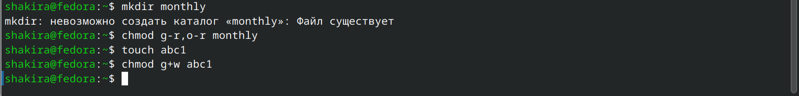{#fig:008 width=70%}

## Выполнение лабораторной работы

2. Скопируем файл /usr/include/sys/io.h в домашний каталог и назовем его equipment.  В домашнем каталоге создадим директорию ~/ski.plases. Переместим файл equipment в каталог ~/ski.plases. Переименуем файл ~/ski.plases/equipment в ~/ski.plases/equiplist. Создадим в домашнем каталоге файл abc1 и скопируем его в каталог ~/ski.plases, назовем его equiplist2. Создадим каталог с именем equipment в каталоге ~/ski.plases. Переместим файлы ~/ski.plases/equiplist и equiplist2 в каталог ~/ski.plases/equipment.  Создадим и переместим каталог ~/newdir в каталог ~/ski.plases и назовем его plans.

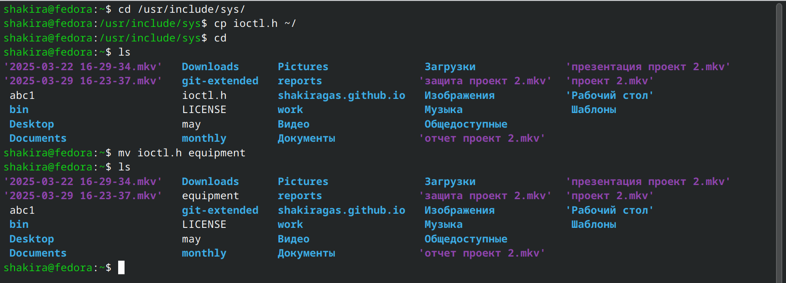{#fig:009 width=70%}

## Выполнение лабораторной работы

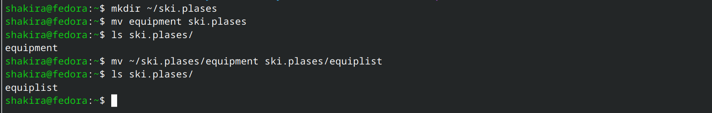{#fig:010 width=70%}

## Выполнение лабораторной работы

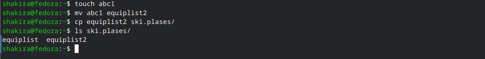{#fig:011 width=70%}

## Выполнение лабораторной работы

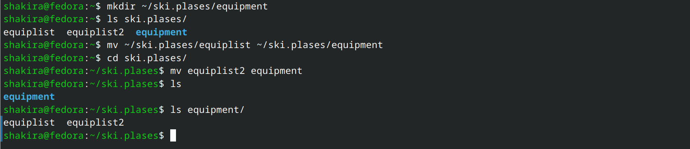{#fig:012 width=70%}

## Выполнение лабораторной работы

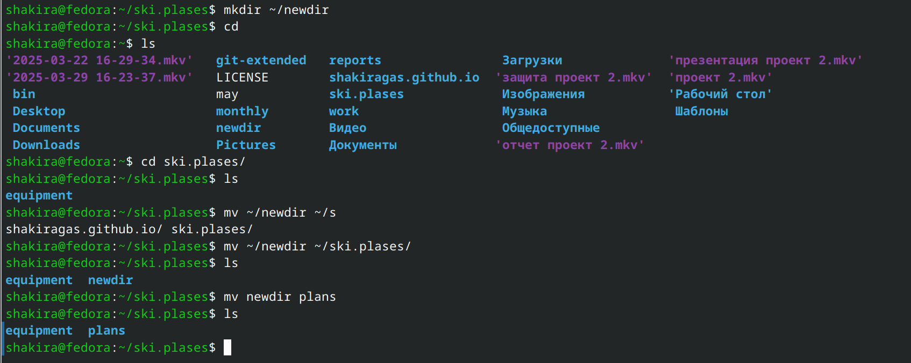{#fig:013 width=70%}

## Выполнение лабораторной работы

3. Изменим права доступа ряду файлов.

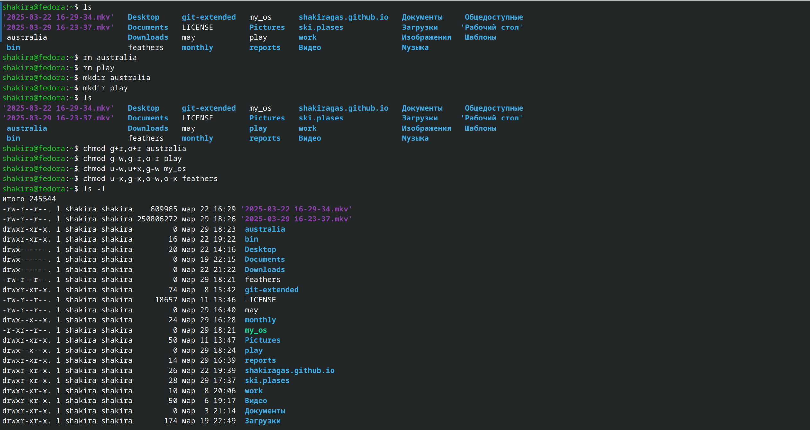{#fig:014 width=70%}

## Выполнение лабораторной работы

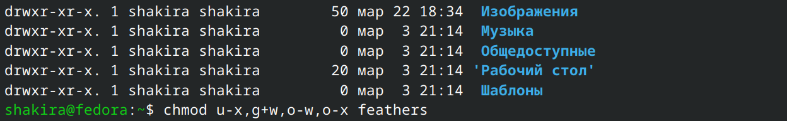{#fig:015 width=70%} 

## Выполнение лабораторной работы

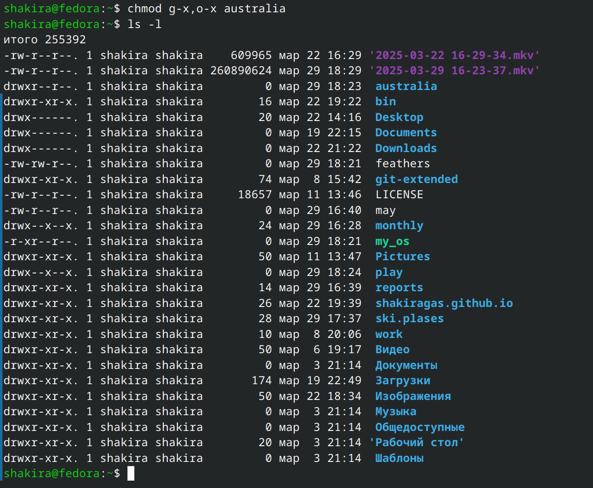{#fig:016 width=70%}

## Выполнение лабораторной работы

4. Просмотрим содержимое файла /etc/password.

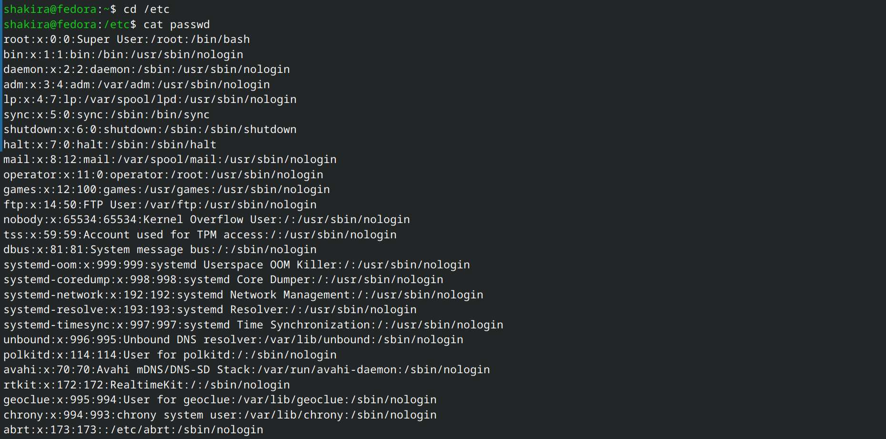{#fig:017 width=70%} 

## Выполнение лабораторной работы

5. Скопируем файл ~/feathers в файл ~/file.old. Переместим файл ~/file.old в каталог ~/play. Скопируем каталог ~/play в каталог ~/fun. Переместим каталог ~/fun в каталог ~/play и назовем его games. Лишим владельца файла ~/feathers права на чтение. Что произойдёт, если вы попытаетесь просмотреть файл ~/feathers командойcat? Отказано в доступе. Что произойдёт, если вы попытаетесь скопировать файл ~/feathers? ОТказано в доствупе. Дадим владельцу файла ~/feathers право на чтение. Лишим владельца каталога ~/play права на выполнение. Перейдем в каталог ~/play. Дадим владельцу каталога ~/play право на выполнение. 

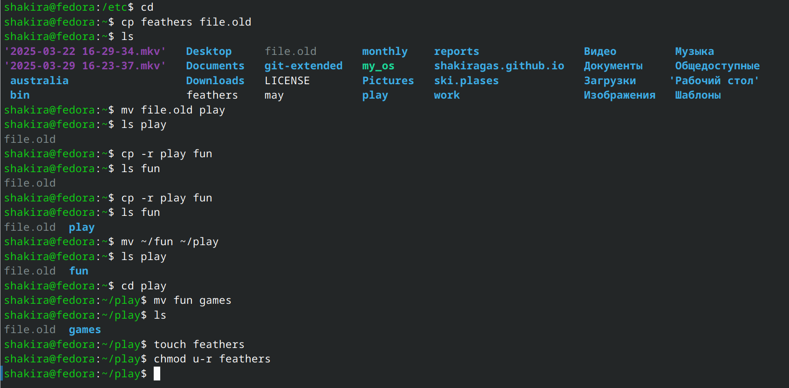{#fig:018 width=70%}

## Выводы

Мы ознакомились с файловой системой Linux, её структурой, именами и содержанием
каталогов. Приобрели практические навыки по применению команд для работы
с файлами и каталогами, по управлению процессами (и работами), по проверке исполь-
зования диска и обслуживанию файловой системы.

## Список литературы

1. Лабораторная работа №7 [Электронный ресурс]
