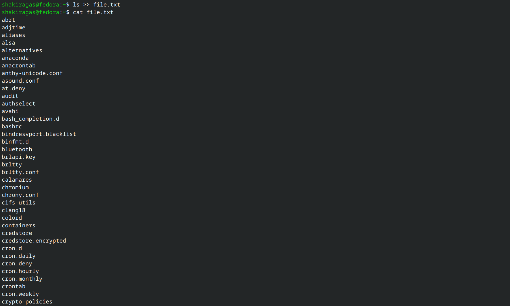
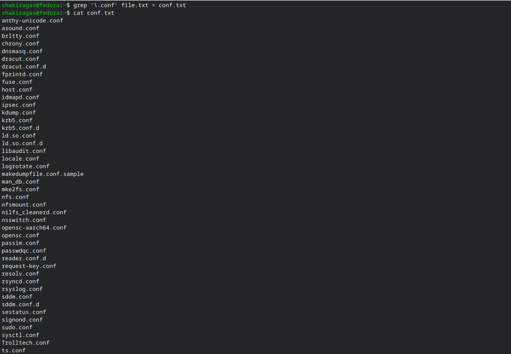
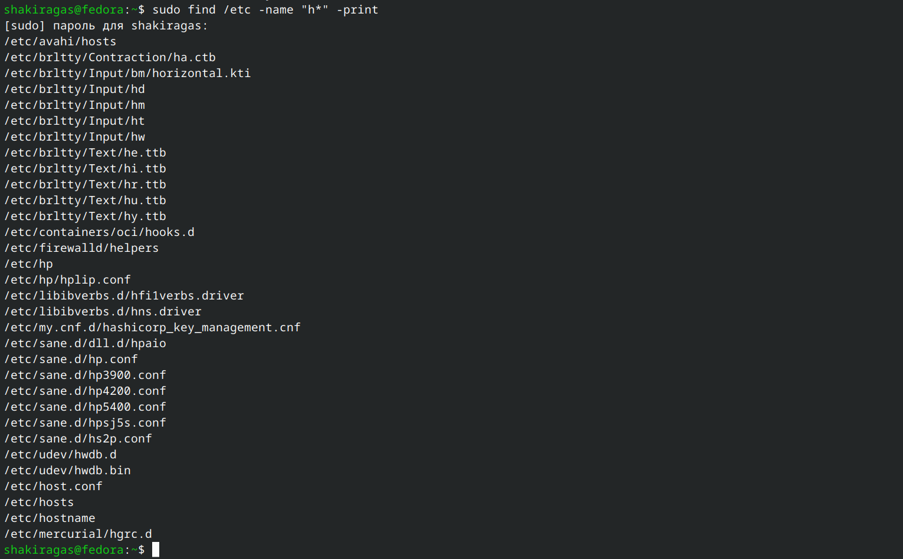
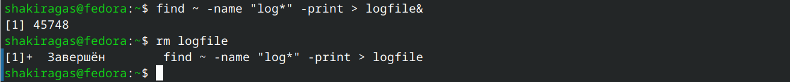
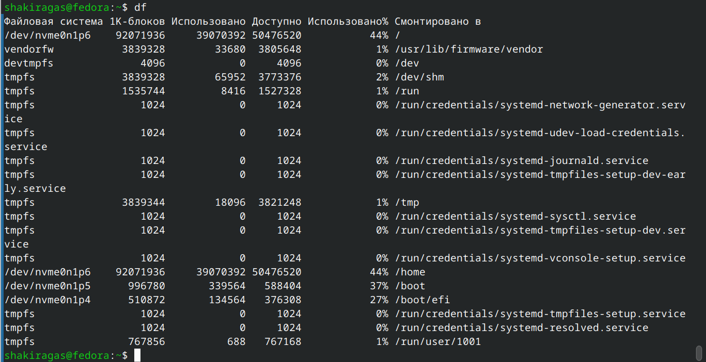
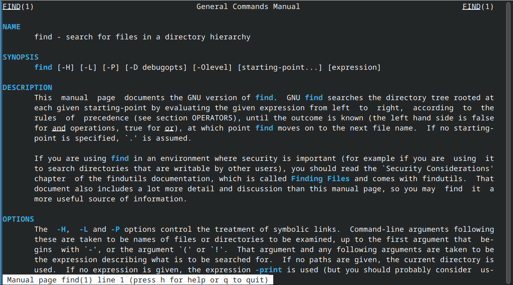
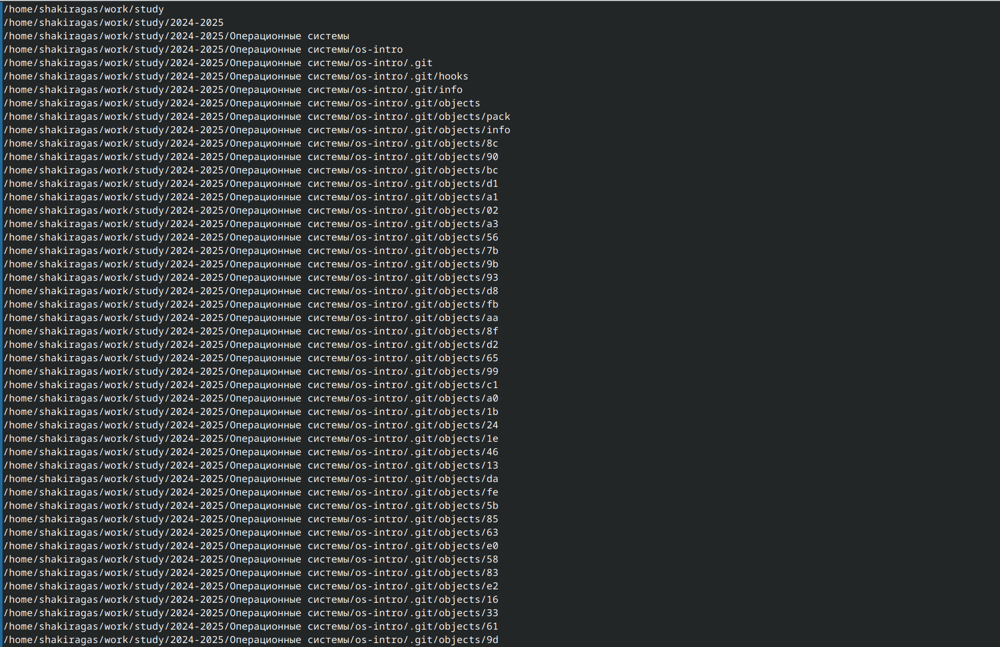

---
## Front matter
lang: ru-RU
title: Лабораторная работа №7
subtitle: Операционные системы
author:
  - Гасанова Ш. Ч.
institute:
  - Российский университет дружбы народов, Москва, Россия
date: 30 марта 2025

## i18n babel
babel-lang: russian
babel-otherlangs: english

## Formatting pdf
toc: false
toc-title: Содержание
slide_level: 2
aspectratio: 169
section-titles: true
theme: metropolis
header-includes:
 - \metroset{progressbar=frametitle,sectionpage=progressbar,numbering=fraction}
 - '\makeatletter'
 - '\beamer@ignorenonframefalse'
 - '\makeatother'
---

## Цель 

Ознакомление с инструментами поиска файлов и фильтрации текстовых данных. Приобретение практических навыков: по управлению процессами (и заданиями), по проверке использования диска и обслуживанию файловых систем.

## Задание

1. Осуществить вход в систему, используя соответствующее имя пользователя. Записать в файл file.txt названия файлов, содержащихся в каталоге /etc. Дописать в этот же файл названия файлов, содержащихся в домашнем каталоге.
2. Вывести имена всех файлов из file.txt, имеющих расширение .conf, после чего записать их в новый текстовой файл conf.txt.
3. Определить, какие файлы в домашнем каталоге имеют имена, начинающиеся с символа c.
4. Вывести на экран (по странично) имена файлов из каталога /etc, начинающиеся с символа h.
5. Запустить в фоновом режиме процесс, который будет записывать в файл ~/logfile файлы, имена которых начинаются с log. Удалить файл ~/logfile.

## Задание

6. Запустить из консоли в фоновом режиме редактор gedit. Определить идентификатор процесса gedit, используя команду ps, конвейер и фильтр grep.
7. Прочесть справку (man) команды kill, после чего использовать её для завершения процесса gedit.
8. Выполнить команды df и du, предварительно получив информацию об этих командах, с помощью команды man.
9. Воспользовавшись справкой команды find, вывести имена всех директорий, имеющихся в домашнем каталоге.

## Выполнение лабораторной работы

Вхожу в систему, используя соответствующее имя пользователя. Записываю в файл file.txt названия файлов, содержащихся в каталоге /etc

{#fig:001 width=70%}

## Выполнение лабораторной работы

Дописываю в этот же файл названия файлов, содержащихся в домашнем каталоге

{#fig:002 width=70%}

## Выполнение лабораторной работы

Вывожу имена всех файлов из file.txt, имеющих расширение .conf

{#fig:003 width=70%}

## Выполнение лабораторной работы

Записываю их в новый текстовой файл conf.txt

{#fig:004 width=70%}

## Выполнение лабораторной работы

Определяю, какие файлы в домашнем каталоге имеют имена, начинающиеся с символа c

{#fig:005 width=70%}

{#fig:006 width=70%}

## Выполнение лабораторной работы

Вывожу на экран (по странично) имена файлов из каталога /etc, начинающиеся с символа h

{#fig:007 width=70%}

## Выполнение лабораторной работы

Запускаю в фоновом режиме процесс, который будет записывать в файл ~/logfile файлы, имена которых начинаются с log. Удаляю файл ~/logfile

{#fig:008 width=70%}

## Выполнение лабораторной работы

Запускаю из консоли в фоновом режиме редактор gedit. Определяю идентификатор процесса gedit, используя команду ps, конвейер и фильтр grep

{#fig:009 width=70%}

## Выполнение лабораторной работы

Читаю справку (man) команды kill

{#fig:010 width=70%}

## Выполнение лабораторной работы

Использую её для завершения процесса gedit

{#fig:011 width=70%}

## Выполнение лабораторной работы

Получаю информацию об командах df и du, с помощью команды man

{#fig:012 width=70%}

## Выполнение лабораторной работы

{#fig:013 width=70%}

## Выполнение лабораторной работы

Выполняю команды df и du

{#fig:014 width=70%}

## Выполнение лабораторной работы

{#fig:015 width=70%} 

## Выполнение лабораторной работы

Смотрю справку команды find

{#fig:016 width=70%}

## Выполнение лабораторной работы

Вывожу имена всех директорий, имеющихся в домашнем каталоге, с помощью команды find ~ -type d

{#fig:017 width=70%} 

## Выводы

При выполнении данной лабораторной работы я ознакомилась с инструментами поиска файлов и фильтрации текстовых данных. Приобрела практические навыки: по управлению процессами (и заданиями), по проверке использования диска и обслуживанию файловых систем.

## Список литературы

1. Лабораторная работа №8 [Электронный ресурс]
