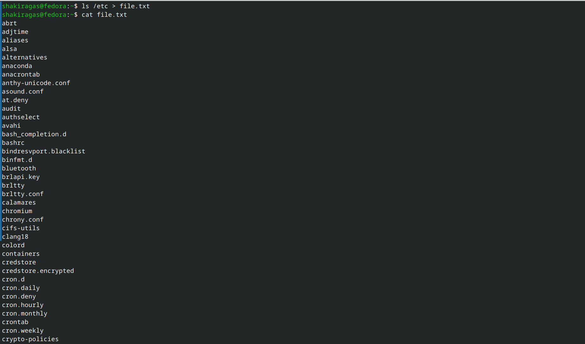
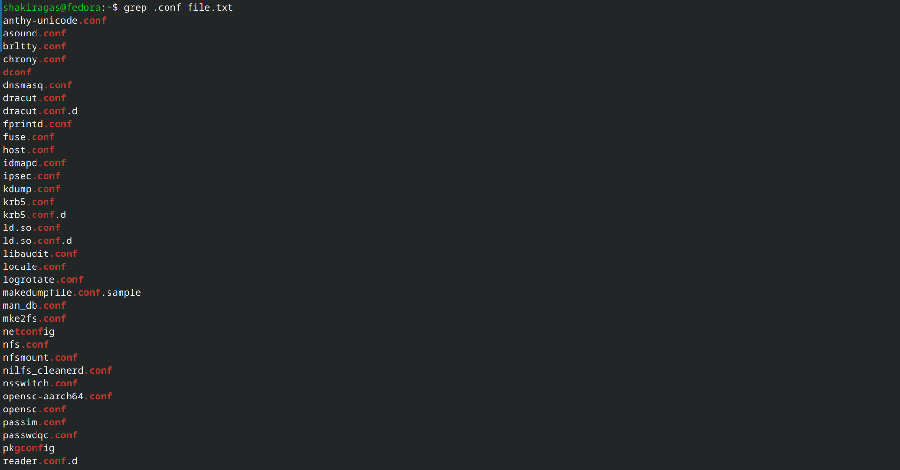
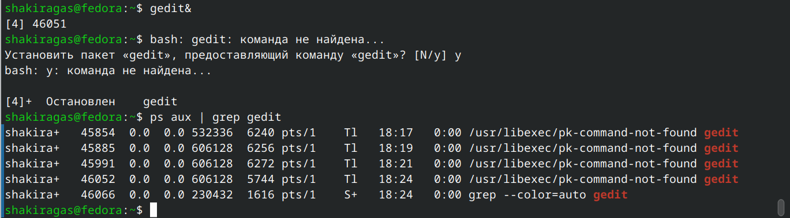
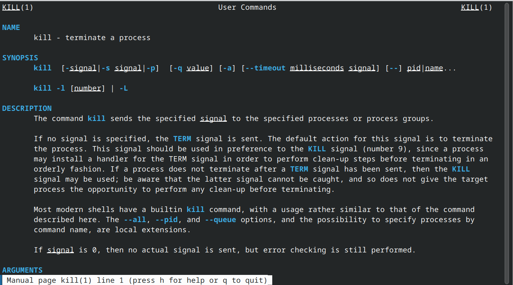
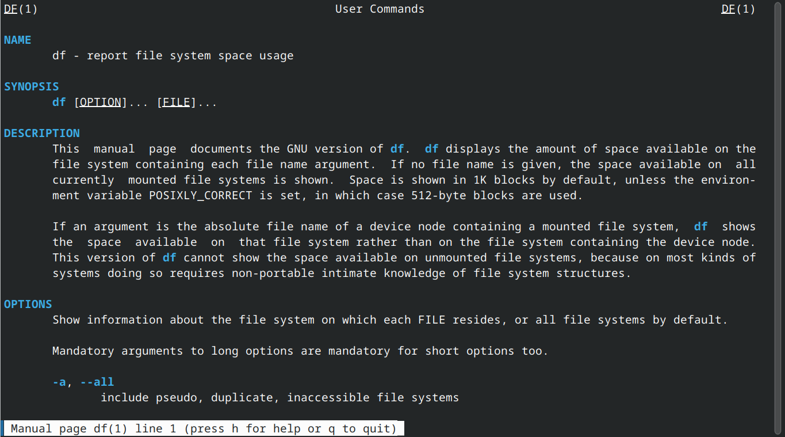
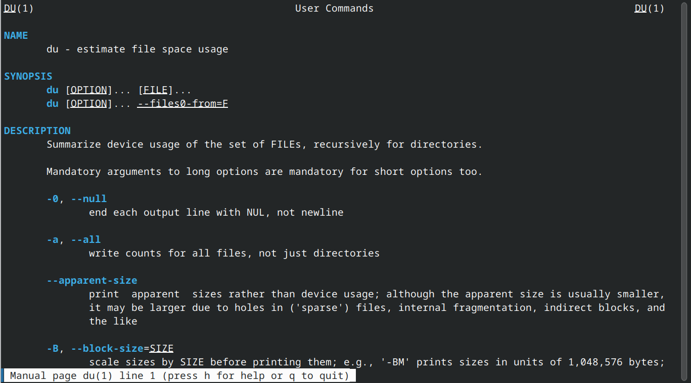
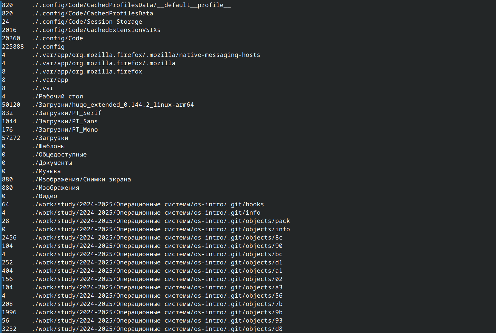

---
## Front matter
title: "Отчёт по лабораторной работе №8"
subtitle: "Операционные системы"
author: "Гасанова Шакира Чингизовна"

## Generic otions
lang: ru-RU
toc-title: "Содержание"

## Bibliography
bibliography: bib/cite.bib
csl: pandoc/csl/gost-r-7-0-5-2008-numeric.csl

## Pdf output format
toc: true # Table of contents
toc-depth: 2
lof: true # List of figures
lot: true # List of tables
fontsize: 12pt
linestretch: 1.5
papersize: a4
documentclass: scrreprt
## I18n polyglossia
polyglossia-lang:
  name: russian
  options:
	- spelling=modern
	- babelshorthands=true
polyglossia-otherlangs:
  name: english
## I18n babel
babel-lang: russian
babel-otherlangs: english
## Fonts
mainfont: PT Serif
romanfont: PT Serif
sansfont: PT Sans
monofont: PT Mono
mainfontoptions: Ligatures=TeX
romanfontoptions: Ligatures=TeX
sansfontoptions: Ligatures=TeX,Scale=MatchLowercase
monofontoptions: Scale=MatchLowercase,Scale=0.9
## Biblatex
biblatex: true
biblio-style: "gost-numeric"
biblatexoptions:
  - parentracker=true
  - backend=biber
  - hyperref=auto
  - language=auto
  - autolang=other*
  - citestyle=gost-numeric
## Pandoc-crossref LaTeX customization
figureTitle: "Рис."
tableTitle: "Таблица"
listingTitle: "Листинг"
lofTitle: "Список иллюстраций"
lotTitle: "Список таблиц"
lolTitle: "Листинги"
## Misc options
indent: true
header-includes:
  - \usepackage{indentfirst}
  - \usepackage{float} # keep figures where there are in the text
  - \floatplacement{figure}{H} # keep figures where there are in the text
---

# Цель 

Ознакомление с инструментами поиска файлов и фильтрации текстовых данных. Приобретение практических навыков: по управлению процессами (и заданиями), по проверке использования диска и обслуживанию файловых систем.

# Задание

1. Осуществить вход в систему, используя соответствующее имя пользователя. Записать в файл file.txt названия файлов, содержащихся в каталоге /etc. Дописать в этот же файл названия файлов, содержащихся в домашнем каталоге.
2. Вывести имена всех файлов из file.txt, имеющих расширение .conf, после чего записать их в новый текстовой файл conf.txt.
3. Определить, какие файлы в домашнем каталоге имеют имена, начинающиеся с символа c.
4. Вывести на экран (по странично) имена файлов из каталога /etc, начинающиеся с символа h.
5. Запустить в фоновом режиме процесс, который будет записывать в файл ~/logfile файлы, имена которых начинаются с log. Удалить файл ~/logfile.
6. Запустить из консоли в фоновом режиме редактор gedit. Определить идентификатор процесса gedit, используя команду ps, конвейер и фильтр grep.
7. Прочесть справку (man) команды kill, после чего использовать её для завершения процесса gedit.
8. Выполнить команды df и du, предварительно получив информацию об этих командах, с помощью команды man.
9. Воспользовавшись справкой команды find, вывести имена всех директорий, имеющихся в домашнем каталоге.

# Теоретическое введение

В системе по умолчанию открыто три специальных потока: – stdin — стандартный поток ввода (по умолчанию: клавиатура), файловый дескриптор 0; – stdout — стандартный поток вывода (по умолчанию: консоль), файловый дескриптор 1; – stderr — стандартный поток вывод сообщений об ошибках (по умолчанию: консоль), файловый дескриптор 2. Большинство используемых в консоли команд и программ записывают результаты своей работы в стандартный поток вывода stdout. Например, команда ls выводит в стан- дартный поток вывода (консоль) список файлов в текущей директории. Потоки вывода и ввода можно перенаправлять на другие файлы или устройства. Проще всего это делается с помощью символов >, >>, <, <<. Конвейер (pipe) служит для объединения простых команд или утилит в цепочки, в ко- торых результат работы предыдущей команды передаётся последующей. Команда find используется для поиска и отображения на экран имён файлов, соответ- ствующих заданной строке символов.

# Выполнение лабораторной работы

Вхожу в систему, используя соответствующее имя пользователя. Записываю в файл file.txt названия файлов, содержащихся в каталоге /etc (рис. @fig:001).

{#fig:001 width=70%}

Дописываю в этот же файл названия файлов, содержащихся в домашнем каталоге (рис. @fig:002).

{#fig:002 width=70%}

Вывожу имена всех файлов из file.txt, имеющих расширение .conf (рис. @fig:003).

{#fig:003 width=70%}

Записываю их в новый текстовой файл conf.txt (рис. @fig:004).

{#fig:004 width=70%}

Определяю, какие файлы в домашнем каталоге имеют имена, начинающиеся с символа c (рис. @fig:005, рис. @fig:006).

{#fig:005 width=70%}

{#fig:006 width=70%}

Вывожу на экран (по странично) имена файлов из каталога /etc, начинающиеся с символа h (рис. @fig:007).

{#fig:007 width=70%}

Запускаю в фоновом режиме процесс, который будет записывать в файл ~/logfile файлы, имена которых начинаются с log. Удаляю файл ~/logfile (рис. @fig:008).

{#fig:008 width=70%}

Запускаю из консоли в фоновом режиме редактор gedit. Определяю идентификатор процесса gedit, используя команду ps, конвейер и фильтр grep (рис. @fig:009).

{#fig:009 width=70%}

Читаю справку (man) команды kill (рис. @fig:010).

{#fig:010 width=70%}

Использую её для завершения процесса gedit (рис. @fig:011).

{#fig:011 width=70%}

Получаю информацию об командах df и du, с помощью команды man (рис. @fig:012, рис. @fig:013).

{#fig:012 width=70%}

{#fig:013 width=70%}

Выполняю команды df и du (рис. @fig:014, рис. @fig:015).

{#fig:014 width=70%}

{#fig:015 width=70%} 

Смотрю справку команды find (рис. @fig:016).

{#fig:016 width=70%}

Вывожу имена всех директорий, имеющихся в домашнем каталоге, с помощью команды find ~ -type d (рис. @fig:017).

{#fig:017 width=70%} 

# Контрольные вопросы

1. В системе по умолчанию открыто три специальных потока: – stdin — стандартный поток ввода (по умолчанию: клавиатура), файловый дескриптор 0; – stdout — стандартный поток вывода (по умолчанию: консоль), файловый дескриптор 1; – stderr — стандартный поток вывод сообщений об ошибках (по умолчанию: консоль), файловый дескриптор 2.

2. Объясните разницу между операцией > и >>. Этот знак > - перенаправление ввода/вывода, а >> - перенаправление в режиме добавления.

3. Конвейер (pipe) служит для объединения простых команд или утилит в цепочки, в которых результат работы предыдущей команды передаётся последующей.

4. Главное отличие между программой и процессом заключается в том, что программа - это набор инструкций, который позволяет ЦПУ выполнять определенную задачу, в то время как процесс - это исполняемая программа.

5. PPID - (parent process ID) идентификатор родительского процесса. Процесс может порождать и другие процессы. UID, GID - реальные идентификаторы пользователя и его группы, запустившего данный процесс.

6. Запущенные фоном программы называются задачами (jobs). Ими можно управлять с помощью команды jobs, которая выводит список запущенных в данный момент задач.

7. Команда htop похожа на команду top по выполняемой функции: они обе показывают информацию о процессах в реальном времени, выводят данные о потреблении системных ресурсов и позволяют искать, останавливать и управлять процессами.

8. У обеих команд есть свои преимущества. Например, в программе htop реализован очень удобный поиск по процессам, а также их фильтрация. В команде top это не так удобно — нужно знать кнопку для вывода функции поиска. Зато в top можно разделять область окна и выводить информацию о процессах в соответствии с разными настройками. В целом top намного более гибкая в настройке отображения процессов.

9. Команда find - это одна из наиболее важных и часто используемых утилит системы Linux. Это команда для поиска файлов и каталогов на основе специальных условий. Ее можно использовать в различных обстоятельствах, например, для поиска файлов по разрешениям, владельцам, группам, типу, размеру и другим подобным критериям. Утилита find предустановлена по умолчанию во всех Linux дистрибутивах, поэтому вам не нужно будет устанавливать никаких дополнительных пакетов. Это очень важная находка для тех, кто хочет использовать командную строку наиболее эффективно. Команда find имеет такой синтаксис: find [папка] [параметры] критерий шаблон [действие] Пример: find /etc -name "p*" -print

10. Можно ли по контексту (содержанию) найти файл? Если да, то как? find / -type f -exec grep -H 'текстДляПоиска' {} ;

11. Определить объем свободной памяти на жёстком диске можно с помощью команды df -h.

12. Определить объем вашего домашнего каталога можно с помощью команды du -s.

13. Удалить зависший процесс млжно с помощью команды kill% номер задачи.

# Выводы

При выполнении данной лабораторной работы я ознакомилась с инструментами поиска файлов и фильтрации текстовых данных. Приобрела практические навыки: по управлению процессами (и заданиями), по проверке использования диска и обслуживанию файловых систем.

# Список литературы

1. Лабораторная работа №8 [Электронный ресурс]
