---
## Front matter
lang: ru-RU
title: Лабораторная работа №9
subtitle: Операционные системы
author:
  - Гасанова Ш. Ч.
institute:
  - Российский университет дружбы народов, Москва, Россия
date: 8 апреля 2025

## i18n babel
babel-lang: russian
babel-otherlangs: english

## Formatting pdf
toc: false
toc-title: Содержание
slide_level: 2
aspectratio: 169
section-titles: true
theme: metropolis
header-includes:
 - \metroset{progressbar=frametitle,sectionpage=progressbar,numbering=fraction}
 - '\makeatletter'
 - '\beamer@ignorenonframefalse'
 - '\makeatother'
---

## Цель 

Освоение основных возможностей командной оболочки Midnight Commander. Приобретение навыков практической работы по просмотру каталогов и файлов; манипуляций с ними.

## Задание

1. Изучить информацию о mc, вызвав в командной строке man mc.
2. Запустить из командной строки mc, изучите его структуру и меню.
3. Выполнить несколько операций в mc, используя управляющие клавиши.
4. Выполните основные команды меню левой (или правой) панели.
5. Используя возможности подменю Файл
    - просмотреть содержимое текстового файла;
    - редактировать содержимое текстового файла (без сохранения результатов редактирования);
    - создать каталог;
    - копировать файлы в созданный каталог.
6. С помощью соответствующих средств подменю Команда
    - сделать поиск в файловой системе файла с заданными условиями;
    - выборать и повторить одной из предыдущих команд;
    - перейти в домашний каталог;
    - проанализировать файл меню и файл расширений.

## Задание

7. Вызвать подменю Настройки. Освоить операции, определяющие структуру экрана mc.
8. Создать текстовой файл text.txt, открыть с помощью mc.
9. Вставить в файл небольшой фрагмент текста, скопированный из любого источника.
10. Проделайте с текстом следующие манипуляции, используя горячие клавиши:
    - Удалить строку текста.
    - Выделить фрагмент текста и скопировать на новую строку.
    - Выделить фрагмент текста и перенести его на новую строку.
    - Сохранить файл.
    - Отменить последнее действие.
    - Перейти в конец файла и написать некоторый текст.
    - Перейти в начало файла и написать некоторый текст.
    - Сохранить и закрыть файл.
11. Открыть файл с исходным текстом на некотором языке программирования (например C или Java)
12. Используя меню редактора, включить подсветку синтаксиса, если она не включена, или выключить, если она включена.

## Выполнение лабораторной работы

Изучаю информацию о mc, вызвав в командной строке man mc

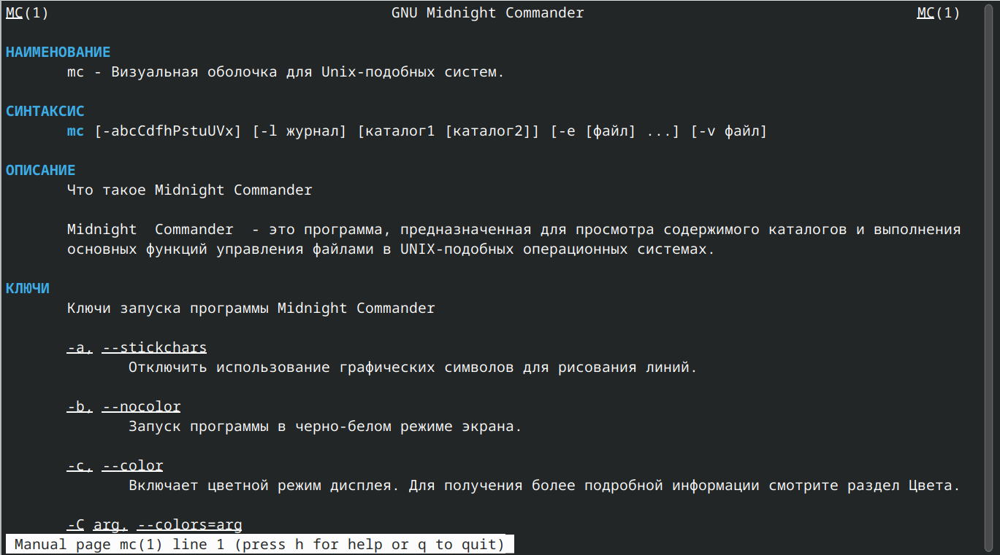{#fig:001 width=70%}

## Выполнение лабораторной работы

Запустить из командной строки mc, выполняю несколько операций в mc, используя управляющие клавиши

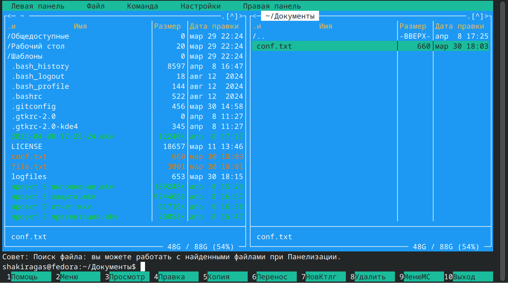{#fig:002 width=70%}

## Выполнение лабораторной работы

{#fig:003 width=70%}

## Выполнение лабораторной работы

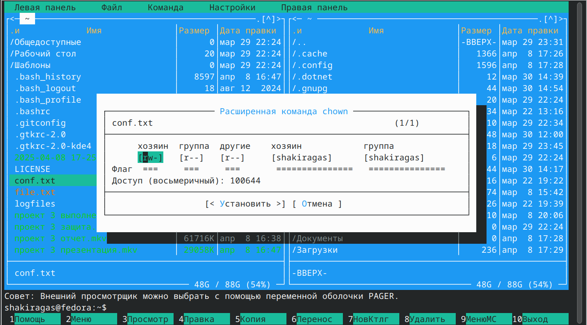{#fig:004 width=70%}

## Выполнение лабораторной работы

Выполняю некоторые команды меню левой панели

{#fig:005 width=70%}

## Выполнение лабораторной работы

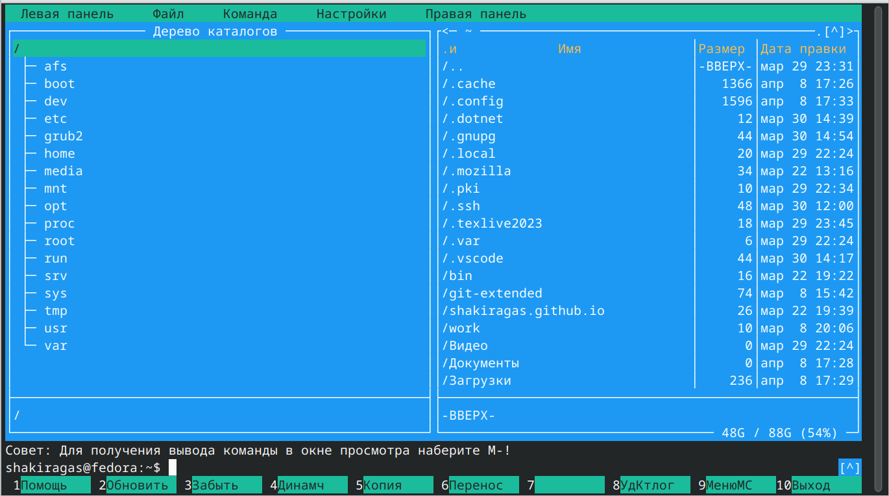{#fig:006 width=70%}

## Выполнение лабораторной работы

Просматриваю содержимое текстового файла 

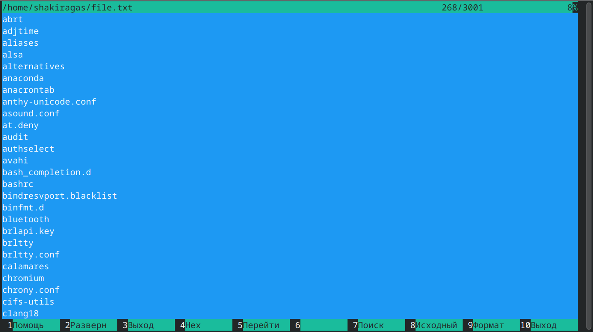{#fig:007 width=70%}

## Выполнение лабораторной работы

Редактирую содержимое текстового файла

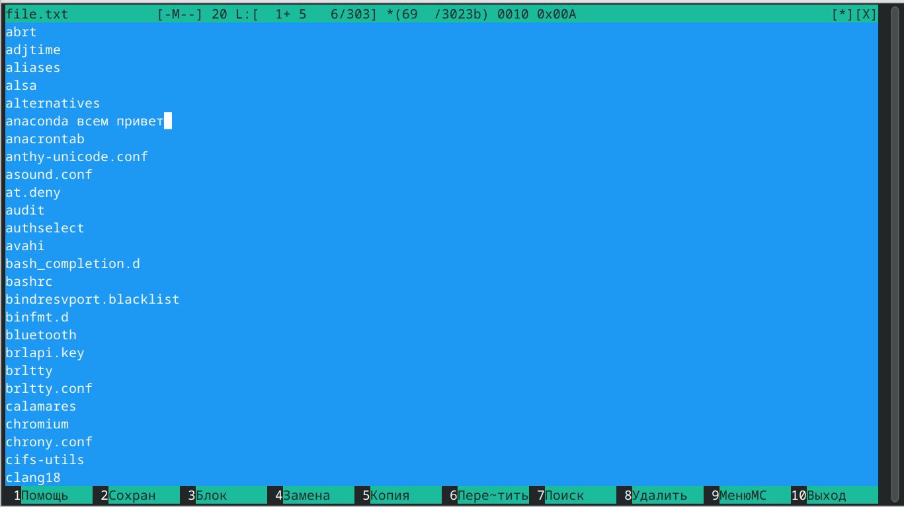{#fig:008 width=70%}

## Выполнение лабораторной работы

Создаю каталог 

{#fig:009 width=70%}

## Выполнение лабораторной работы

Копирую файл в созданный каталог 

{#fig:010 width=70%}

## Выполнение лабораторной работы

Делаю поиск в файловой системе файла с заданными условиями 

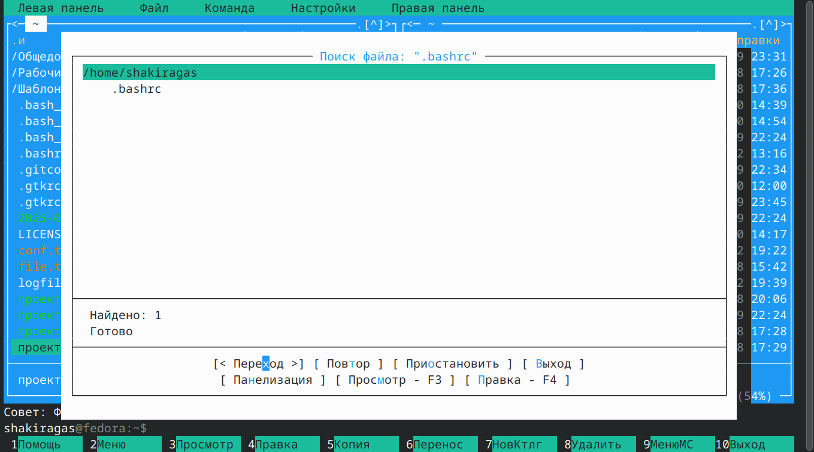{#fig:011 width=70%}

## Выполнение лабораторной работы

Выбираю и повторяю одной из предыдущих команд 

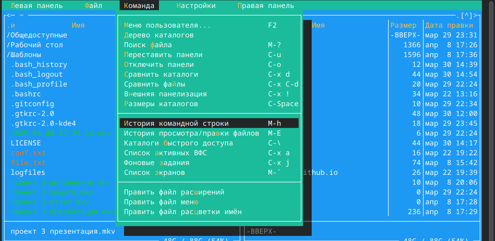{#fig:012 width=70%}

## Выполнение лабораторной работы

Анализирую файл меню и файл расширений 

{#fig:013 width=70%}

## Выполнение лабораторной работы

{#fig:014 width=70%}

## Выполнение лабораторной работы

Вызываю подменю Настройки. Меняю внешний вид экрана mc 

{#fig:015 width=70%} 

## Выполнение лабораторной работы

Создаю файл text.txt, вставляю туда произвольный текст

{#fig:016 width=70%}

## Выполнение лабораторной работы

С помощью горячих клавиш удаляю строку текста

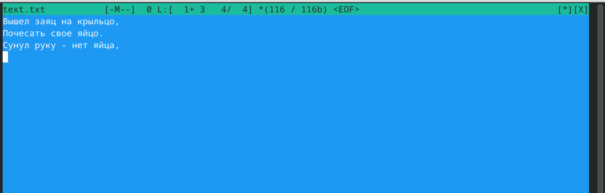{#fig:017 width=70%} 

## Выполнение лабораторной работы

Выделяю фрагмент текста и копирую на новую строку 

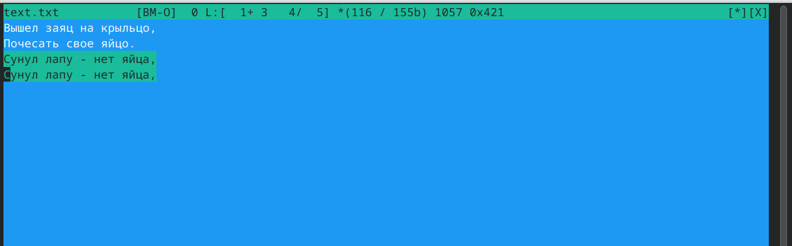{#fig:018 width=70%}

## Выполнение лабораторной работы

Выделяю фрагмент текста и переношу его на новую строку 

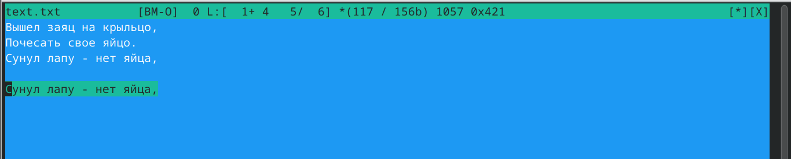{#fig:019 width=70%}

## Выполнение лабораторной работы

Сохраняю файл 

{#fig:020 width=70%}

## Выполнение лабораторной работы

Отменяю последнее действие 

{#fig:021 width=70%}

## Выполнение лабораторной работы

Перехожу в конец файла и пишу текст 

{#fig:022 width=70%}

## Выполнение лабораторной работы

Перехожу в начало файла и пишу текст 

{#fig:023 width=70%}

## Выполнение лабораторной работы

Сохраню и заурываю файл 

{#fig:024 width=70%}

## Выполнение лабораторной работы

Используя меню редактора, выключаю подсветку синтаксиса 

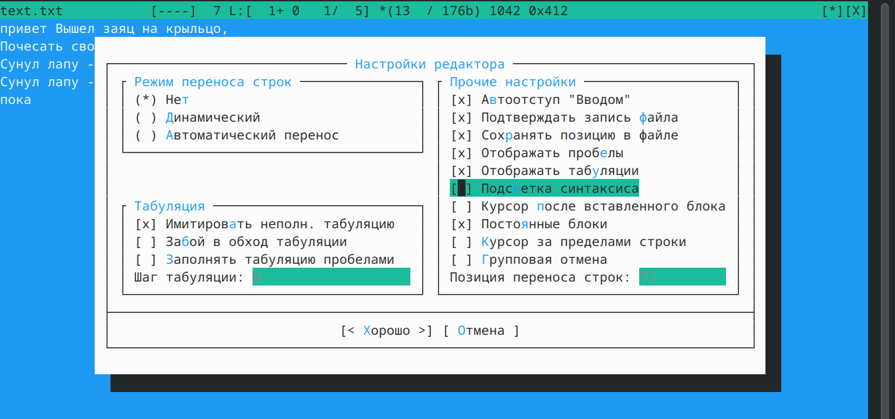{#fig:025 width=70%}

## Выводы

При выполнении данной лабораторной работы я освоила основные возможностей командной оболочки Midnight Commander. Приобрела навыки практической работы по просмотру каталогов и файлов; манипуляций с ними.

## Список литературы

1. Лабораторная работа №9 [Электронный ресурс]

