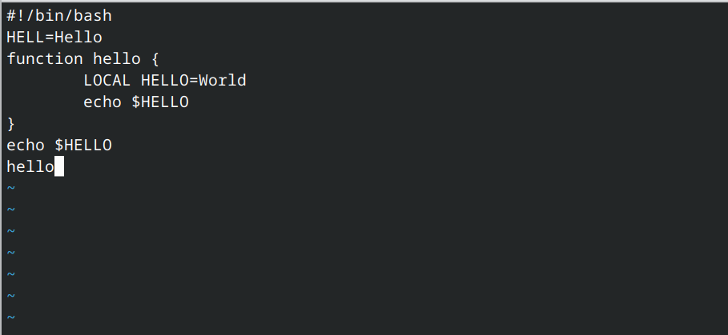
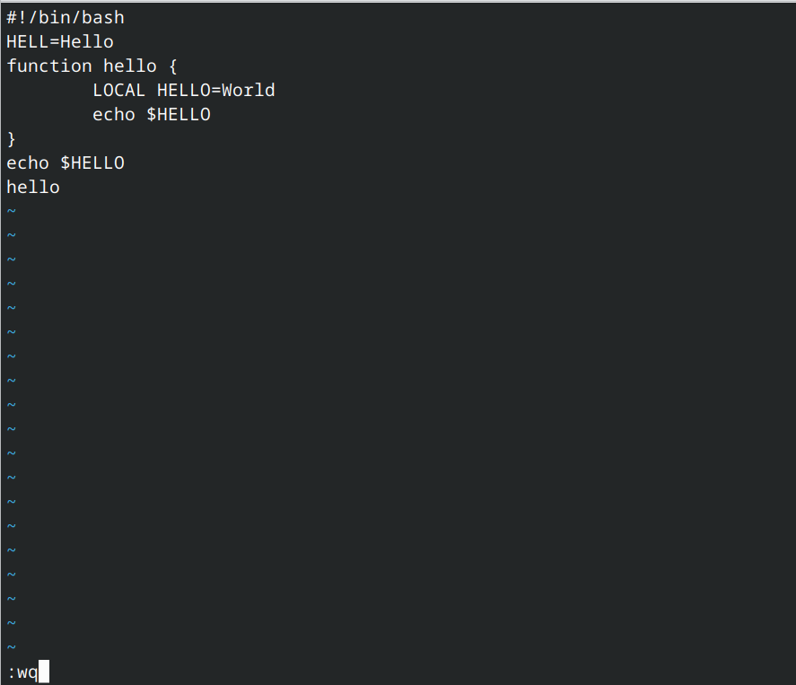
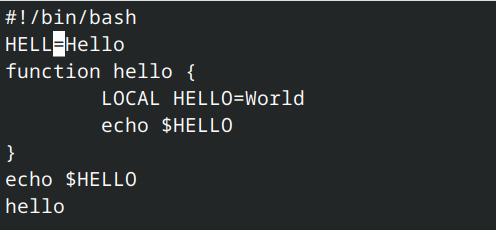
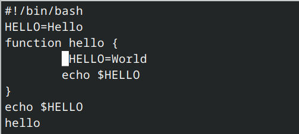
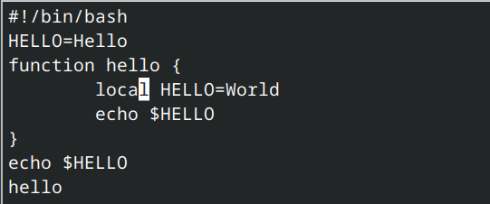
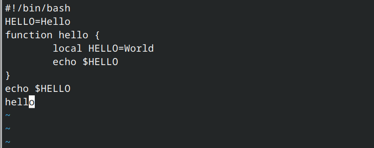
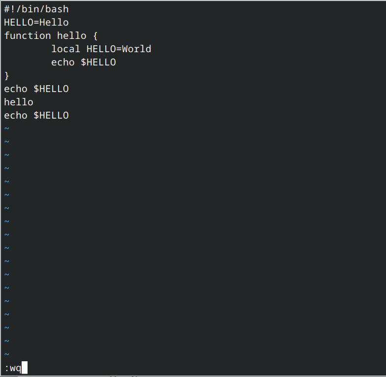

---
## Front matter
lang: ru-RU
title: Лабораторная работа №10
subtitle: Операционные системы
author:
  - Гасанова Ш. Ч.
institute:
  - Российский университет дружбы народов, Москва, Россия
date: 15 апреля 2025

## i18n babel
babel-lang: russian
babel-otherlangs: english

## Formatting pdf
toc: false
toc-title: Содержание
slide_level: 2
aspectratio: 169
section-titles: true
theme: metropolis
header-includes:
 - \metroset{progressbar=frametitle,sectionpage=progressbar,numbering=fraction}
 - '\makeatletter'
 - '\beamer@ignorenonframefalse'
 - '\makeatother'
---

## Цель 

Получить практические навыки работы с редактором vi, установленным по умолчанию практически во всех дистрибутивах.

## Задание

1. Создайть каталог с именем ~/work/os/lab10, перейти в него
2. Вызвать vi и создать файл hello.sh
3. С помощью клавиши i и ввести данный текст
4. Перейти в командный режим с помощью клавиши Esc после завершения ввода текста
5. Перейти в режим последней строки с помощью клавиши :
6. Нажать w (записать) и q (выйти), а затем нажать клавишу Enter для сохранения текста и завершения работы
7. Сделайте файл исполняемым

## Задание

8. Вызвать vi на редактирование файла
9. Установить курсор в конец слова HELL второй строки, заменить на HELLO, вернуться в командный режим
10. Установить курсор на четвертую строку и стереть слово LOCAL, заменить на local, выйти в командный режим
11. Установить курсор на последней строке файла. Вставить следующий текст: echo $HELLO, выйти в командный режим
12. Удалить последнюю строку
13. Отменить последнее действие, перейти в режим последней строки, записать изменения и выйти из редактора

## Выполнение лабораторной работы

Создаю каталог с именем ~/work/os/lab10, перехожу в него. Вызываю vi и создаю файл с именем hello.sh

{#fig:001 width=70%}

## Выполнение лабораторной работы

Запускаю редактор и с помощью клавиши i ввожу следующий текст

{#fig:002 width=70%}

## Выполнение лабораторной работы

Перехожу в командный режим с помощью Esc, перехожу в режим последней строки с помощью : и ввожу wq для записи и выхода из редактора

{#fig:003 width=70%}

## Выполнение лабораторной работы

Делаю файл исполняемым

{#fig:004 width=70%}

## Выполнение лабораторной работы

Снова вызываю vi и устанавливаю курсор в конце слова HELL

{#fig:005 width=70%}

## Выполнение лабораторной работы

Перехожу в режим вставки и заменяю это слово на HELLO

{#fig:006 width=70%}

## Выполнение лабораторной работы

Установливаю курсор на четвертую строку и стираю слово LOCAL

{#fig:007 width=70%}

## Выполнение лабораторной работы

Вместо него пишу local и выхожу в командный режим

{#fig:008 width=70%}

## Выполнение лабораторной работы

Устанавливаю курсор на последней строке файла, перехожу в режим вставки и с помощью клавиши o добавляю новую строку, где пишу echo $HELLO

{#fig:009 width=70%}

## Выполнение лабораторной работы

Удаляю последнюю строку с помощью сочетания клавиш d + $

{#fig:010 width=70%}

## Выполнение лабораторной работы

Отменяю последнее действие с помощью u 

{#fig:011 width=70%}

## Выполнение лабораторной работы

Перехожу в режим последней строки, записываю изменения и выхожу из редактора 

{#fig:012 width=70%}

## Выполнение лабораторной работы

{#fig:013 width=70%}

## Выводы

При выполнении данной лабораторной работы я получила практические навыки работы с редактором vi.

## Список литературы

1. Лабораторная работа №10 [Электронный ресурс]
