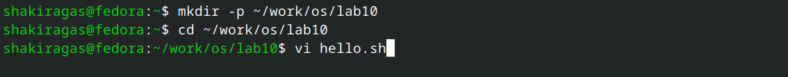
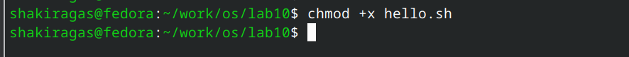
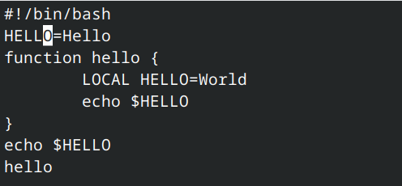
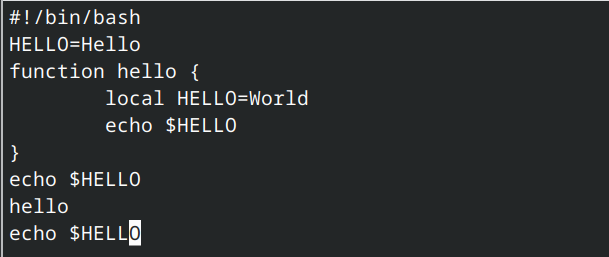
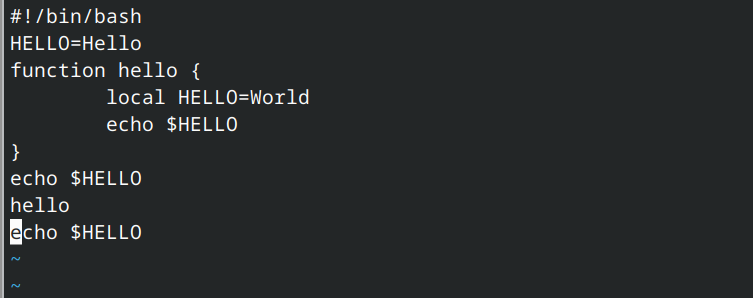
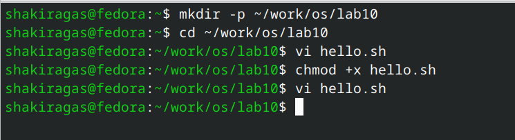

---
## Front matter
title: "Отчёт по лабораторной работе №10"
subtitle: "Операционные системы"
author: "Гасанова Шакира Чингизовна"

## Generic otions
lang: ru-RU
toc-title: "Содержание"

## Bibliography
bibliography: bib/cite.bib
csl: pandoc/csl/gost-r-7-0-5-2008-numeric.csl

## Pdf output format
toc: true # Table of contents
toc-depth: 2
lof: true # List of figures
lot: true # List of tables
fontsize: 12pt
linestretch: 1.5
papersize: a4
documentclass: scrreprt
## I18n polyglossia
polyglossia-lang:
  name: russian
  options:
	- spelling=modern
	- babelshorthands=true
polyglossia-otherlangs:
  name: english
## I18n babel
babel-lang: russian
babel-otherlangs: english
## Fonts
mainfont: PT Serif
romanfont: PT Serif
sansfont: PT Sans
monofont: PT Mono
mainfontoptions: Ligatures=TeX
romanfontoptions: Ligatures=TeX
sansfontoptions: Ligatures=TeX,Scale=MatchLowercase
monofontoptions: Scale=MatchLowercase,Scale=0.9
## Biblatex
biblatex: true
biblio-style: "gost-numeric"
biblatexoptions:
  - parentracker=true
  - backend=biber
  - hyperref=auto
  - language=auto
  - autolang=other*
  - citestyle=gost-numeric
## Pandoc-crossref LaTeX customization
figureTitle: "Рис."
tableTitle: "Таблица"
listingTitle: "Листинг"
lofTitle: "Список иллюстраций"
lotTitle: "Список таблиц"
lolTitle: "Листинги"
## Misc options
indent: true
header-includes:
  - \usepackage{indentfirst}
  - \usepackage{float} # keep figures where there are in the text
  - \floatplacement{figure}{H} # keep figures where there are in the text
---

# Цель 

Получить практические навыки работы с редактором vi, установленным по умолчанию практически во всех дистрибутивах.

# Задание

1. Создайть каталог с именем ~/work/os/lab10, перейти в него
2. Вызвать vi и создать файл hello.sh
3. С помощью клавиши i и ввести данный текст
4. Перейти в командный режим с помощью клавиши Esc после завершения ввода текста
5. Перейти в режим последней строки с помощью клавиши :
6. Нажать w (записать) и q (выйти), а затем нажать клавишу Enter для сохранения текста и завершения работы
7. Сделайте файл исполняемым
8. Вызвать vi на редактирование файла
9. Установить курсор в конец слова HELL второй строки, заменить на HELLO, вернуться в командный режим
10. Установить курсор на четвертую строку и стереть слово LOCAL, заменить на local, выйти в командный режим
11. Установить курсор на последней строке файла. Вставить следующий текст: echo $HELLO, выйти в командный режим
12. Удалить последнюю строку
13. Отменить последнее действие, перейти в режим последней строки, записать изменения и выйти из редактора

# Теоретическое введение

В большинстве дистрибутивов Linux в качестве текстового редактора по умолчанию устанавливается интерактивный экранный редактор vi (Visual display editor). Редактор vi имеет три режима работы:
  - командный режим — предназначен для ввода команд редактирования и навигации по редактируемому файлу;
  - режим вставки — предназначен для ввода содержания редактируемого файла;
  - режим последней (или командной) строки — используется для записи изменений в файл и выхода из редактора.
Для вызова редактора vi необходимо указать команду vi и имя редактируемого файла:
vi <имя_файла>
При этом в случае отсутствия файла с указанным именем будет создан такой файл. Переход в командный режим осуществляется нажатием клавиши Esc . Для выхода из редактора vi необходимо перейти в режим последней строки: находясь в командном режиме, нажать Shift-; (по сути символ : — двоеточие), затем:
  - набрать символы wq, если перед выходом из редактора требуется записать изменения в файл;
  - набрать символ q (или q!), если требуется выйти из редактора без сохранения.
Замечание. Следует помнить, что vi различает прописные и строчные буквы при наборе (восприятии) команд.

# Выполнение лабораторной работы

Создаю каталог с именем ~/work/os/lab10, перехожу в него. Вызываю vi и создаю файл с именем hello.sh (рис. @fig:001).

{#fig:001 width=70%}

Запускаю редактор и с помощью клавиши i ввожу следующий текст (рис. @fig:002).

{#fig:002 width=70%}

Перехожу в командный режим с помощью Esc, перехожу в режим последней строки с помощью : и ввожу wq для записи и выхода из редактора (рис. @fig:003).

{#fig:003 width=70%}

Делаю файл исполняемым (рис. @fig:004).

{#fig:004 width=70%}

Снова вызываю vi и устанавливаю курсор в конце слова HELL (рис. @fig:005).

{#fig:005 width=70%}

Перехожу в режим вставки и заменяю это слово на HELLO (рис. @fig:006).

{#fig:006 width=70%}

Установливаю курсор на четвертую строку и стираю слово LOCAL (рис. @fig:007).

{#fig:007 width=70%}

Вместо него пишу local и выхожу в командный режим (рис. @fig:008).

{#fig:008 width=70%}

Устанавливаю курсор на последней строке файла, перехожу в режим вставки и с помощью клавиши o добавляю новую строку, где пишу echo $HELLO (рис. @fig:009).

{#fig:009 width=70%}

Удаляю последнюю строку с помощью сочетания клавиш d$ (рис. @fig:010).

{#fig:010 width=70%}

Отменяю последнее действие с помощью u (рис. @fig:011).

{#fig:011 width=70%}

Перехожу в режим последней строки, записываю изменения и выхожу из редактора (рис. @fig:012, рис. @fig:013).

{#fig:012 width=70%}

{#fig:013 width=70%}

# Контрольные вопросы

1.Командный режим — предназначен для ввода команд редактирования и навигации по редактируемому файлу;
Режим вставки — предназначен для ввода содержания редактируемого файла;
Режим последней (или командной) строки — используется для записи изменений в файл и выхода из редактора.

2. Как выйти из редактора, не сохраняя произведённые изменения?
Можно нажимать символ q (или q!), если требуется выйти из редактора без сохранения.

3. Назовите и дайте краткую характеристику командам позиционирования.
0 (ноль) — переход в начало строки;
$ — переход в конец строки;
G — переход в конец файла;
n G — переход на строку с номером n.

4. Что для редактора vi является словом?
Редактор vi предполагает, что слово - это строка символов, которая может включать в себя буквы, цифры и символы подчеркивания.

5. Каким образом из любого места редактируемого файла перейти в начало (конец) файла?
С помощью G — переход в конец файла

6. Назовите и дайте краткую характеристику основным группам команд редактирования.
Вставка текста – а — вставить текст после курсора; – А — вставить текст в конец строки; – i — вставить текст перед курсором; – n i — вставить текст n раз; – I — вставить текст в начало строки.
Вставка строки – о — вставить строку под курсором; – О — вставить строку над курсором.
Удаление текста – x — удалить один символ в буфер; – d w — удалить одно слово в буфер; – d $ — удалить в буфер текст от курсора до конца строки; – d 0 — удалить в буфер текст от начала строки до позиции курсора; – d d — удалить в буфер одну строку; – n d d — удалить в буфер n строк.
Отмена и повтор произведённых изменений – u — отменить последнее изменение; – . — повторить последнее изменение.
Копирование текста в буфер – Y — скопировать строку в буфер; – n Y — скопировать n строк в буфер; – y w — скопировать слово в буфер.
Вставка текста из буфера – p — вставить текст из буфера после курсора; – P — вставить текст из буфера перед курсором.
Замена текста – c w — заменить слово; – n c w — заменить n слов; – c $ — заменить текст от курсора до конца строки; – r — заменить слово; – R — заменить текст.
Поиск текста – / текст — произвести поиск вперёд по тексту указанной строки символов текст; – ? текст — произвести поиск назад по тексту указанной строки символов текст.

7. Необходимо заполнить строку символами $. Каковы ваши действия?
Перейти в режим вставки.

8. Как отменить некорректное действие, связанное с процессом редактирования?
С помощью u — отменить последнее изменение

9. Назовите и дайте характеристику основным группам команд режима последней строки.
Режим последней строки — используется для записи изменений в файл и выхода из редактора.

10. Как определить, не перемещая курсора, позицию, в которой заканчивается строка?
$ — переход в конец строки

11. Выполните анализ опций редактора vi (сколько их, как узнать их назначение и т.д.).
Опции редактора vi позволяют настроить рабочую среду. Для задания опций используется команда set (в режиме последней строки): – : set all — вывести полный список опций; – : set nu — вывести номера строк; – : set list — вывести невидимые символы; – : set ic — не учитывать при поиске, является ли символ прописным или строчным.

12. Как определить режим работы редактора vi?

В редакторе vi есть два основных режима: командный режим и режим вставки. По умолчанию работа начинается в командном режиме. В режиме вставки клавиатура используется для набора текста. Для выхода в командный режим используется клавиша Esc или комбинация Ctrl + c .

13. Переключение между режимами
- Esc для выхода в командный.
- i, a, o для входа в режим вставки. 
- R для режима замены.
- : для последовательного режима.

# Выводы

При выполнении данной лабораторной работы я получила практические навыки работы с редактором vi.

# Список литературы

1. Лабораторная работа №10 [Электронный ресурс]
