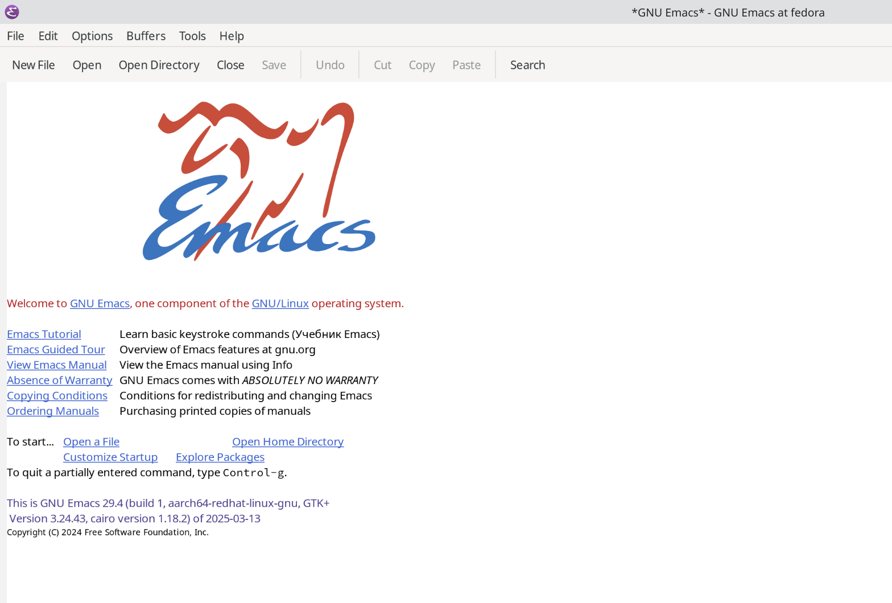
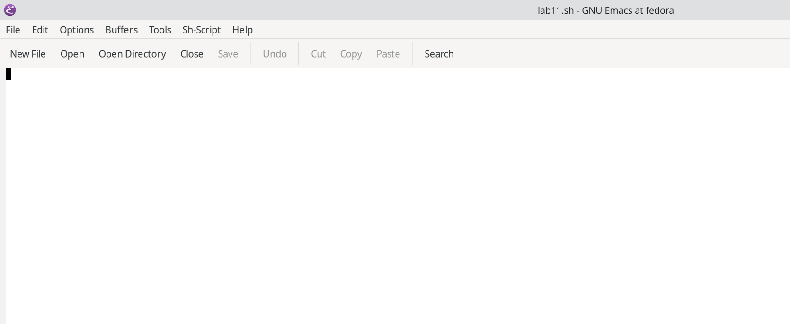
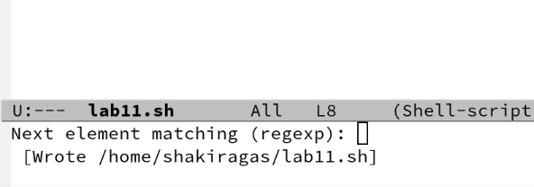
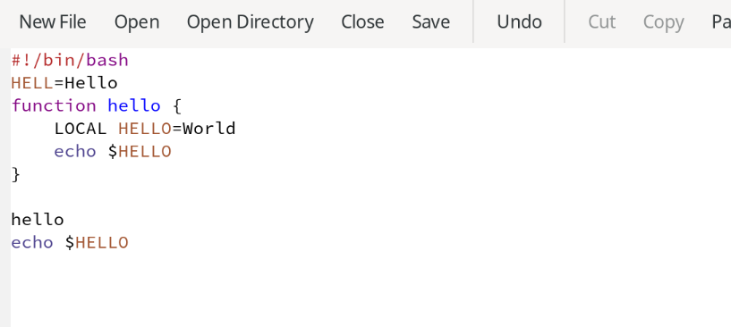
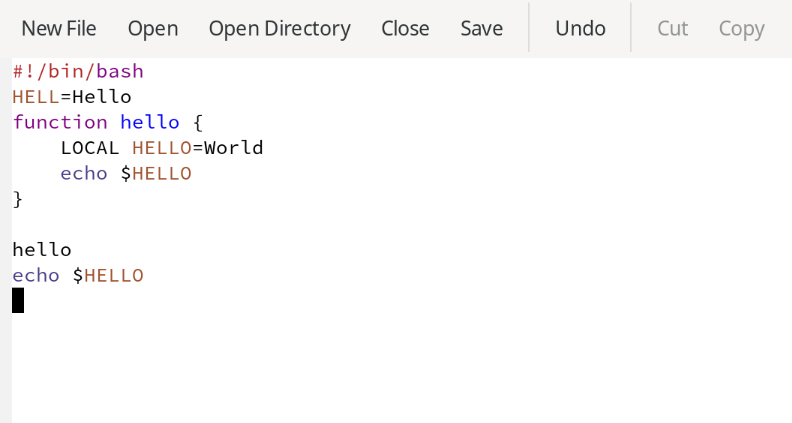
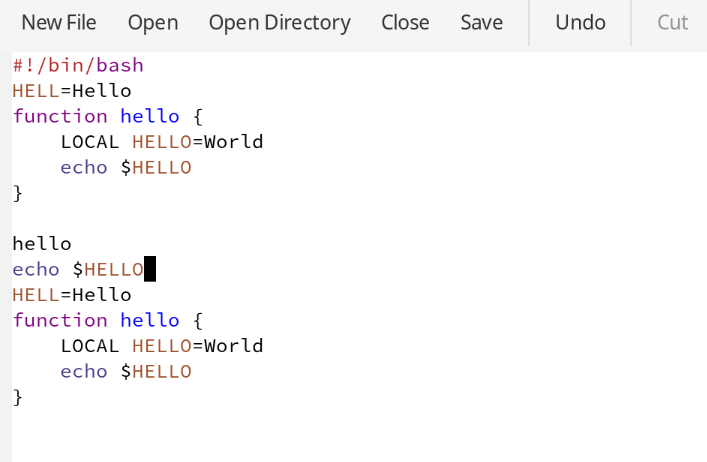
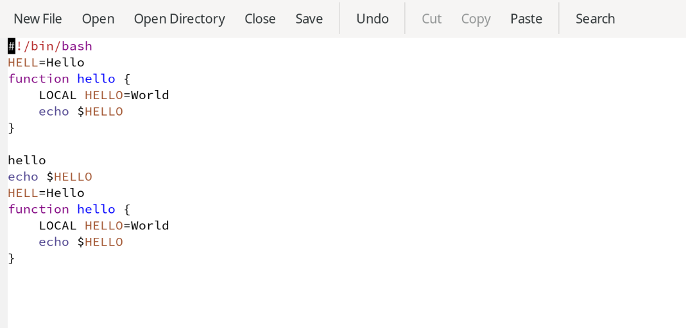
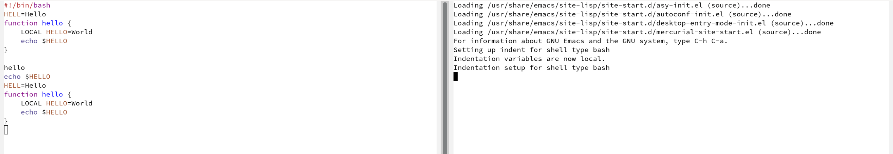
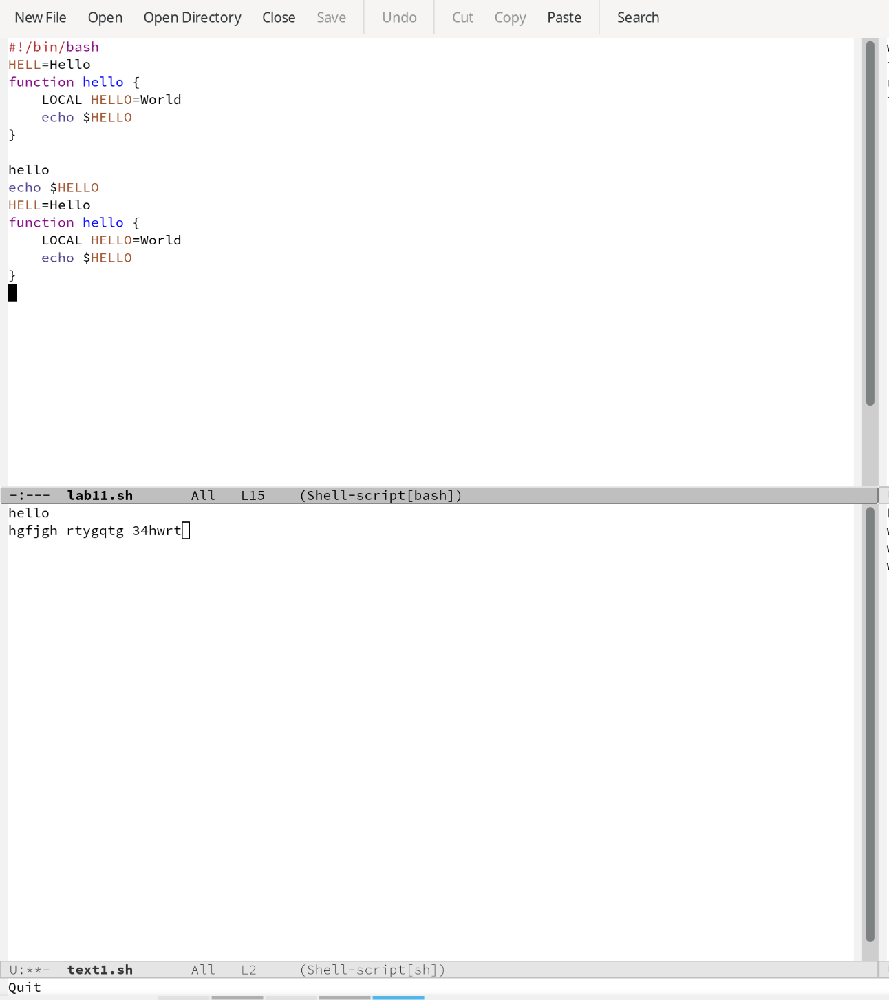
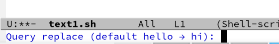

---
## Front matter
lang: ru-RU
title: Лабораторная работа №11
subtitle: Операционные системы
author:
  - Гасанова Ш. Ч.
institute:
  - Российский университет дружбы народов, Москва, Россия
date: 24 апреля 2025

## i18n babel
babel-lang: russian
babel-otherlangs: english

## Formatting pdf
toc: false
toc-title: Содержание
slide_level: 2
aspectratio: 169
section-titles: true
theme: metropolis
header-includes:
 - \metroset{progressbar=frametitle,sectionpage=progressbar,numbering=fraction}
 - '\makeatletter'
 - '\beamer@ignorenonframefalse'
 - '\makeatother'
---

## Цель 

Получить практические навыки работы с редактором Emacs.

## Задание

1. Открыть emacs и создать файл lab11.sh с помощью комбинации Ctrl-x Ctrl-f
2. Набрать данный текст
3. Сохранить файл с помощью комбинации Ctrl-x Ctrl-s (C-x C-s).
4. Проделать с текстом стандартные процедуры редактирования
5. Научиться использовать команды по перемещению курсора
6. Осуществить команды по управлению буферами
7. Осуществить команды по управлению окнами
8. Освоить режим поиска

## Выполнение лабораторной работы

Открываю emacs и создаю файл lab11.sh с помощью комбинации Ctrl-x Ctrl-f

{#fig:001 width=70%}

## Выполнение лабораторной работы

{#fig:002 width=70%}

## Выполнение лабораторной работы

Ввожу текст 

{#fig:003 width=70%}

## Выполнение лабораторной работы

Сохраняю файл с помощью комбинации Ctrl-x Ctrl-s

{#fig:004 width=70%}

## Выполнение лабораторной работы

Вырезаю с помощью C-k целую строку и вставляю эту строку в конец файла (C-y) 

{#fig:005 width=70%}

## Выполнение лабораторной работы

Выделяю область текста (C-space) и копирую в буфер обмена (M-w) 

{#fig:006 width=70%}

## Выполнение лабораторной работы

Вставляю текст в конец файла 

{#fig:007 width=70%}

## Выполнение лабораторной работы

Снова выделяю эту область и на этот раз вырезаю её (C-w) 

{#fig:008 width=70%}

## Выполнение лабораторной работы

Отменяю последнее действие (C-/)

{#fig:009 width=70%}

## Выполнение лабораторной работы

Перемещаю курсор в начало строки (C-a)

{#fig:010 width=70%}

## Выполнение лабораторной работы

Перемещаю курсор в конец строки (C-e) 

{#fig:011 width=70%}

## Выполнение лабораторной работы

Перемещаю курсор в начало текста (M-<) 

{#fig:012 width=70%}

## Выполнение лабораторной работы

Перемещаю курсор в конец текста (M->) 

{#fig:013 width=70%}

## Выполнение лабораторной работы

Вывожу список активных буферов на экран (C-x C-b) 

{#fig:014 width=70%}

## Выполнение лабораторной работы

Перемещаюсь во вновь открытое окно (C-x) со списком открытых буферов и переключаюсь на другой буфер. Закрываю окно (C-x 0) 

{#fig:015 width=70%}

## Выполнение лабораторной работы

Делю фрейм на 4 части 

{#fig:016 width=70%}

## Выполнение лабораторной работы

В каждом из четырёх созданных окон открываю новый буфер и ввожу несколько строк текста 

{#fig:017 width=70%}

## Выполнение лабораторной работы

Переключаюсь в режим поиска (C-s) и нахожу несколько слов, присутствующих в тексте 

{#fig:018 width=70%}

## Выполнение лабораторной работы

Нажимая C-s, переключаюсь между результатами поиска 

{#fig:019 width=70%}

## Выполнение лабораторной работы

Выхожу из режима поиска, нажав C-g 

{#fig:020 width=70%}

## Выполнение лабораторной работы

Перехожу в режим поиска и замены (M-%), ввожу текст, который следует найти и заменить, нажимаю Enter, ввожу текст для замены. После того как будут подсвечены результаты поиска, нажимаю ! для подтверждения замены 

{#fig:021 width=70%}

## Выполнение лабораторной работы

Пробую другой режим поиска, нажав M-s 

{#fig:022 width=70%}

## Выводы

При выполнении данной лабораторной работы я получила практические навыки работы с редактором Emacs.

## Список литературы

1. Лабораторная работа №11 [Электронный ресурс]
