---
## Front matter
title: "Отчёт по лабораторной работе №11"
subtitle: "Операционные системы"
author: "Гасанова Шакира Чингизовна"

## Generic otions
lang: ru-RU
toc-title: "Содержание"

## Bibliography
bibliography: bib/cite.bib
csl: pandoc/csl/gost-r-7-0-5-2008-numeric.csl

## Pdf output format
toc: true # Table of contents
toc-depth: 2
lof: true # List of figures
lot: true # List of tables
fontsize: 12pt
linestretch: 1.5
papersize: a4
documentclass: scrreprt
## I18n polyglossia
polyglossia-lang:
  name: russian
  options:
	- spelling=modern
	- babelshorthands=true
polyglossia-otherlangs:
  name: english
## I18n babel
babel-lang: russian
babel-otherlangs: english
## Fonts
mainfont: PT Serif
romanfont: PT Serif
sansfont: PT Sans
monofont: PT Mono
mainfontoptions: Ligatures=TeX
romanfontoptions: Ligatures=TeX
sansfontoptions: Ligatures=TeX,Scale=MatchLowercase
monofontoptions: Scale=MatchLowercase,Scale=0.9
## Biblatex
biblatex: true
biblio-style: "gost-numeric"
biblatexoptions:
  - parentracker=true
  - backend=biber
  - hyperref=auto
  - language=auto
  - autolang=other*
  - citestyle=gost-numeric
## Pandoc-crossref LaTeX customization
figureTitle: "Рис."
tableTitle: "Таблица"
listingTitle: "Листинг"
lofTitle: "Список иллюстраций"
lotTitle: "Список таблиц"
lolTitle: "Листинги"
## Misc options
indent: true
header-includes:
  - \usepackage{indentfirst}
  - \usepackage{float} # keep figures where there are in the text
  - \floatplacement{figure}{H} # keep figures where there are in the text
---

# Цель 

Получить практические навыки работы с редактором Emacs.

# Задание

1. Открыть emacs и создать файл lab11.sh с помощью комбинации Ctrl-x Ctrl-f
2. Набрать данный текст
3. Сохранить файл с помощью комбинации Ctrl-x Ctrl-s (C-x C-s).
4. Проделать с текстом стандартные процедуры редактирования
5. Научиться использовать команды по перемещению курсора
6. Осуществить команды по управлению буферами
7. Осуществить команды по управлению окнами
8. Освоить режим поиска

# Теоретическое введение

Буфер — объект, представляющий какой-либо текст. Буфер может содержать что угодно, например, результаты компиляции программы или встроенные подсказки. Практически всё взаимодействие с пользователем, в том числе интерактивное, происходит посредством буферов. Фрейм соответствует окну в обычном понимании этого слова. Каждый фрейм содержит область вывода и одно или несколько окон Emacs. 
Окно — прямоугольная область фрейма, отображающая один из буферов. Каждое окно имеет свою строку состояния, в которой выводится следующая информация: название буфера, его основной режим, изменялся ли текст буфера и как далеко вниз по буферу расположен курсор. Каждый буфер находится только в одном из возможных основных режимов. Существующие основные режимы включают режим Fundamental (наименее специализированный), режим Text, режим Lisp, режим С, режим Texinfo и другие. Под второстепенными режимами понимается список режимов, которые включены в данный момент в буфере выбранного окна.
Область вывода — одна или несколько строк внизу фрейма, в которой Emacs выводит различные сообщения, а также запрашивает подтверждения и дополнительную информацию от пользователя.
Минибуфер используется для ввода дополнительной информации и всегда отображается в области вывода. Точка вставки — место вставки (удаления) данных в буфере.

# Выполнение лабораторной работы

Открываю emacs и создаю файл lab11.sh с помощью комбинации Ctrl-x Ctrl-f(рис. @fig:001, рис. @fig:002).

{#fig:001 width=70%}

{#fig:002 width=70%}

Ввожу текст (рис. @fig:003).

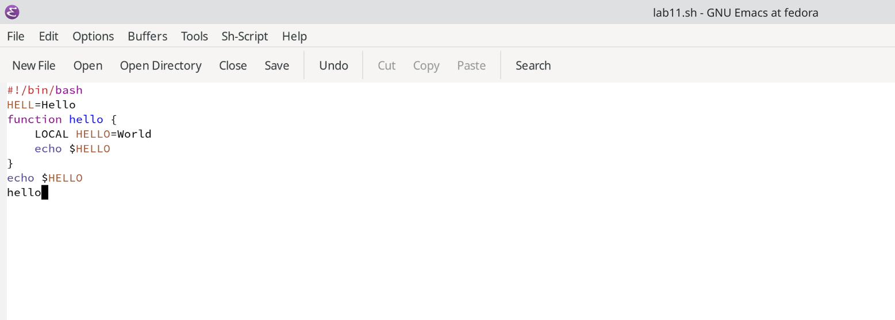{#fig:003 width=70%}

Сохраняю файл с помощью комбинации Ctrl-x Ctrl-s (рис. @fig:004).

{#fig:004 width=70%}

Вырезаю с помощью C-k целую строку и вставляю эту строку в конец файла (C-y) (рис. @fig:005).

{#fig:005 width=70%}

Выделяю область текста (C-space) и копирую в буфер обмена (M-w) (рис. @fig:006).

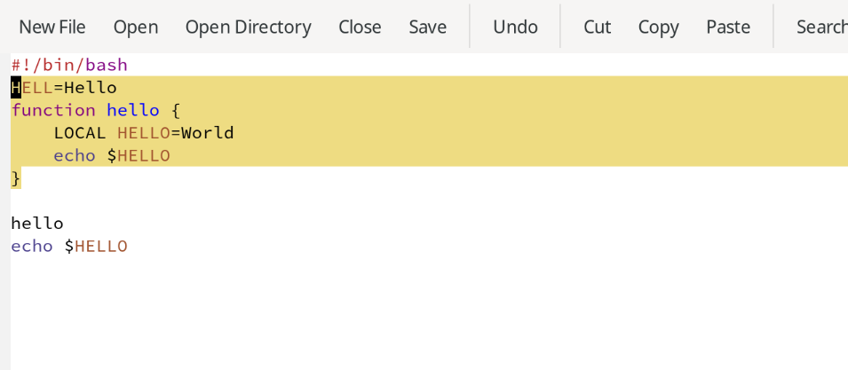{#fig:006 width=70%}

Вставляю текст в конец файла (рис. @fig:007).

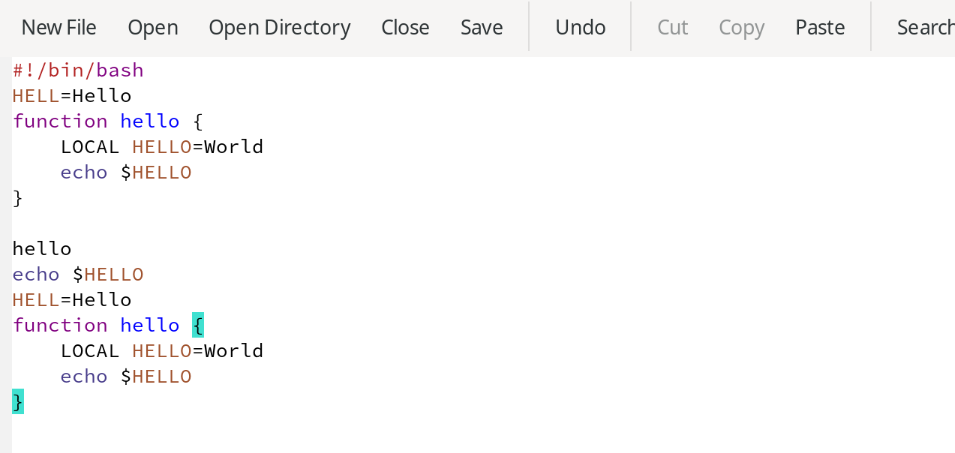{#fig:007 width=70%}

Снова выделяю эту область и на этот раз вырезаю её (C-w) (рис. @fig:008).

{#fig:008 width=70%}

Отменяю последнее действие (C-/) (рис. @fig:009).

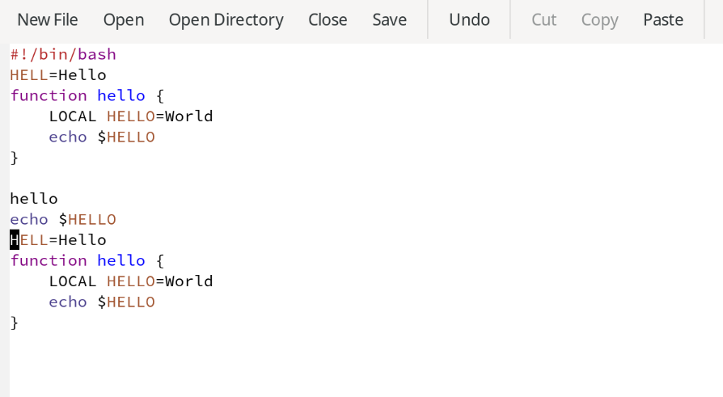{#fig:009 width=70%}

Перемещаю курсор в начало строки (C-a) (рис. @fig:010).

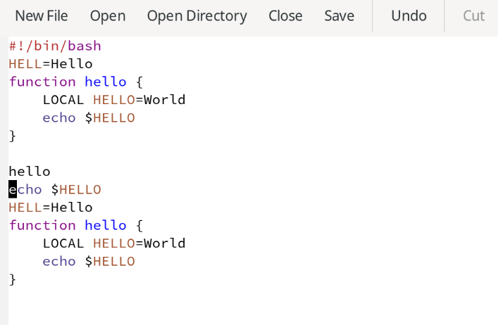{#fig:010 width=70%}

Перемещаю курсор в конец строки (C-e) (рис. @fig:011).

{#fig:011 width=70%}

Перемещаю курсор в начало текста (M-<) (рис. @fig:012).

{#fig:012 width=70%}

Перемещаю курсор в конец текста (M->) (рис. @fig:013).

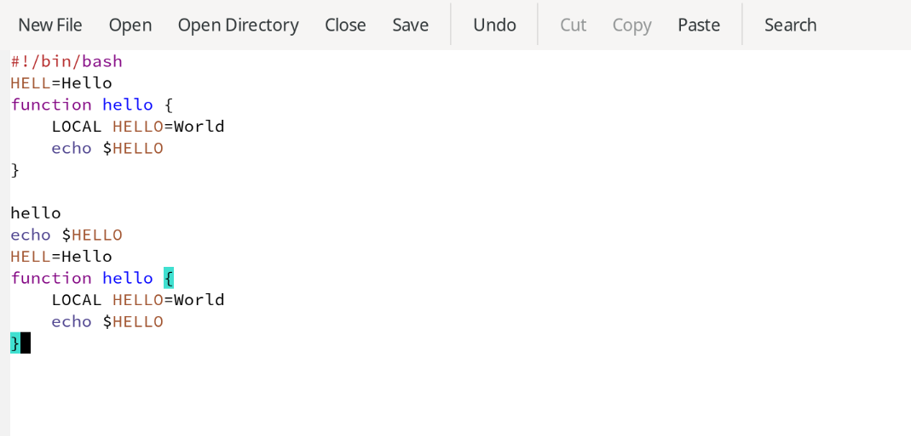{#fig:013 width=70%}

Вывожу список активных буферов на экран (C-x C-b) (рис. @fig:014).

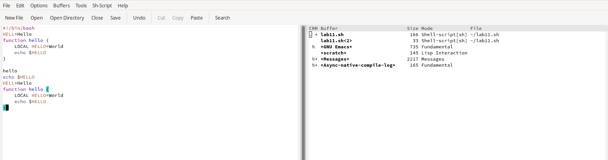{#fig:014 width=70%}

Перемещаюсь во вновь открытое окно (C-x) со списком открытых буферов и переключаюсь на другой буфер. Закрываю окно (C-x 0) (рис. @fig:015).

{#fig:015 width=70%}

Делю фрейм на 4 части (рис. @fig:016).

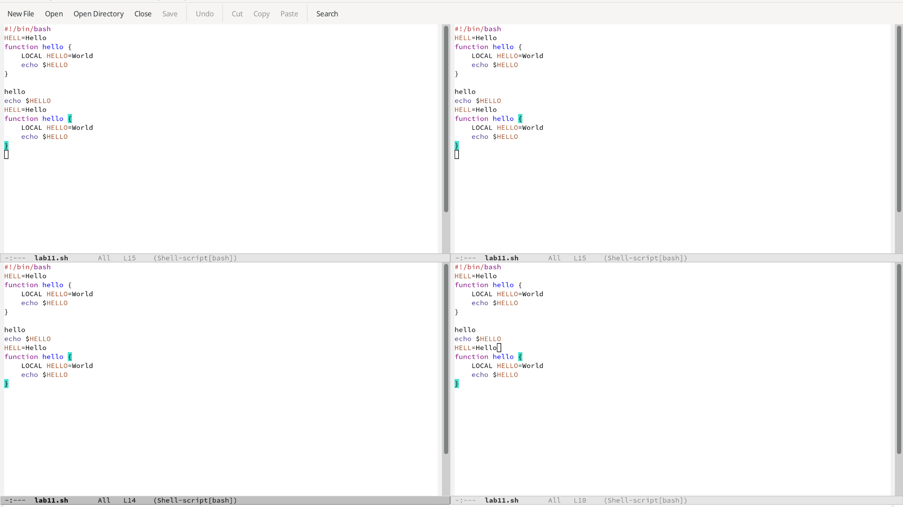{#fig:016 width=70%}

В каждом из четырёх созданных окон открываю новый буфер и ввожу несколько строк текста (рис. @fig:017).

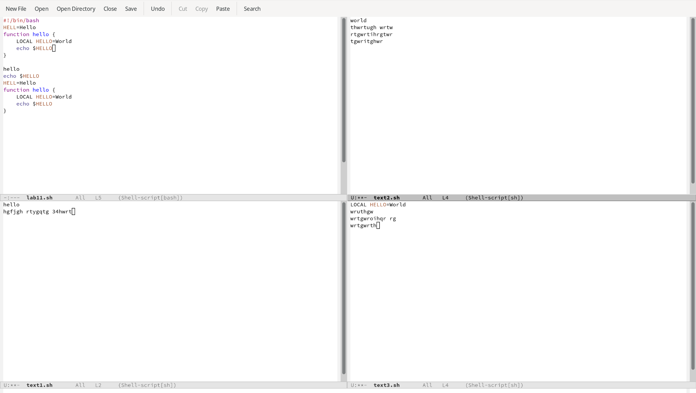{#fig:017 width=70%}

Переключаюсь в режим поиска (C-s) и нахожу несколько слов, присутствующих в тексте (рис. @fig:018).

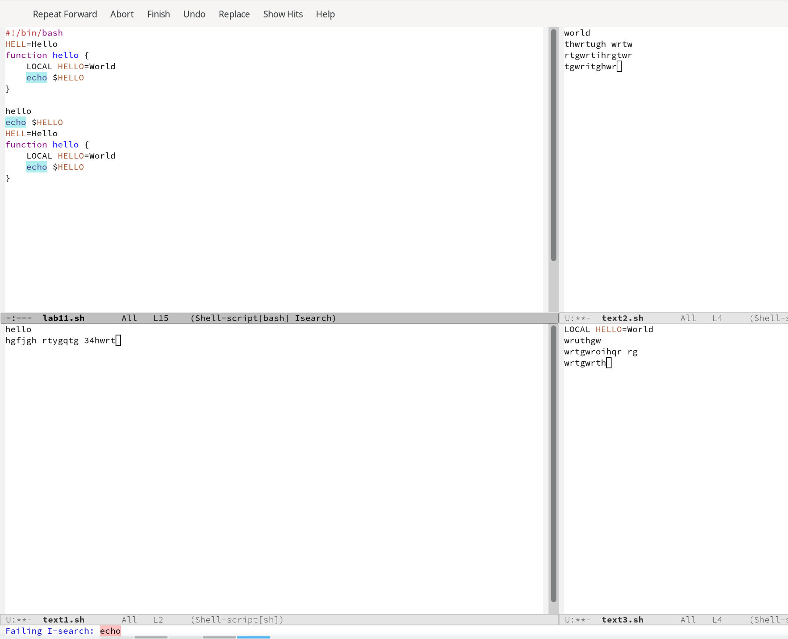{#fig:018 width=70%}

Нажимая C-s, переключаюсь между результатами поиска (рис. @fig:019).

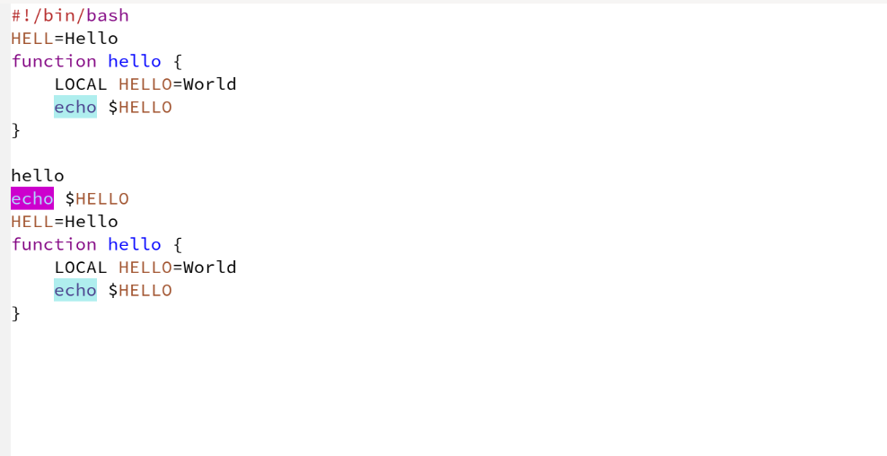{#fig:019 width=70%}

Выхожу из режима поиска, нажав C-g (рис. @fig:020).

{#fig:020 width=70%}

Перехожу в режим поиска и замены (M-%), ввожу текст, который следует найти и заменить, нажимаю Enter, ввожу текст для замены. После того как будут подсвечены результаты поиска, нажимаю ! для подтверждения замены (рис. @fig:021).

{#fig:021 width=70%}

Пробую другой режим поиска, нажав M-s (рис. @fig:022).

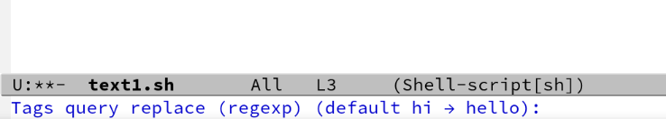{#fig:022 width=70%}

# Контрольные вопросы

1. Кратко охарактеризуйте редактор emacs.
Emacs — один из наиболее мощных и широко распространённых редакторов, используемых в мире UNIX. Написан на языке высокого уровня Lisp.

2. Какие особенности данного редактора могут сделать его сложным для освоения новичком?
Большое разнообразие сложных комбинаций клавиш, которые необходимы для редактирования файла и в принципе для работа с Emacs.

3. Своими словами опишите, что такое буфер и окно в терминологии emacs’а.
Буфер - это объект в виде текста. Окно - это прямоугольная область, в которой отображен буфер.

4. Можно ли открыть больше 10 буферов в одном окне?
Да, можно.

5. Какие буферы создаются по умолчанию при запуске emacs?
Emacs использует буферы с именами, начинающимися с пробела, для внутренних целей. Отчасти он обращается с буферами с такими именами особенным образом -- например, по умолчанию в них не записывается информация для отмены изменений.

6. Какие клавиши вы нажмёте, чтобы ввести следующую комбинацию C-c | и C-c C-|?
Ctrl + c, а потом | и Ctrl + c Ctrl + |

7. Как поделить текущее окно на две части?
С помощью команды Ctrl + x 3 (по вертикали) и Ctrl + x 2 (по горизонтали).

8. В каком файле хранятся настройки редактора emacs?
Настройки emacs хранятся в файле . emacs, который хранится в домашней дирректории пользователя. Кроме этого файла есть ещё папка . emacs.

9. Какую функцию выполняет клавиша и можно ли её переназначить?
Выполняет фугкцию стереть, думаю можно переназначить.

10. Какой редактор вам показался удобнее в работе vi или emacs? Поясните почему.
Для меня удобнее оказался редактор vi, потому что у него удобный интерфейс и горячие клавиши более интуитивные.

# Выводы

При выполнении данной лабораторной работы я получила практические навыки работы с редактором Emacs.

# Список литературы

1. Лабораторная работа №11 [Электронный ресурс]
