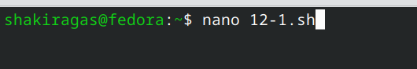
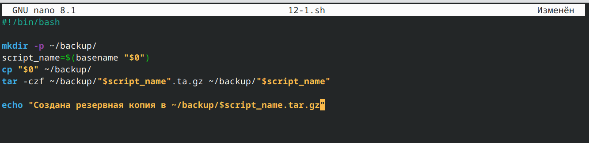
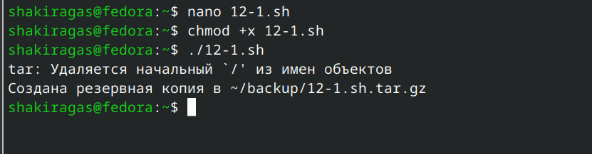
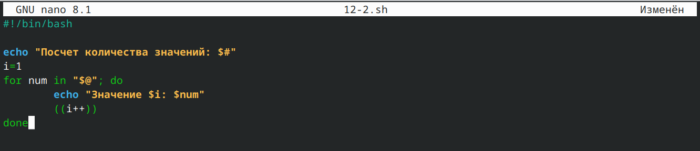
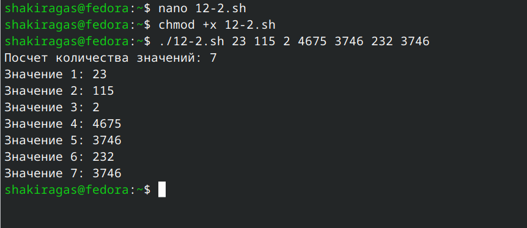
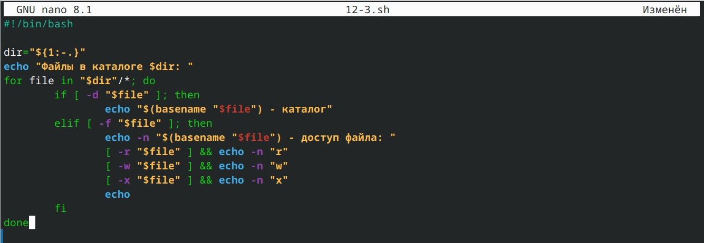
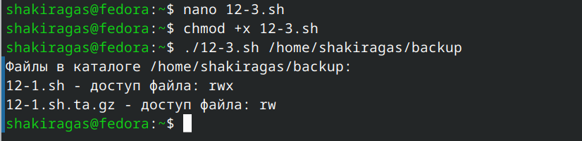
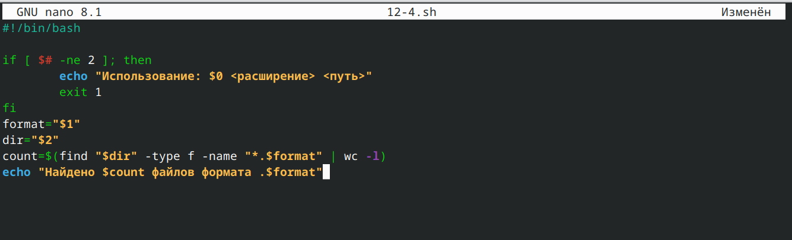
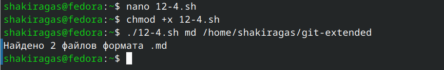

---
## Front matter
lang: ru-RU
title: Лабораторная работа №12
subtitle: Операционные системы
author:
  - Гасанова Ш. Ч.
institute:
  - Российский университет дружбы народов, Москва, Россия
date: 1 мая 2025

## i18n babel
babel-lang: russian
babel-otherlangs: english

## Formatting pdf
toc: false
toc-title: Содержание
slide_level: 2
aspectratio: 169
section-titles: true
theme: metropolis
header-includes:
 - \metroset{progressbar=frametitle,sectionpage=progressbar,numbering=fraction}
 - '\makeatletter'
 - '\beamer@ignorenonframefalse'
 - '\makeatother'
---

## Цель 

Изучить основы программирования в оболочке ОС UNIX/Linux. Научиться писать небольшие командные файлы.

## Задание

1. Написать скрипт, который при запуске будет делать резервную копию самого себя в другую директорию backup в домашнем каталоге. При этом файл должен архивироваться одним из архиваторов на выбор zip, bzip2 или tar.
2. Написать пример командного файла, обрабатывающего любое произвольное число аргументов командной строки, в том числе превышающее десять.
3. Написать командный файл — аналог команды ls. Требуется, чтобы он выдавал информацию о нужном каталоге и выводил информацию о возможностях доступа к файлам этого каталога.
4. Написать командный файл, который получает в качестве аргумента командной строки формат файла и вычисляет количество таких файлов в указанной директории. 

## Выполнение лабораторной работы

Создаю файл 12-1.sh и пишу там скрипт, который при запуске будет делать резервную копию самого себя в другую директорию backup в домашнем каталоге

{#fig:001 width=70%}

## Выполнение лабораторной работы

{#fig:002 width=70%}

## Выполнение лабораторной работы

Затем делаю файл исполняемым и проверяю его работоспособность 

{#fig:003 width=70%}

## Выполнение лабораторной работы

Аналогично создаю файл 12-2.sh и пишу скрипт, обрабатывающий любое произвольное число аргументов командной строки 

{#fig:004 width=70%}

## Выполнение лабораторной работы

Делаю файл исполняемым, проверяю работу 

{#fig:005 width=70%}

## Выполнение лабораторной работы

Пишу командный файл — аналог команды ls, чтобы он выдавал информацию о нужном каталоге и выводил информацию о возможностях доступа к файлам этого каталога 

{#fig:006 width=70%}

## Выполнение лабораторной работы

Делаю файл исполняемым, проверяю работу 

{#fig:007 width=70%}

## Выполнение лабораторной работы

Пишу командный файл, который получает в качестве аргумента командной строки формат файла и вычисляет количество таких файлов в указанной директории 

{#fig:008 width=70%}

## Выполнение лабораторной работы

Делаю файл исполняемым, проверяю работу

{#fig:009 width=70%}

## Выводы

При выполнении данной лабораторной работы я изучила основы программирования в оболочке ОС UNIX/Linux и научилась писать небольшие командные файлы.

## Список литературы

1. Лабораторная работа №12 [Электронный ресурс]
