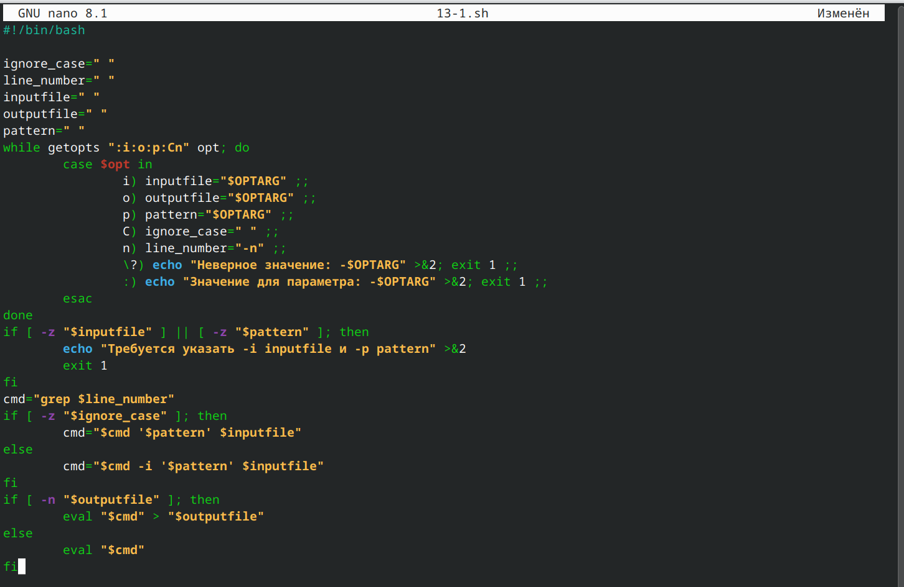
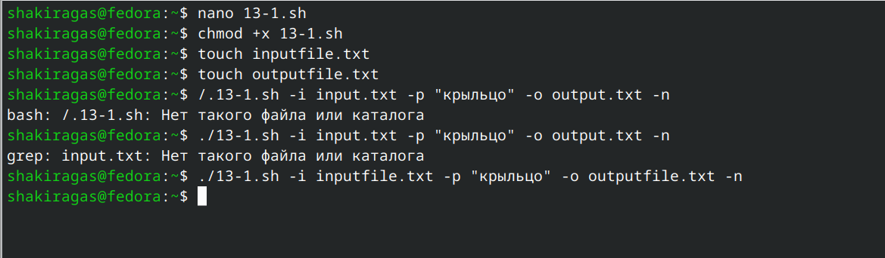
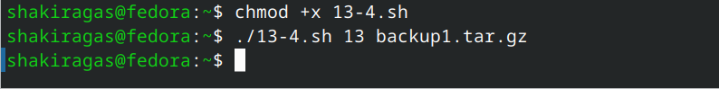
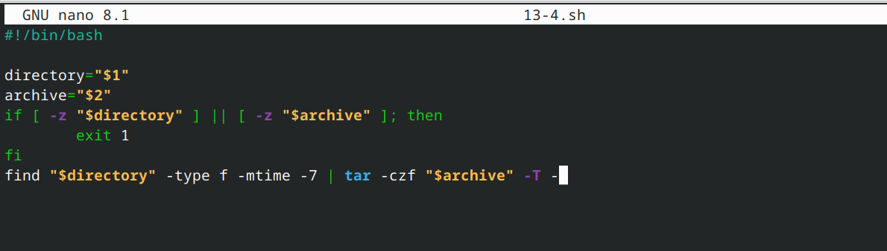
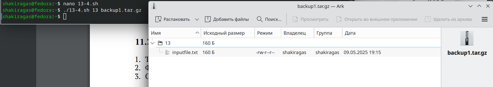

---
## Front matter
lang: ru-RU
title: Лабораторная работа №13
subtitle: Операционные системы
author:
  - Гасанова Ш. Ч.
institute:
  - Российский университет дружбы народов, Москва, Россия
date: 9 мая 2025

## i18n babel
babel-lang: russian
babel-otherlangs: english

## Formatting pdf
toc: false
toc-title: Содержание
slide_level: 2
aspectratio: 169
section-titles: true
theme: metropolis
header-includes:
 - \metroset{progressbar=frametitle,sectionpage=progressbar,numbering=fraction}
 - '\makeatletter'
 - '\beamer@ignorenonframefalse'
 - '\makeatother'
---

## Цель 

Научится писать более сложные командные файлы с использованием логических управляющих конструкций и циклов.

## Задание

1. Используя команды getopts grep, написать командный файл, который анализирует командную строку с ключами: 
  - iinputfile
  - ooutputfile
  - pшаблон
  - C
  - n
а затем ищет в указанном файле нужные строки, определяемые ключом -p.

2. Написать на языке Си программу, которая вводит число и определяет, является ли оно больше нуля, меньше нуля или равно нулю. Затем программа завершается с помощью функции exit(n), передавая информацию в о коде завершения в оболочку. Командный файл должен вызывать эту программу и, проанализировав с помощью команды $?, выдать сообщение о том, какое число было введено.

## Задание

3. Написать командный файл, создающий указанное число файлов, пронумерованных последовательно от 1 до N (например 1.tmp, 2.tmp, 3.tmp,4.tmp и т.д.). Число файлов, которые необходимо создать, передаётся в аргументы командной строки. Этот же командный файл должен уметь удалять все созданные им файлы (если они существуют).

4. Написать командный файл, который с помощью команды tar запаковывает в архив все файлы в указанной директории. Модифицировать его так, чтобы запаковывались только те файлы, которые были изменены менее недели тому назад (использовать команду find).

## Выполнение лабораторной работы

Создаю файл 13-1.sh и пишу там скрипт, который который анализирует командную строку с приведёнными ключами, а затем ищет в указанном файле нужные строки 

{#fig:001 width=70%}

## Выполнение лабораторной работы

Делаю файл исполняемым, проверяю работоспособность 

{#fig:002 width=70%}

## Выполнение лабораторной работы

{#fig:003 width=70%}

## Выполнение лабораторной работы

Создаю файл 13-2.c и пишу на языке Си программу, которая выводит число и сравнивает его с нулём 

{#fig:005 width=70%}

## Выполнение лабораторной работы

Пишу командный файл 13-2.sh, который вызывает программу (13-2.c) и выдаёт сообщение о том, какое число было введено 

{#fig:004 width=70%}

## Выполнение лабораторной работы

Делаю файл исполняемым, проверяю работу 

{#fig:006 width=70%}

## Выполнение лабораторной работы

Создаю файл 13-3.sh и пишу командный файл, создающий указанное число файлов, пронумерованных последовательно от 1 до N, а затем удаляет их 

{#fig:007 width=70%}

## Выполнение лабораторной работы

Делаю файл исполняемым, проверяю 

{#fig:008 width=70%}

## Выполнение лабораторной работы

Пишу командный файл 13-4.sh, который с помощью команды tar запаковывает в архив все файлы в указанной директории 

{#fig:009 width=70%}

## Выполнение лабораторной работы

Проверяю созданный архив 

{#fig:010 width=70%}

## Выполнение лабораторной работы

{#fig:011 width=70%}

## Выполнение лабораторной работы

Модифицирую файл, чтобы запаковывал только те файлы, которые были изменены за последнюю неделю

{#fig:012 width=70%}

## Выполнение лабораторной работы

Проверяю созданный архив 

{#fig:013 width=70%}

## Выводы

При выполнении данной лабораторной работы я научилась писать более сложные командные файлы с использованием логических управляющих конструкций и циклов.

## Список литературы

1. Лабораторная работа №13 [Электронный ресурс]
