---
## Front matter
lang: ru-RU
title: Индивидуальный проект 1 этап
subtitle: Операционные системы
author:
  - Гасанова Ш. Ч.
institute:
  - Российский университет дружбы народов, Москва, Россия
date: 8 марта 2025

## i18n babel
babel-lang: russian
babel-otherlangs: english

## Formatting pdf
toc: false
toc-title: Содержание
slide_level: 2
aspectratio: 169
section-titles: true
theme: metropolis
header-includes:
 - \metroset{progressbar=frametitle,sectionpage=progressbar,numbering=fraction}
 - '\makeatletter'
 - '\beamer@ignorenonframefalse'
 - '\makeatother'
---

## Цель работы

Цель данного этапа - научиться размещать сайт на GitHub pages.

## Задание

1. Установить необходимое ПО
2. Скачать шаблон темы сайта
3. Разместить его на хостинге Git
4. Установить параметр для URL сайта
5. Разместить заготовку сайта на GitHub pages

## Выполнение этапа индивидуального проекта

### Установка необходимого ПО

Скачиваю последнюю версию исполняемого файла hugo для своей операционной системы. После скачивания распаковываю архив (рис. 1).

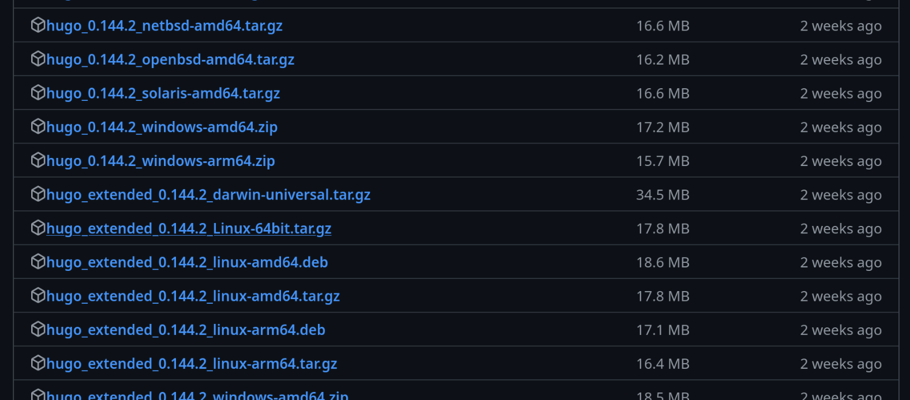{#fig:001 width=70%}

## Установка необходимого ПО

Создаю в домашнем каталоге папку bin и переношу туда исполняемый файл hugo (рис. 2).

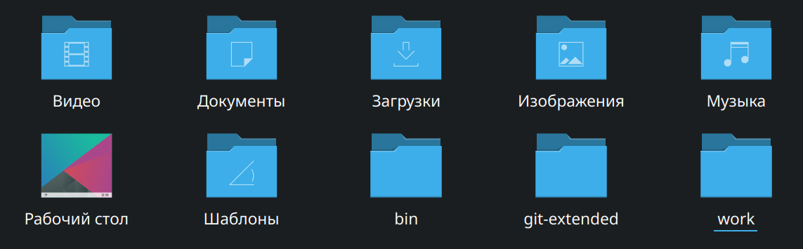{#fig:002 width=70%}

## Скачивание шаблона темы сайта

Открываю репозиторий с шаблоном и на его основе создаю свой (рис. 3).

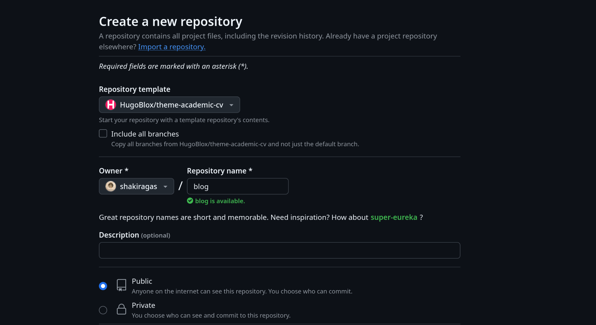{#fig:003 width=70%}

## Скачивание шаблона темы сайта

Клонирую созданный репозиторий к себе в локальный репозиторий (рис. 4).

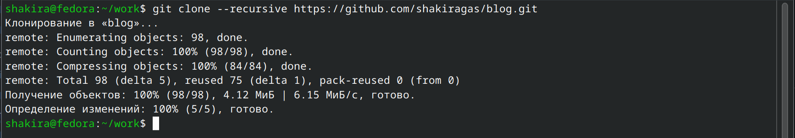{#fig:004 width=70%}

## Размещение его на хостинге Git

Устанавливаю go hugo (рис. 5).

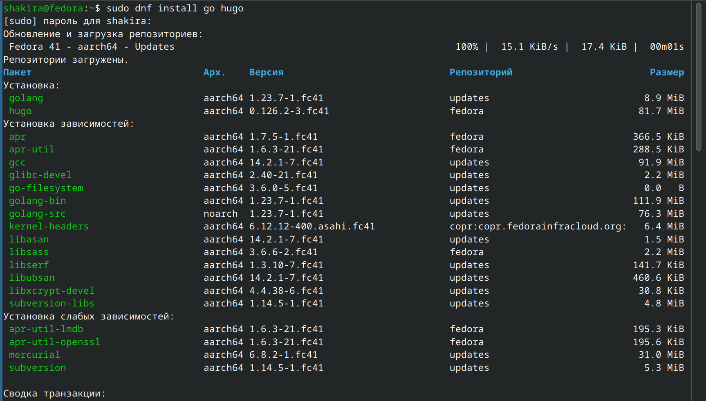{#fig:005 width=70%}

## Размещение его на хостинге Git

Запускаю исполняемый файл hugo (рис. 6).

{#fig:006 width=70%}

## Размещение его на хостинге Git

Удаляю папку public, затем я буду устанавливать свою (рис. 7).

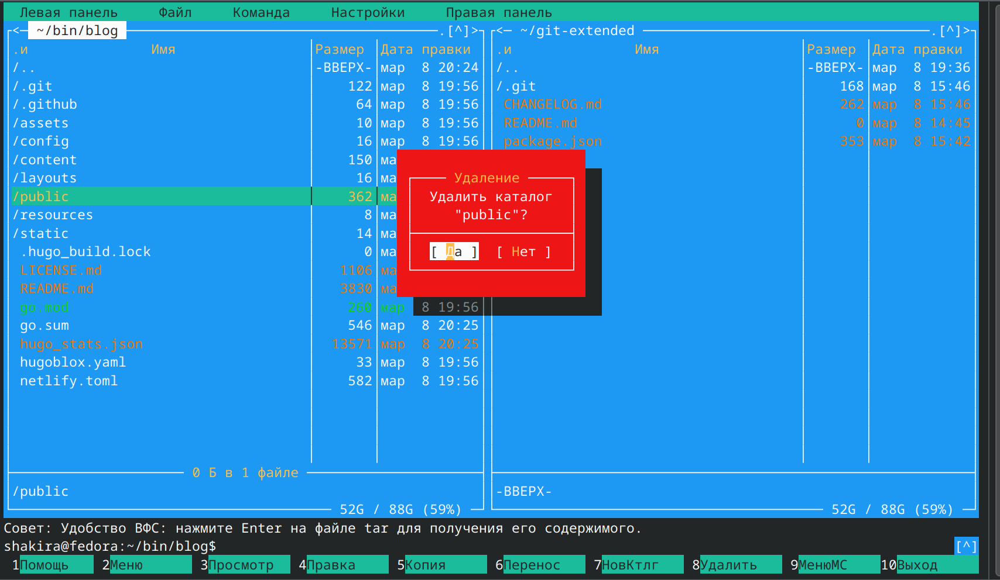{#fig:007 width=70%}

## Размещение его на хостинге Git

Снова запускаю файл с командой server (рис. 8).

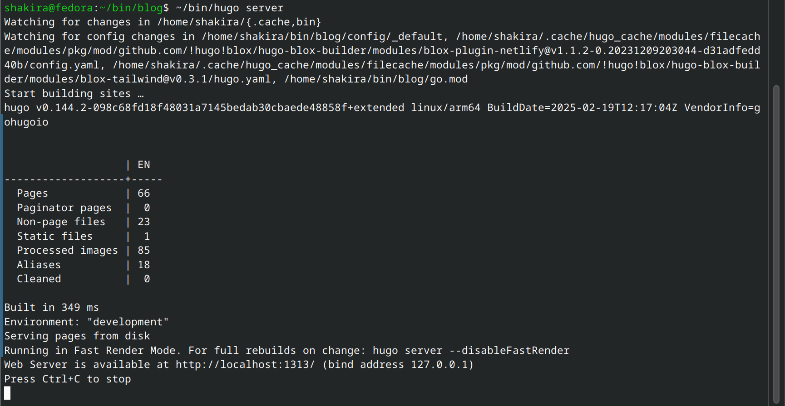{#fig:008 width=70%}

## Размещение его на хостинге Git

Получилась страничка сайта на локальном сервере, куда я перешла по ссылке (рис. 9).

{#fig:009 width=70%}

## Установка параметра для URL сайта

Создаю новый пустой репозиторий (рис. 10).

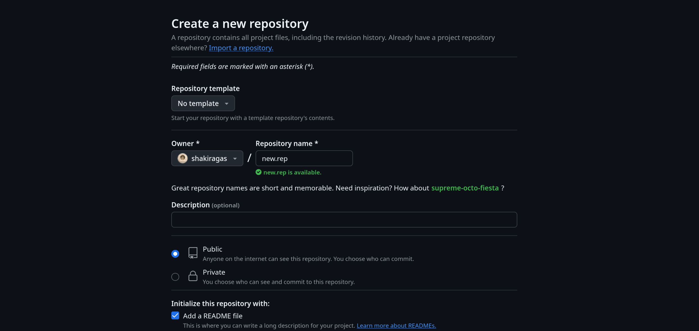{#fig:010 width=70%}

## Установка параметра для URL сайта

Клонирую созданный репозиторий (рис. 11).

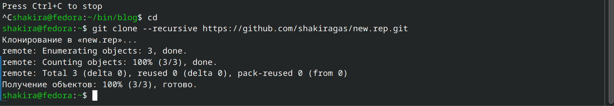{#fig:011 width=70%}

## Установка параметра для URL сайта

Создаю главную ветку с именем main, она уже существует (рис. 12).

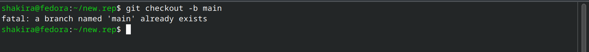{#fig:012 width=70%}

## Установка параметра для URL сайта

Создаю пустой README.md и отправляю на гитхаб (рис. 13).

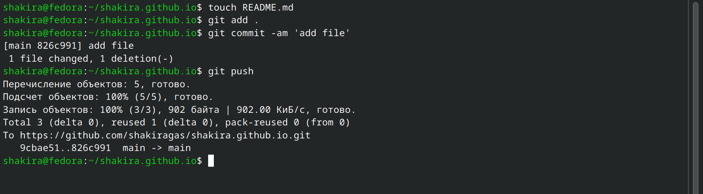{#fig:013 width=70%}

## Установка параметра для URL сайта

Подключаю репозиторий к каталогу public и снова выполняю команду исполняемого файла hugo, чтобы заполнить каталог public (рис. 14).

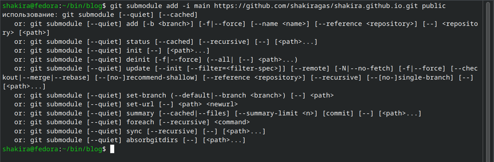{#fig:014 width=70%}

## Размещение заготовки сайта на GitHub pages

Проверяю подключение между public и моим для сайта, после чего отправляю изменения на гитхаб (рис. 15).

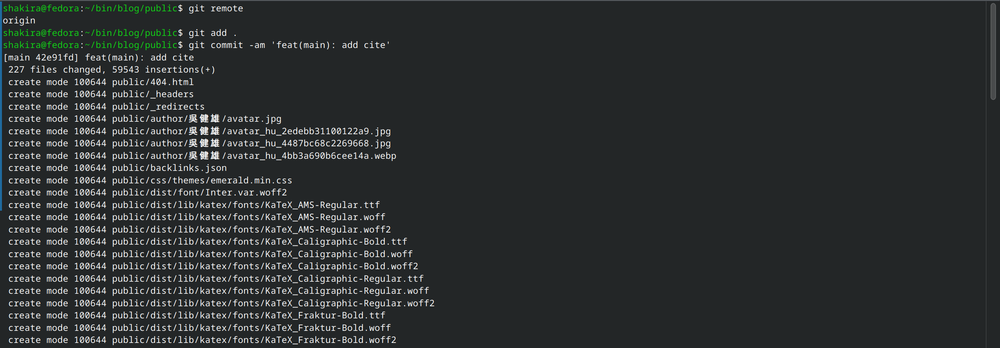{#fig:015 width=70%}

## Размещение заготовки сайта на GitHub pages

Отправляю изменения на гитхаб (рис. 16).

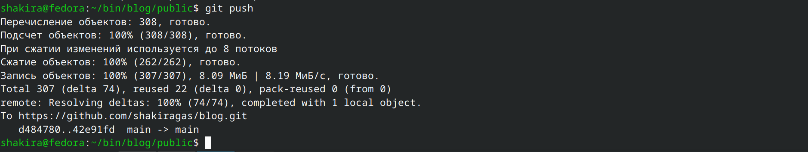{#fig:016 width=70%}

## Размещение заготовки сайта на GitHub pages

Проверяю на гитхабе созданные файлы (рис. 17).

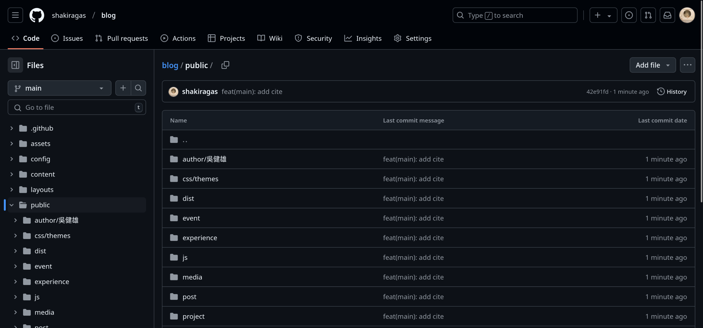{#fig:017 width=70%}

## Выводы

При выполнении первого этапа я научилась размещать сайт на GitHub pages.
