---
## Front matter
title: "Отчет по этапу индивидуального проекта №1"
subtitle: "Операционные системы"
author: "Гасанова Ш. Ч."

## Generic otions
lang: ru-RU
toc-title: "Содержание"

## Bibliography
bibliography: bib/cite.bib
csl: pandoc/csl/gost-r-7-0-5-2008-numeric.csl

## Pdf output format
toc: true # Table of contents
toc-depth: 2
lof: true # List of figures
lot: true # List of tables
fontsize: 12pt
linestretch: 1.5
papersize: a4
documentclass: scrreprt
## I18n polyglossia
polyglossia-lang:
  name: russian
  options:
	- spelling=modern
	- babelshorthands=true
polyglossia-otherlangs:
  name: english
## I18n babel
babel-lang: russian
babel-otherlangs: english
## Fonts
mainfont: PT Serif
romanfont: PT Serif
sansfont: PT Sans
monofont: PT Mono
mainfontoptions: Ligatures=TeX
romanfontoptions: Ligatures=TeX
sansfontoptions: Ligatures=TeX,Scale=MatchLowercase
monofontoptions: Scale=MatchLowercase,Scale=0.9
## Biblatex
biblatex: true
biblio-style: "gost-numeric"
biblatexoptions:
  - parentracker=true
  - backend=biber
  - hyperref=auto
  - language=auto
  - autolang=other*
  - citestyle=gost-numeric
## Pandoc-crossref LaTeX customization
figureTitle: "Рис."
tableTitle: "Таблица"
listingTitle: "Листинг"
lofTitle: "Список иллюстраций"
lotTitle: "Список таблиц"
lolTitle: "Листинги"
## Misc options
indent: true
header-includes:
  - \usepackage{indentfirst}
  - \usepackage{float} # keep figures where there are in the text
  - \floatplacement{figure}{H} # keep figures where there are in the text
---

# Цель работы

Цель данного этапа - научиться размещать сайт на GitHub pages.

# Задание

1. Установить необходимое ПО
2. Скачать шаблон темы сайта
3. Разместить его на хостинге Git
4. Установить параметр для URL сайта
5. Разместить заготовку сайта на GitHub pages

# Выполнение этапа индивидуального проекта

## Установка необходимого ПО

Скачиваю последнюю версию исполняемого файла hugo для своей операционной системы. После скачивания распаковываю архив (рис. @fig:001).

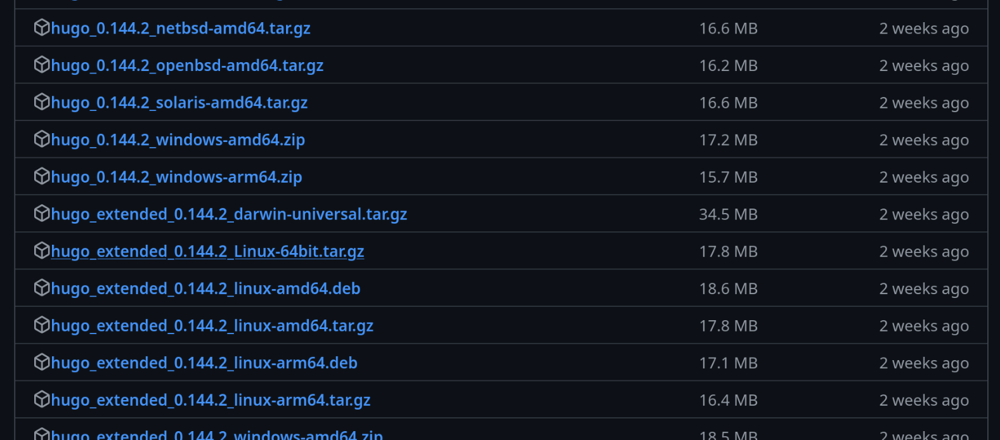{#fig:001 width=70%}

Создаю в домашнем каталоге папку bin и переношу туда исполняемый файл hugo (рис. @fig:002).

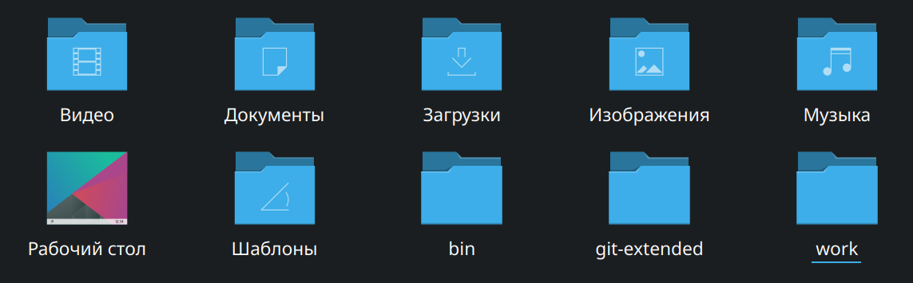{#fig:002 width=70%}

## Скачивание шаблона темы сайта

Открываю репозиторий с шаблоном и на его основе создаю свой (рис. @fig:003).

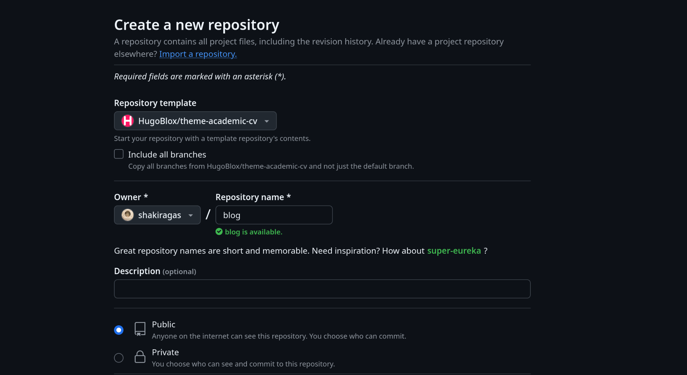{#fig:003 width=70%}

Клонирую созданный репозиторий к себе в локальный репозиторий (рис. @fig:004).

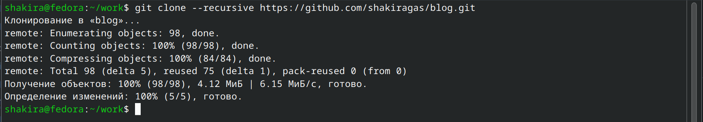{#fig:004 width=70%}

## Размещение его на хостинге Git

Устанавливаю go hugo (рис. @fig:005).

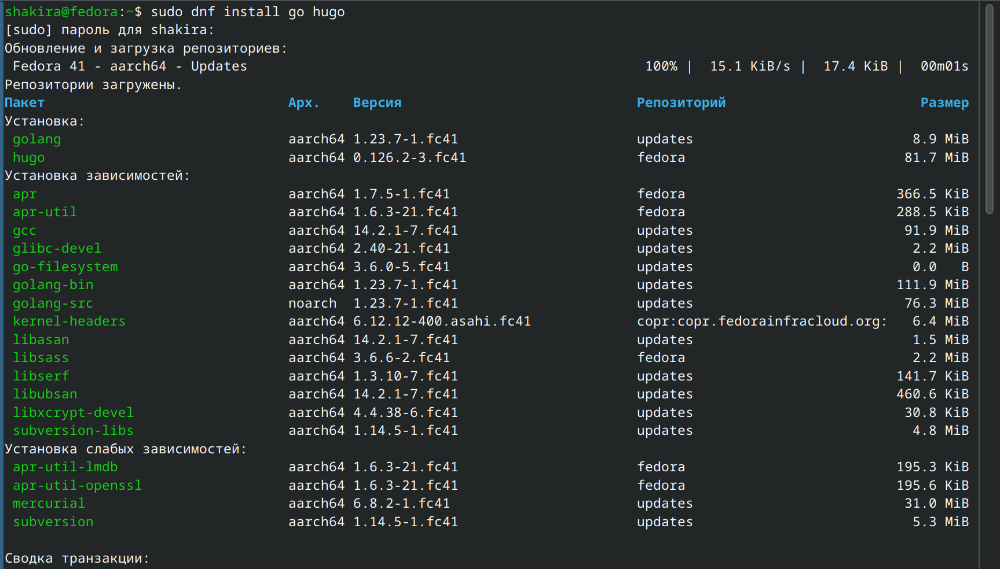{#fig:005 width=70%}

Запускаю исполняемый файл hugo (рис. @fig:006).

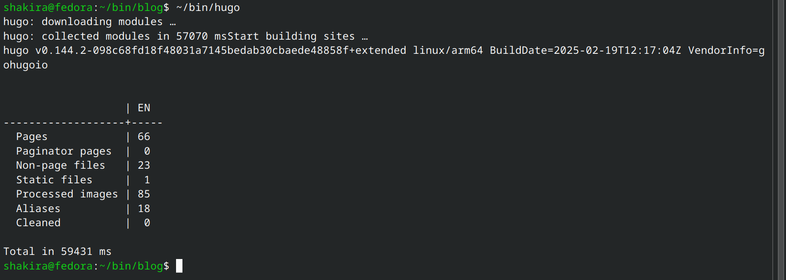{#fig:006 width=70%}

Удаляю папку public, затем я буду устанавливать свою (рис. @fig:007).

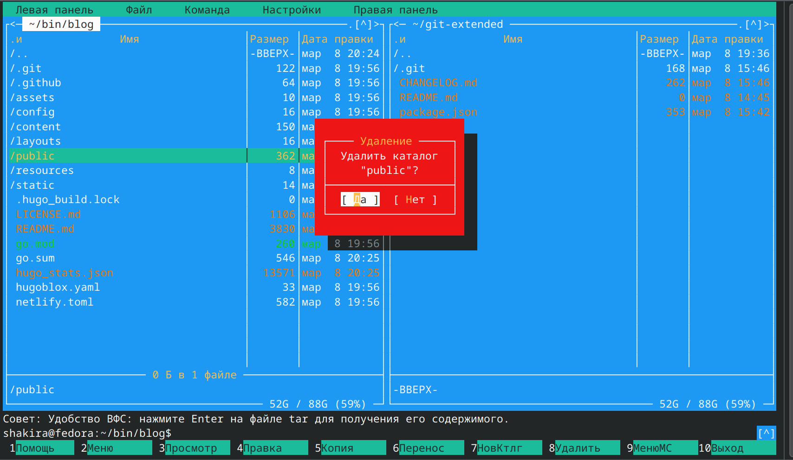{#fig:007 width=70%}

Снова запускаю файл с командой server (рис. @fig:008).

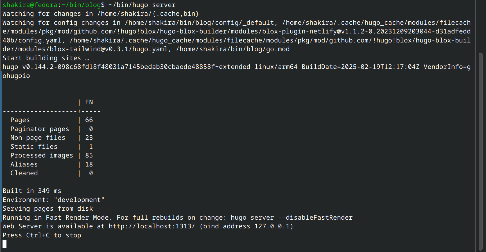{#fig:008 width=70%}

Получилась страничка сайта на локальном сервере, куда я перешла по ссылке (рис. @fig:009).

{#fig:009 width=70%}

## Установка параметра для URL сайта

Создаю новый пустой репозиторий (рис. @fig:010).

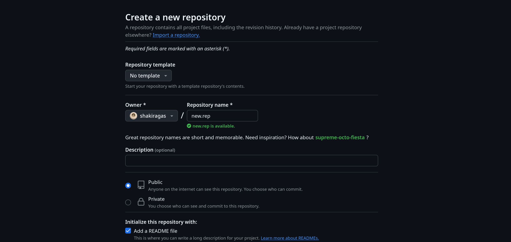{#fig:010 width=70%}

Клонирую созданный репозиторий (рис. @fig:011).

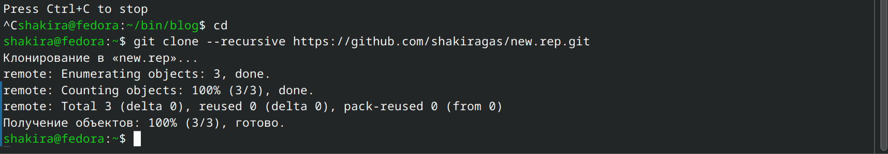{#fig:011 width=70%}

Создаю главную ветку с именем main, она уже существует (рис. @fig:012).

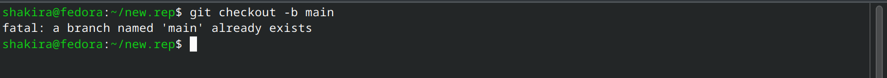{#fig:012 width=70%}

Создаю пустой README.md и отправляю на гитхаб (рис. @fig:013).

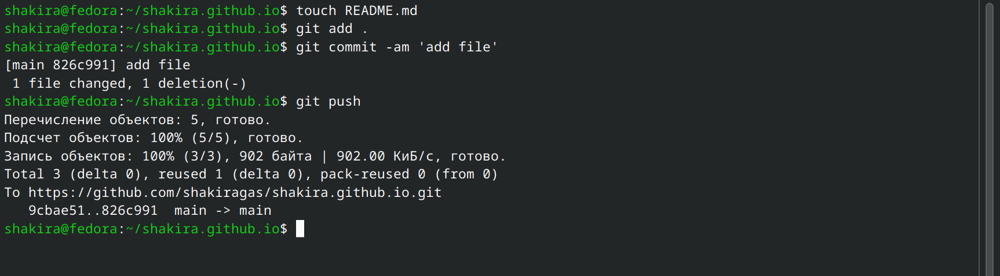{#fig:013 width=70%}

Подключаю репозиторий к каталогу public и снова выполняю команду исполняемого файла hugo, чтобы заполнить каталог public (рис. @fig:014).

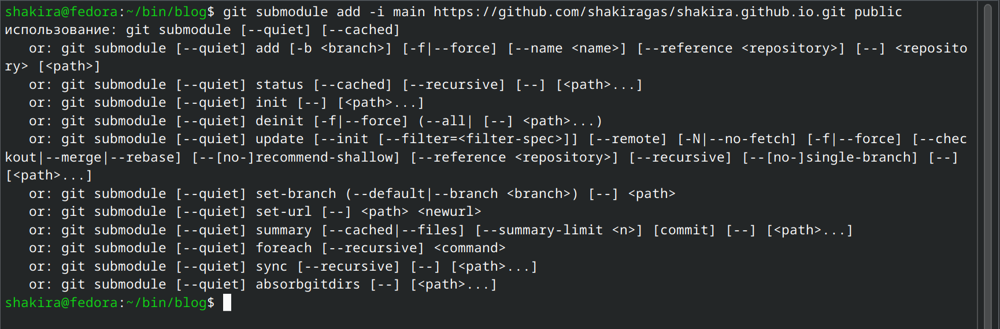{#fig:014 width=70%}

## Размещение заготовки сайта на GitHub pages

Проверяю подключение между public и моим для сайта, после чего отправляю изменения на гитхаб (рис. @fig:015).

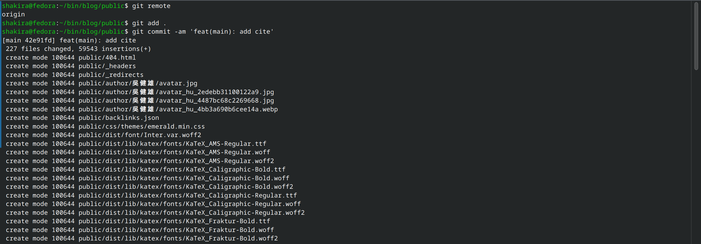{#fig:015 width=70%}

Отправляю изменения на гитхаб (рис. @fig:016).

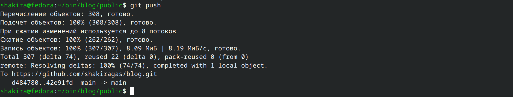{#fig:016 width=70%}

Проверяю на гитхабе созданные файлы (рис. @fig:017).

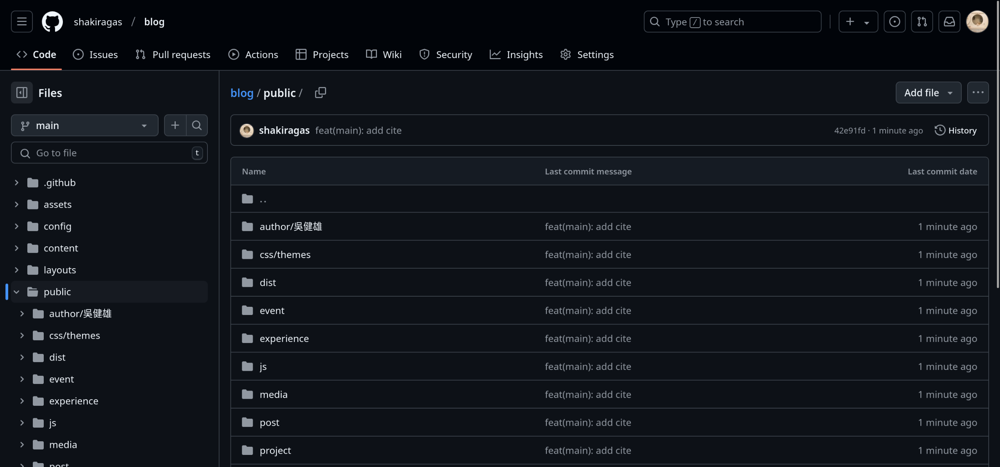{#fig:017 width=70%}

# Выводы

При выполнении первого этапа я научилась размещать сайт на GitHub pages.
