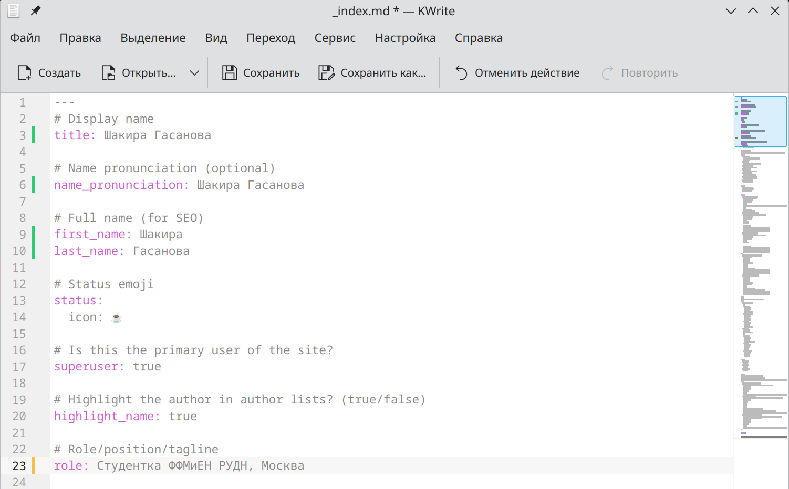
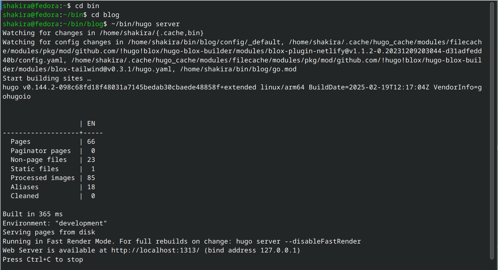
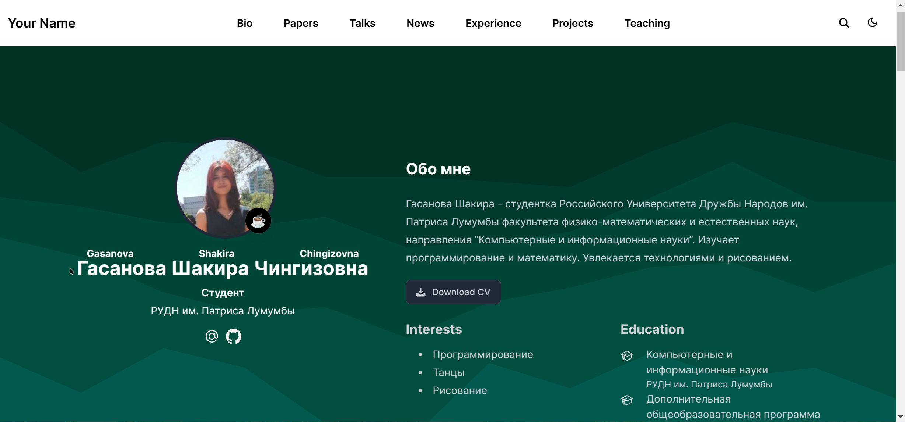
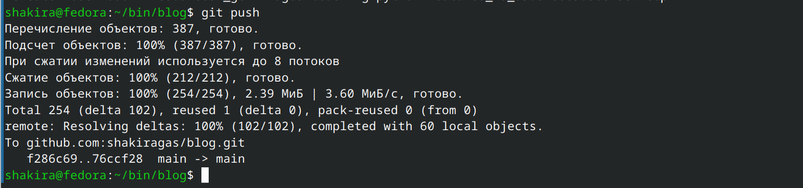

---
## Front matter
lang: ru-RU
title: Индивидуальный проект 2 этап
subtitle: Операционные системы
author:
  - Гасанова Ш. Ч.
institute:
  - Российский университет дружбы народов, Москва, Россия
date: 22 марта 2025

## i18n babel
babel-lang: russian
babel-otherlangs: english

## Formatting pdf
toc: false
toc-title: Содержание
slide_level: 2
aspectratio: 169
section-titles: true
theme: metropolis
header-includes:
 - \metroset{progressbar=frametitle,sectionpage=progressbar,numbering=fraction}
 - '\makeatletter'
 - '\beamer@ignorenonframefalse'
 - '\makeatother'
---

## Цель работы

Цель данного этапа - продолжить работу с сайтом, добавить информацию о себе.

## Задание

1. Разместить фотографию владельца сайта.
2. Разместить краткое описание владельца сайта (Biography).
3. Добавить информацию об интересах (Interests).
4. Добавить информацию от образовании (Education).
5. Сделать пост по прошедшей неделе.
6. Добавить пост на тему по выбору:
   - Управление версиями. Git.
   - Непрерывная интеграция и непрерывное развертывание (CI/CD).

## Выполнение этапа индивидуального проекта

Переношу свою фотографию в нужный каталог.

{#fig:001 width=70%}

## Выполнение этапа индивидуального проекта

В файле index.md изменяю данные на свои. Добавляю информацию о себе, интересы и образование.

{#fig:002 width=70%}

## Выполнение этапа индивидуального проекта

Запускаю сайт на локальном сервере и проверяю изменения.

{#fig:003 width=70%}

## Выполнение этапа индивидуального проекта

Данные успешно изменились.

{#fig:004 width=70%}

## Выполнение этапа индивидуального проекта

Далее пишу пост по прошедшей неделе.

{#fig:005 width=70%}

## Выполнение этапа индивидуального проекта

Проверяю изменения на сайте.

{#fig:006 width=70%}

## Выполнение этапа индивидуального проекта

Пишу пост на выбранную тему. В моём случае "Управление версиями. Git."

{#fig:007 width=70%}

## Выполнение этапа индивидуального проекта

Проверяю изменения на сайте.

{#fig:008 width=70%}

## Выполнение этапа индивидуального проекта

Добавляю изменения на гит, делаю коммит.

{#fig:009 width=70%}

## Выполнение этапа индивидуального проекта

Отправляю изменения на свой репозиторий.

{#fig:010 width=70%}

## Выводы

При выполнении второго этапа я добавила информацию о себе и выложила два поста.
