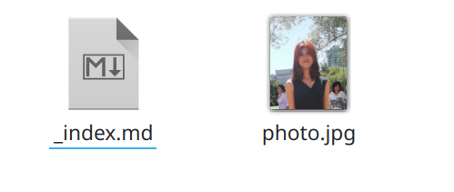
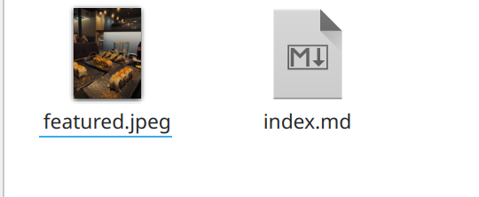
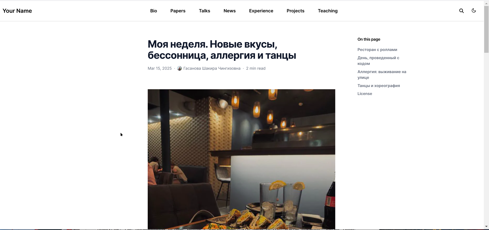
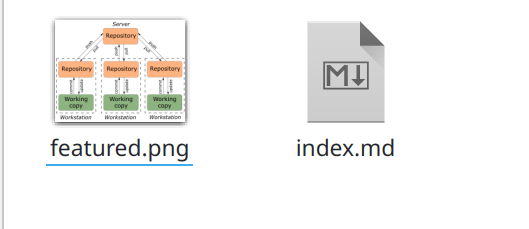
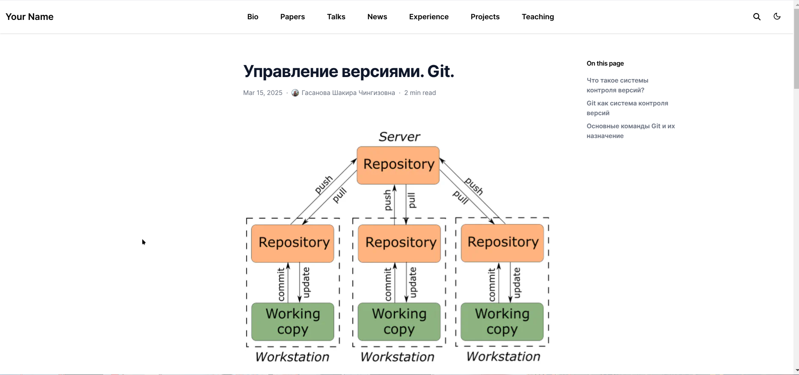
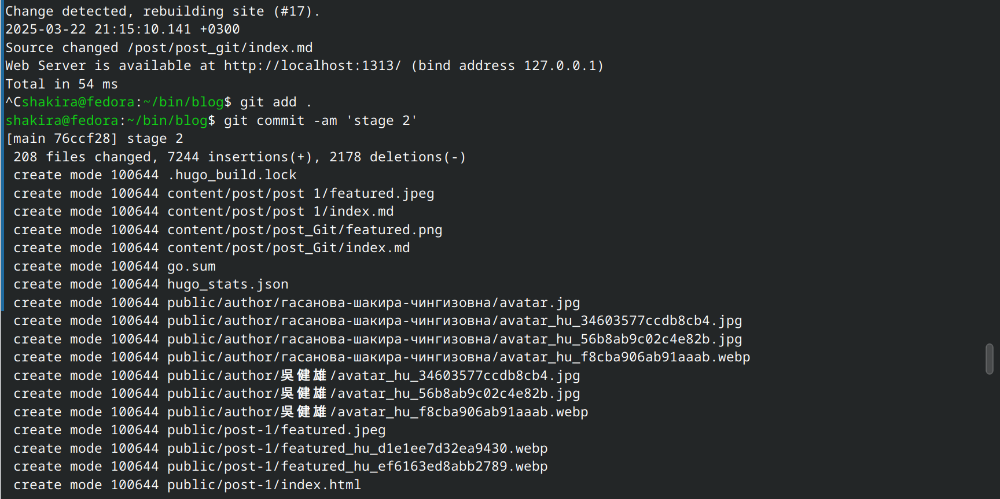

---
## Front matter
title: "Отчет по этапу индивидуального проекта №2"
subtitle: "Операционные системы"
author: "Гасанова Ш. Ч."

## Generic otions
lang: ru-RU
toc-title: "Содержание"

## Bibliography
bibliography: bib/cite.bib
csl: pandoc/csl/gost-r-7-0-5-2008-numeric.csl

## Pdf output format
toc: true # Table of contents
toc-depth: 2
lof: true # List of figures
lot: true # List of tables
fontsize: 12pt
linestretch: 1.5
papersize: a4
documentclass: scrreprt
## I18n polyglossia
polyglossia-lang:
  name: russian
  options:
	- spelling=modern
	- babelshorthands=true
polyglossia-otherlangs:
  name: english
## I18n babel
babel-lang: russian
babel-otherlangs: english
## Fonts
mainfont: PT Serif
romanfont: PT Serif
sansfont: PT Sans
monofont: PT Mono
mainfontoptions: Ligatures=TeX
romanfontoptions: Ligatures=TeX
sansfontoptions: Ligatures=TeX,Scale=MatchLowercase
monofontoptions: Scale=MatchLowercase,Scale=0.9
## Biblatex
biblatex: true
biblio-style: "gost-numeric"
biblatexoptions:
  - parentracker=true
  - backend=biber
  - hyperref=auto
  - language=auto
  - autolang=other*
  - citestyle=gost-numeric
## Pandoc-crossref LaTeX customization
figureTitle: "Рис."
tableTitle: "Таблица"
listingTitle: "Листинг"
lofTitle: "Список иллюстраций"
lotTitle: "Список таблиц"
lolTitle: "Листинги"
## Misc options
indent: true
header-includes:
  - \usepackage{indentfirst}
  - \usepackage{float} # keep figures where there are in the text
  - \floatplacement{figure}{H} # keep figures where there are in the text
---

# Цель работы

Цель данного этапа - продолжить работу с сайтом, добавить информацию о себе.

# Задание

1. Разместить фотографию владельца сайта.
2. Разместить краткое описание владельца сайта (Biography).
3. Добавить информацию об интересах (Interests).
4. Добавить информацию от образовании (Education).
5. Сделать пост по прошедшей неделе.
6. Добавить пост на тему по выбору:
   - Управление версиями. Git.
   - Непрерывная интеграция и непрерывное развертывание (CI/CD).

# Выполнение этапа индивидуального проекта

Переношу свою фотографию в нужный каталог (рис. @fig:001).

{#fig:001 width=70%}

В файле index.md изменяю данные на свои. Добавляю информацию о себе, интересы и образование (рис. @fig:002).

{#fig:002 width=70%}

Запускаю сайт на локальном сервере и проверяю изменения (рис. @fig:003).

{#fig:003 width=70%}

Данные успешно изменились (рис. @fig:004).

{#fig:004 width=70%}

Далее пишу пост по прошедшей неделе (рис. @fig:005).

{#fig:005 width=70%}

Проверяю изменения на сайте (рис. @fig:006).

{#fig:006 width=70%}

Пишу пост на выбранную тему. В моём случае "Управление версиями. Git." (рис. @fig:007).

{#fig:007 width=70%}

Проверяю изменения на сайте (рис. @fig:008).

{#fig:008 width=70%}

Добавляю изменения на гит, делаю коммит (рис. @fig:009).

{#fig:009 width=70%}

Отправляю изменения на свой репозиторий (рис. @fig:010).

{#fig:010 width=70%}

# Выводы

При выполнении первого этапа я добавила информацию о себе и выложила два поста.
