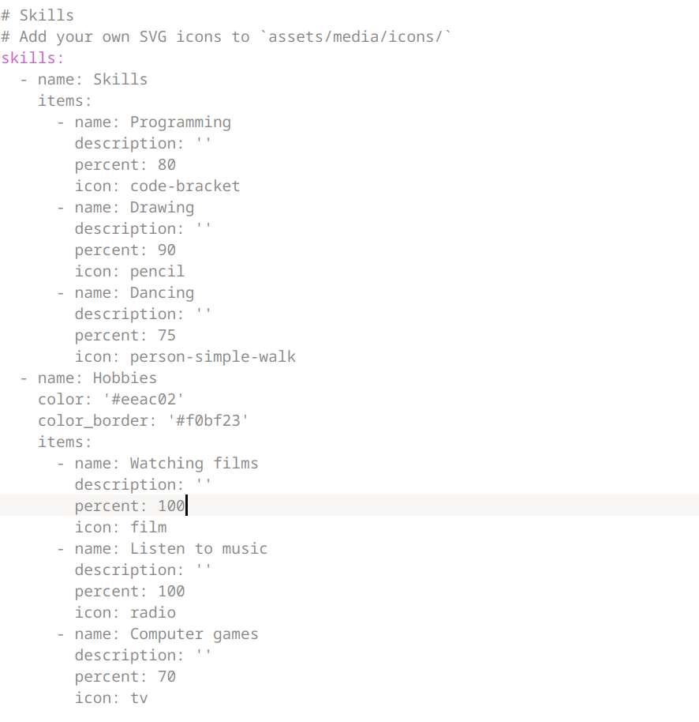
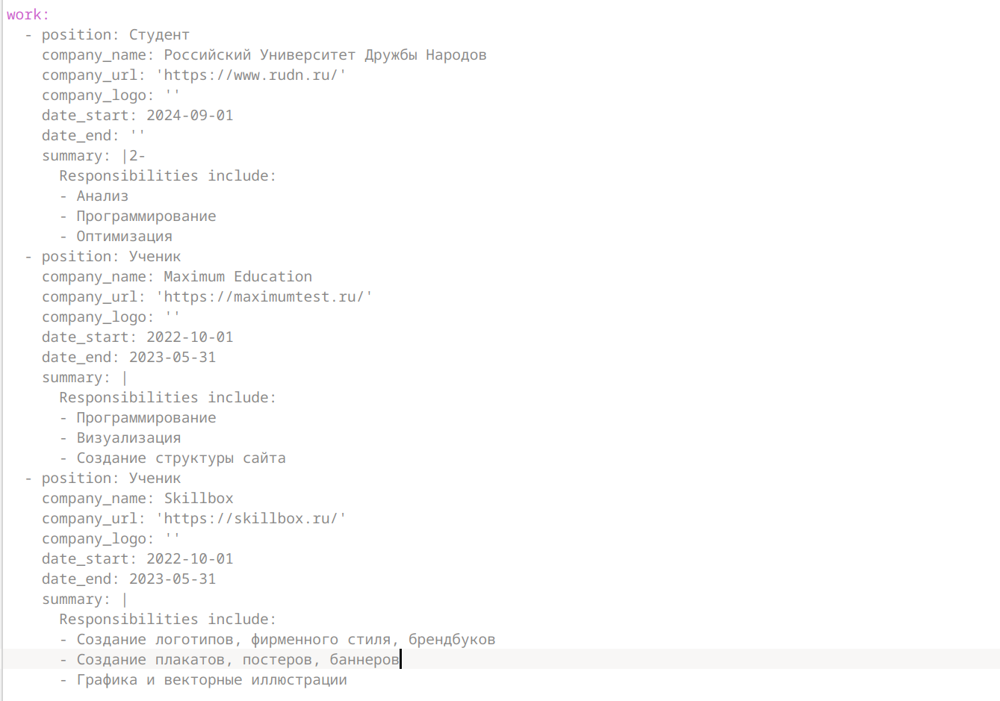
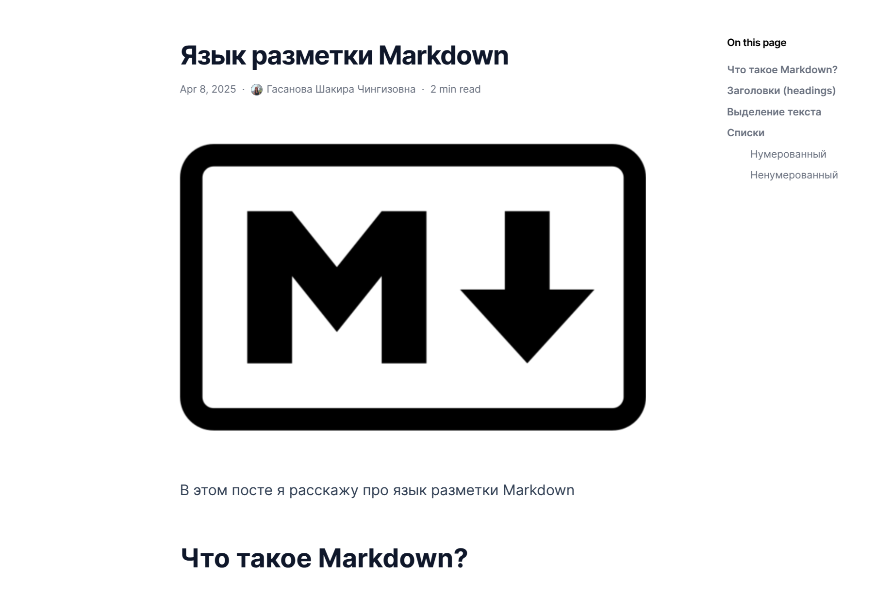

---
## Front matter
lang: ru-RU
title: Индивидуальный проект 3 этап
subtitle: Операционные системы
author:
  - Гасанова Ш. Ч.
institute:
  - Российский университет дружбы народов, Москва, Россия
date: 8 апреля 2025

## i18n babel
babel-lang: russian
babel-otherlangs: english

## Formatting pdf
toc: false
toc-title: Содержание
slide_level: 2
aspectratio: 169
section-titles: true
theme: metropolis
header-includes:
 - \metroset{progressbar=frametitle,sectionpage=progressbar,numbering=fraction}
 - '\makeatletter'
 - '\beamer@ignorenonframefalse'
 - '\makeatother'
---

## Цель работы

Цель данного этапа - продолжить работу с сайтом, добавить информацию о навыках, опыте и достижениях.

## Задание

1. Добавить информацию о навыках (Skills).
2. Добавить информацию об опыте (Experience).
3. Добавить информацию о достижениях (Accomplishments).
4. Сделать пост по прошедшей неделе.
5. Добавить пост на тему по выбору:
    - Легковесные языки разметки.
    - Языки разметки. LaTeX.
    - Язык разметки Markdown.

## Выполнение этапа индивидуального проекта

Перехожу в файл _index.md и добавляю информацию о навыках и проверяю изменения на сайте.

{#fig:001 width=70%}

## Выполнение этапа индивидуального проекта

{#fig:002 width=70%}

## Выполнение этапа индивидуального проекта

Далее добавляю информацию об опыте и проверяю изменения.

{#fig:003 width=70%}

## Выполнение этапа индивидуального проекта

{#fig:004 width=70%}

## Выполнение этапа индивидуального проекта

Вношу свои достижения и проверяю изменения.

{#fig:005 width=70%}

## Выполнение этапа индивидуального проекта

{#fig:006 width=70%}

## Выполнение этапа индивидуального проекта

Пишу пост на выбранную тему. В моём случае "Язык разметки Markdown".

{#fig:007 width=70%}

## Выполнение этапа индивидуального проекта

Проверяю наличие поста на сайте.

{#fig:008 width=70%}

## Выполнение этапа индивидуального проекта

Пишу пост по прошедшей неделе и проверяю изменения.

{#fig:009 width=70%}

## Выполнение этапа индивидуального проекта

{#fig:010 width=70%}

## Выводы

При выполнении второго этапа я добавила информацию о навыках, опыте и достижениях.
