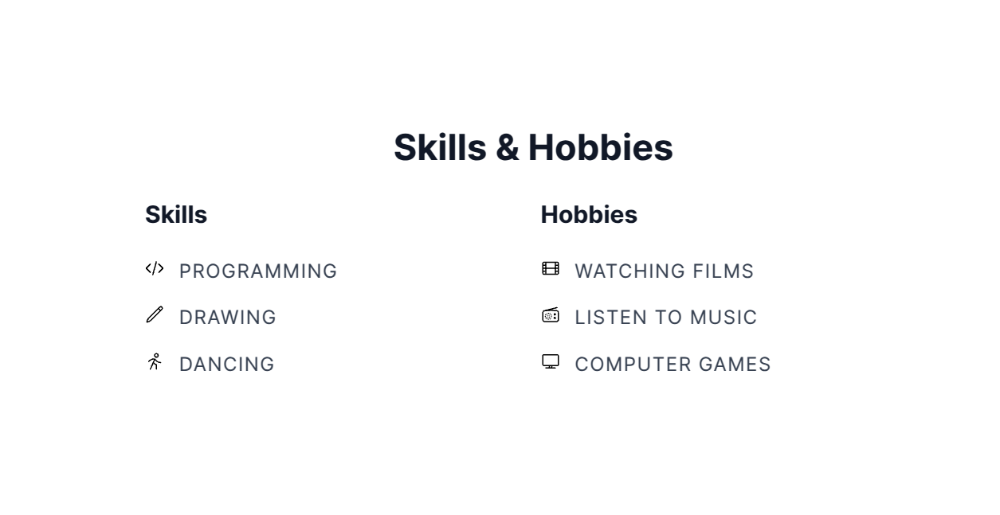
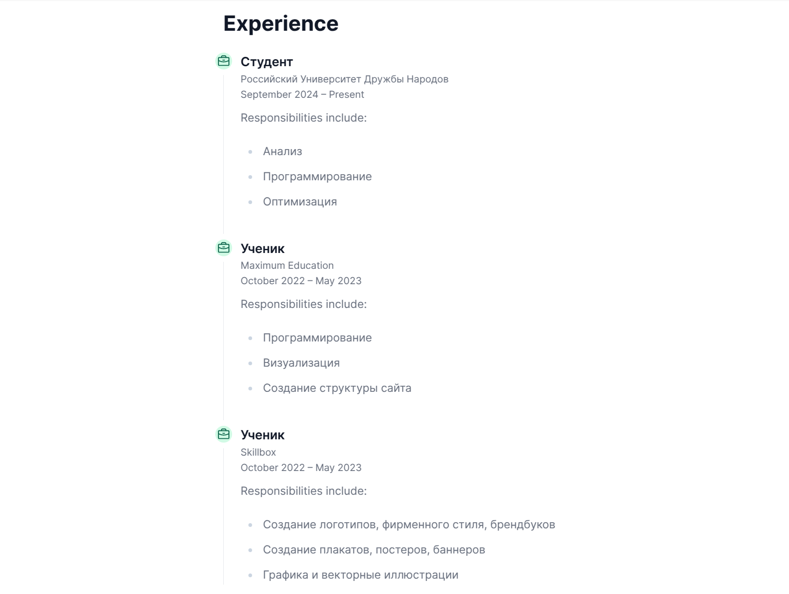
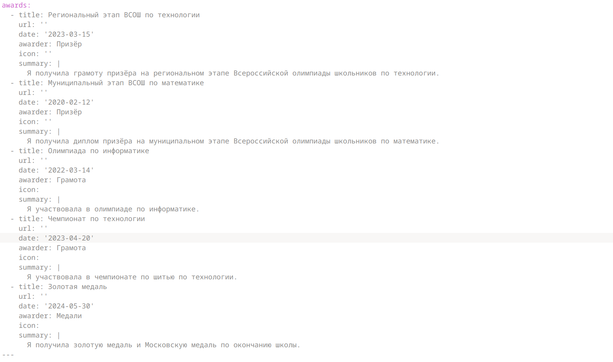
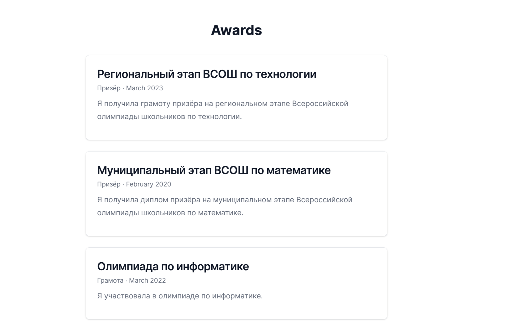
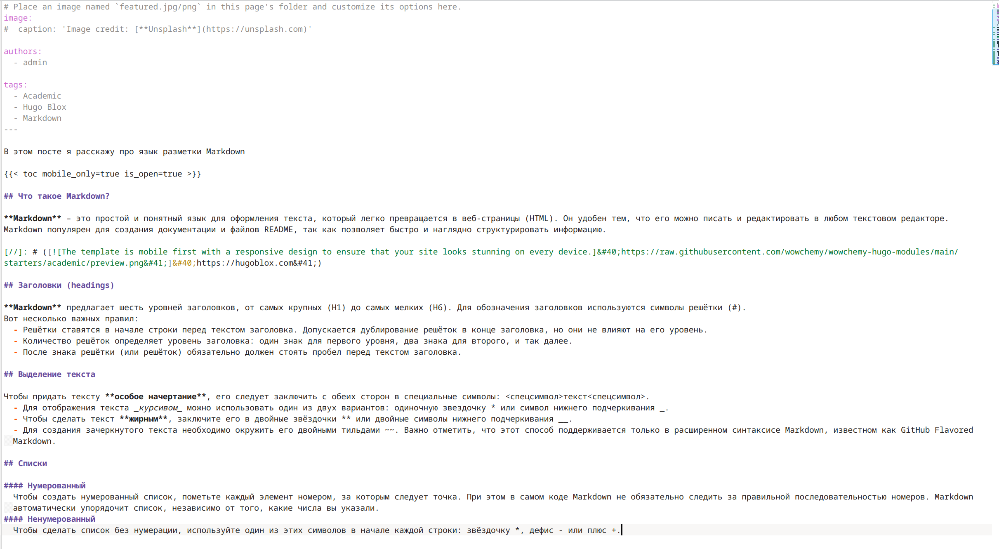
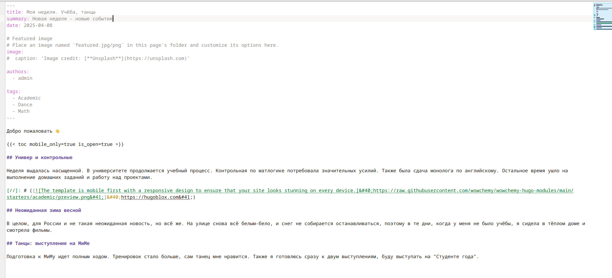
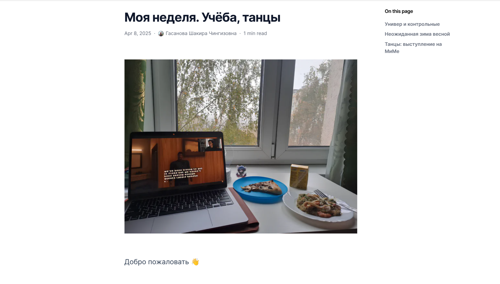

---
## Front matter
title: "Отчет по этапу индивидуального проекта №3"
subtitle: "Операционные системы"
author: "Гасанова Ш. Ч."

## Generic otions
lang: ru-RU
toc-title: "Содержание"

## Bibliography
bibliography: bib/cite.bib
csl: pandoc/csl/gost-r-7-0-5-2008-numeric.csl

## Pdf output format
toc: true # Table of contents
toc-depth: 2
lof: true # List of figures
lot: true # List of tables
fontsize: 12pt
linestretch: 1.5
papersize: a4
documentclass: scrreprt
## I18n polyglossia
polyglossia-lang:
  name: russian
  options:
	- spelling=modern
	- babelshorthands=true
polyglossia-otherlangs:
  name: english
## I18n babel
babel-lang: russian
babel-otherlangs: english
## Fonts
mainfont: PT Serif
romanfont: PT Serif
sansfont: PT Sans
monofont: PT Mono
mainfontoptions: Ligatures=TeX
romanfontoptions: Ligatures=TeX
sansfontoptions: Ligatures=TeX,Scale=MatchLowercase
monofontoptions: Scale=MatchLowercase,Scale=0.9
## Biblatex
biblatex: true
biblio-style: "gost-numeric"
biblatexoptions:
  - parentracker=true
  - backend=biber
  - hyperref=auto
  - language=auto
  - autolang=other*
  - citestyle=gost-numeric
## Pandoc-crossref LaTeX customization
figureTitle: "Рис."
tableTitle: "Таблица"
listingTitle: "Листинг"
lofTitle: "Список иллюстраций"
lotTitle: "Список таблиц"
lolTitle: "Листинги"
## Misc options
indent: true
header-includes:
  - \usepackage{indentfirst}
  - \usepackage{float} # keep figures where there are in the text
  - \floatplacement{figure}{H} # keep figures where there are in the text
---

# Цель работы

Цель данного этапа - продолжить работу с сайтом, добавить информацию о навыках, опыте и достижениях.

# Задание

1. Добавить информацию о навыках (Skills).
2. Добавить информацию об опыте (Experience).
3. Добавить информацию о достижениях (Accomplishments).
4. Сделать пост по прошедшей неделе.
5. Добавить пост на тему по выбору:
    - Легковесные языки разметки.
    - Языки разметки. LaTeX.
    - Язык разметки Markdown.

# Выполнение этапа индивидуального проекта

Перехожу в файл _index.md и добавляю информацию о навыках и проверяю изменения на сайте (рис. @fig:001, рис. @fig:002).

{#fig:001 width=70%}

{#fig:002 width=70%}

Далее добавляю информацию об опыте и проверяю изменения (рис. @fig:003, рис. @fig:004).

{#fig:003 width=70%}

{#fig:004 width=70%}

Вношу свои достижения и проверяю изменения (рис. @fig:005, рис. @fig:006).

{#fig:005 width=70%}

{#fig:006 width=70%}

Пишу пост на выбранную тему. В моём случае "Язык разметки Markdown" (рис. @fig:007).

{#fig:007 width=70%}

Проверяю наличие поста на сайте (рис. @fig:008)

{#fig:008 width=70%}

Пишу пост по прошедшей неделе и проверяю изменения (рис. @fig:009, рис. @fig:010).

{#fig:009 width=70%}

{#fig:010 width=70%}

# Выводы

При выполнении второго этапа я добавила информацию о навыках, опыте и достижениях.
