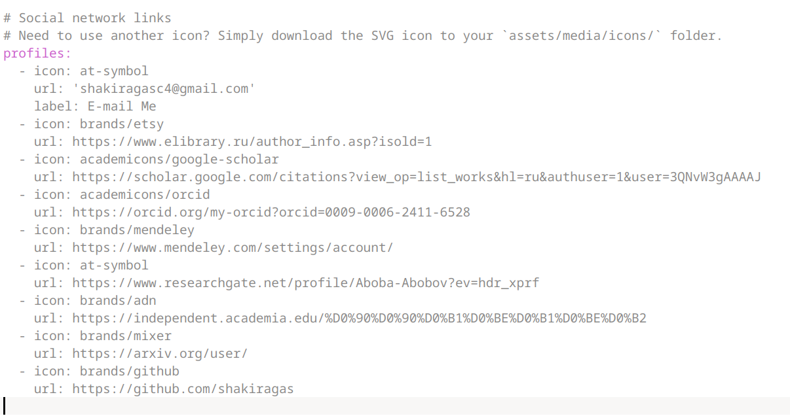
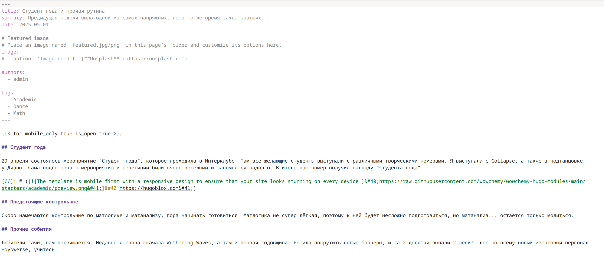
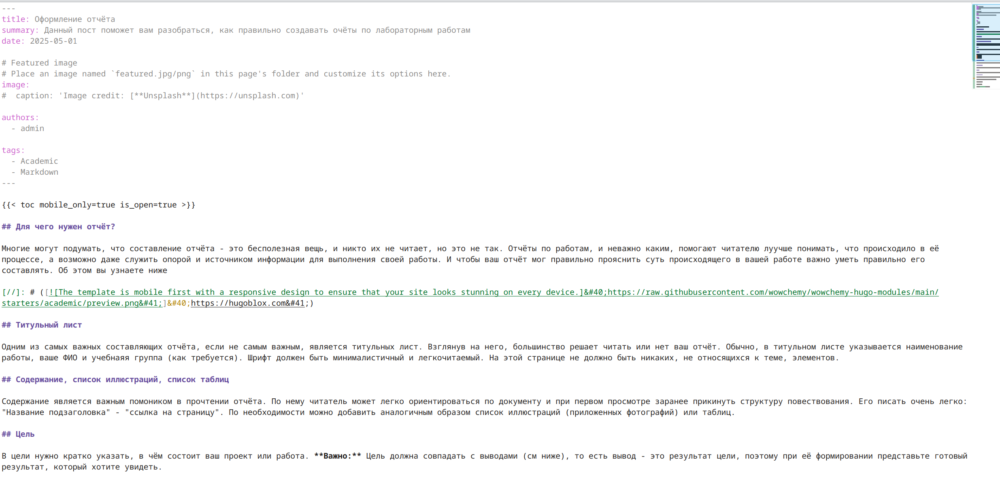

---
## Front matter
lang: ru-RU
title: Индивидуальный проект 4 этап
subtitle: Операционные системы
author:
  - Гасанова Ш. Ч.
institute:
  - Российский университет дружбы народов, Москва, Россия
date: 1 мая 2025

## i18n babel
babel-lang: russian
babel-otherlangs: english

## Formatting pdf
toc: false
toc-title: Содержание
slide_level: 2
aspectratio: 169
section-titles: true
theme: metropolis
header-includes:
 - \metroset{progressbar=frametitle,sectionpage=progressbar,numbering=fraction}
 - '\makeatletter'
 - '\beamer@ignorenonframefalse'
 - '\makeatother'
---

## Цель работы

Цель данного этапа - добавить к сайту ссылки на научные и библиометрические ресурсы.

## Задание

1. Зарегистрироваться на соответствующих ресурсах и разместить на них ссылки на сайте:
  - eLibrary : https://elibrary.ru/;
  - Google Scholar : https://scholar.google.com/;
  - ORCID : https://orcid.org/;
  - Mendeley : https://www.mendeley.com/;
  - ResearchGate : https://www.researchgate.net/;
  - Academia.edu : https://www.academia.edu/;
  - arXiv : https://arxiv.org/;
  - github : https://github.com/.
  
## Задание

2. Сделать пост по прошедшей неделе.
3. Добавить пост на тему по выбору:
  - Оформление отчёта.
  - Создание презентаций.
  - Работа с библиографией.

## Выполнение этапа индивидуального проекта

Регистрируюсь на приведённых в задачах сайтах и вставляю ссылки в index.md 

{#fig:001 width=70%}

## Выполнение этапа индивидуального проекта

Пишу пост по прошедшей неделе 

{#fig:002 width=70%}

## Выполнение этапа индивидуального проекта

Пишу пост по теме на выбор. Моя тема - Оформление отчёта 

{#fig:003 width=70%}

## Выводы

При выполнении второго этапа я добавила к сайту ссылки на научные и библиометрические ресурсы, а также написала два поста.
