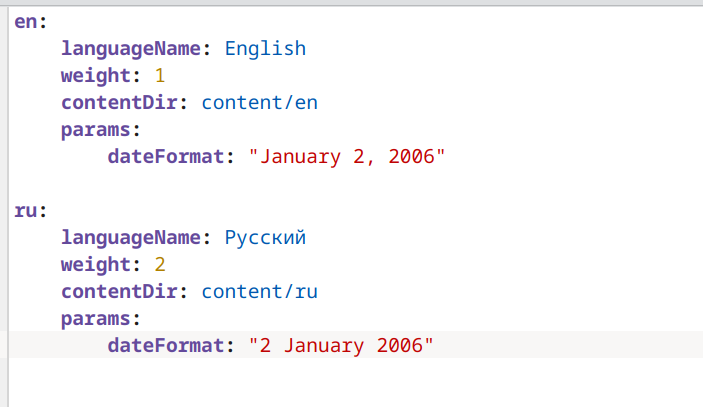
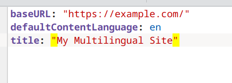
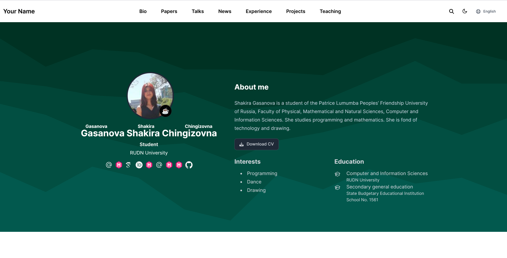
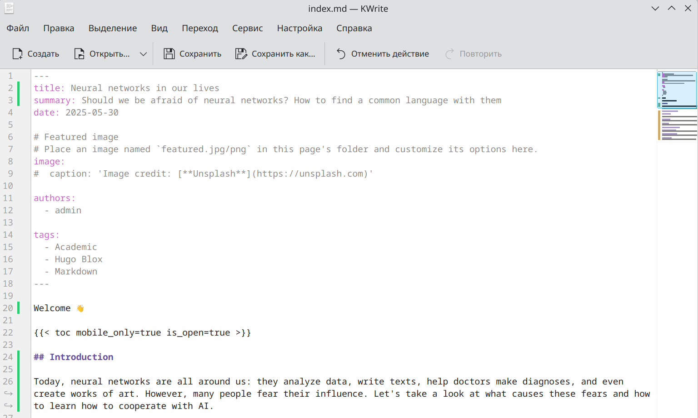

---
## Front matter
lang: ru-RU
title: Индивидуальный проект 6 этап
subtitle: Операционные системы
author:
  - Гасанова Ш. Ч.
institute:
  - Российский университет дружбы народов, Москва, Россия
date: 30 мая 2025

## i18n babel
babel-lang: russian
babel-otherlangs: english

## Formatting pdf
toc: false
toc-title: Содержание
slide_level: 2
aspectratio: 169
section-titles: true
theme: metropolis
header-includes:
 - \metroset{progressbar=frametitle,sectionpage=progressbar,numbering=fraction}
 - '\makeatletter'
 - '\beamer@ignorenonframefalse'
 - '\makeatother'
---

## Цель работы

Цель данного этапа - размещение двуязычного сайта на Github.

## Задание

1. Сделать поддержку английского и русского языков.
2. Разместить элементы сайта на обоих языках.
3. Разместить контент на обоих языках.
4. Сделать пост по прошедшей неделе.
5. Добавить пост на тему по выбору (на двух языках).

## Выполнение этапа индивидуального проекта

Захожу в папку config, затем в default_. Преобразую файлы languages.yaml и hugo.yaml

{#fig:001 width=70%}

## Выполнение этапа индивидуального проекта

{#fig:002 width=70%}

## Выполнение этапа индивидуального проекта

Запускаю сайт и проверяю наличие двух языков 

{#fig:003 width=70%}

## Выполнение этапа индивидуального проекта

{#fig:004 width=70%}

## Выполнение этапа индивидуального проекта

Пишу пост по прошедшей неделе на двух языках 

{#fig:005 width=70%}

## Выполнение этапа индивидуального проекта

{#fig:006 width=70%}

## Выполнение этапа индивидуального проекта

Пишу пост на тему по выбору, в моём случае про нейросети. Так же на двух языках 

{#fig:007 width=70%}

## Выполнение этапа индивидуального проекта

{#fig:008 width=70%}

## Выводы

При выполнении шестого этапа я сделала поддержку двух языков на сайте.
