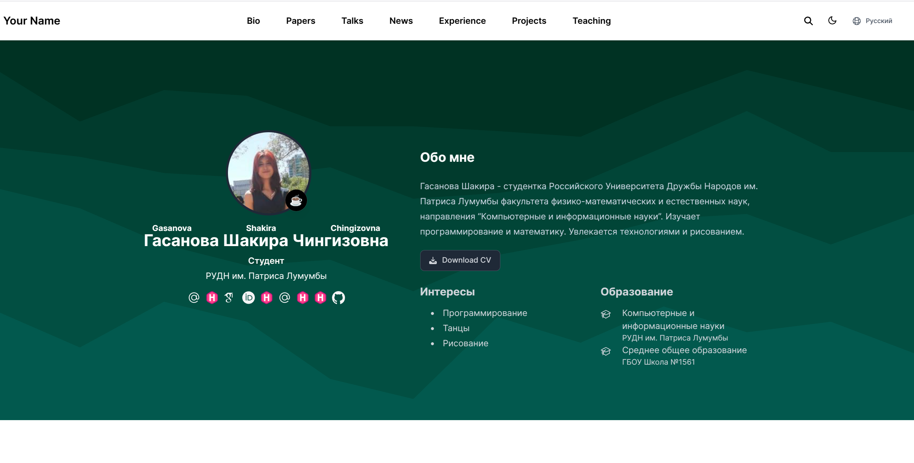
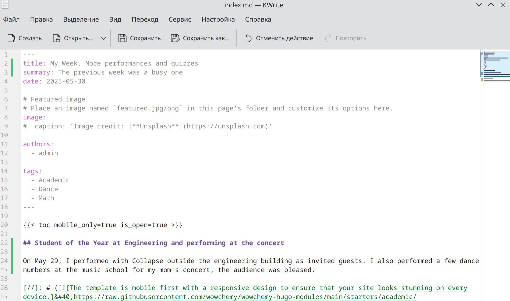
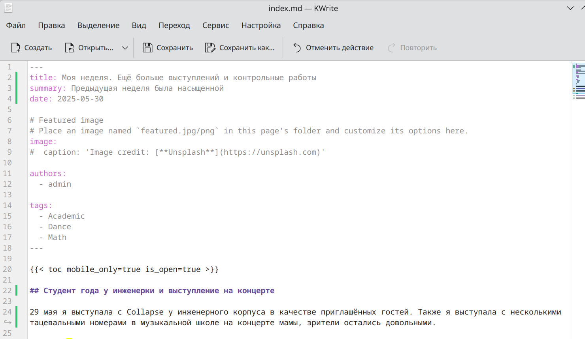
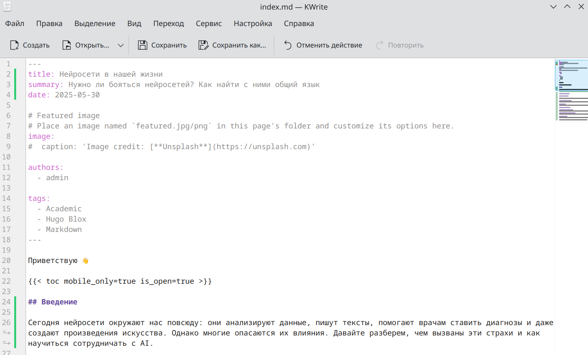

---
## Front matter
title: "Отчет по этапу индивидуального проекта №6"
subtitle: "Операционные системы"
author: "Гасанова Ш. Ч."

## Generic otions
lang: ru-RU
toc-title: "Содержание"

## Bibliography
bibliography: bib/cite.bib
csl: pandoc/csl/gost-r-7-0-5-2008-numeric.csl

## Pdf output format
toc: true # Table of contents
toc-depth: 2
lof: true # List of figures
lot: true # List of tables
fontsize: 12pt
linestretch: 1.5
papersize: a4
documentclass: scrreprt
## I18n polyglossia
polyglossia-lang:
  name: russian
  options:
	- spelling=modern
	- babelshorthands=true
polyglossia-otherlangs:
  name: english
## I18n babel
babel-lang: russian
babel-otherlangs: english
## Fonts
mainfont: PT Serif
romanfont: PT Serif
sansfont: PT Sans
monofont: PT Mono
mainfontoptions: Ligatures=TeX
romanfontoptions: Ligatures=TeX
sansfontoptions: Ligatures=TeX,Scale=MatchLowercase
monofontoptions: Scale=MatchLowercase,Scale=0.9
## Biblatex
biblatex: true
biblio-style: "gost-numeric"
biblatexoptions:
  - parentracker=true
  - backend=biber
  - hyperref=auto
  - language=auto
  - autolang=other*
  - citestyle=gost-numeric
## Pandoc-crossref LaTeX customization
figureTitle: "Рис."
tableTitle: "Таблица"
listingTitle: "Листинг"
lofTitle: "Список иллюстраций"
lotTitle: "Список таблиц"
lolTitle: "Листинги"
## Misc options
indent: true
header-includes:
  - \usepackage{indentfirst}
  - \usepackage{float} # keep figures where there are in the text
  - \floatplacement{figure}{H} # keep figures where there are in the text
---

# Цель работы

Цель данного этапа - размещение двуязычного сайта на Github.

# Задание

1. Сделать поддержку английского и русского языков.
2. Разместить элементы сайта на обоих языках.
3. Разместить контент на обоих языках.
4. Сделать пост по прошедшей неделе.
5. Добавить пост на тему по выбору (на двух языках).

# Выполнение этапа индивидуального проекта

Захожу в папку config, затем в default_. Преобразую файлы languages.yaml и hugo.yaml (рис. @fig:001, рис. @fig:002).

{#fig:001 width=70%}

{#fig:002 width=70%}

Запускаю сайт и проверяю наличие двух языков (рис. @fig:003, рис. @fig:004).

{#fig:003 width=70%}

{#fig:004 width=70%}

Пишу пост по прошедшей неделе на двух языках (рис. @fig:005, рис. @fig:006).

{#fig:005 width=70%}

{#fig:006 width=70%}

Пишу пост на тему по выбору, в моём случае про нейросети. Так же на двух языках (рис. @fig:007, рис. @fig:008).

{#fig:007 width=70%}

{#fig:008 width=70%}

# Выводы

При выполнении шестого этапа я сделала поддержку двух языков на сайте.
