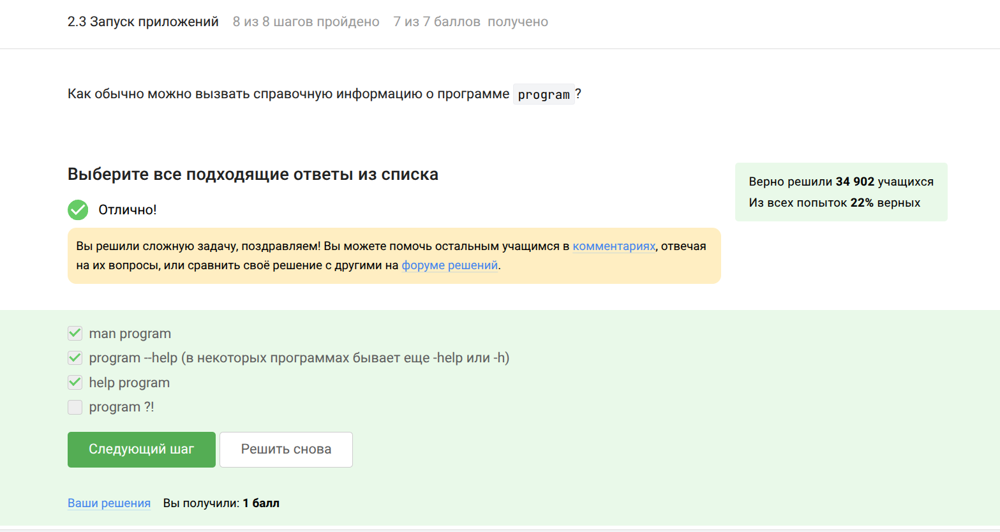
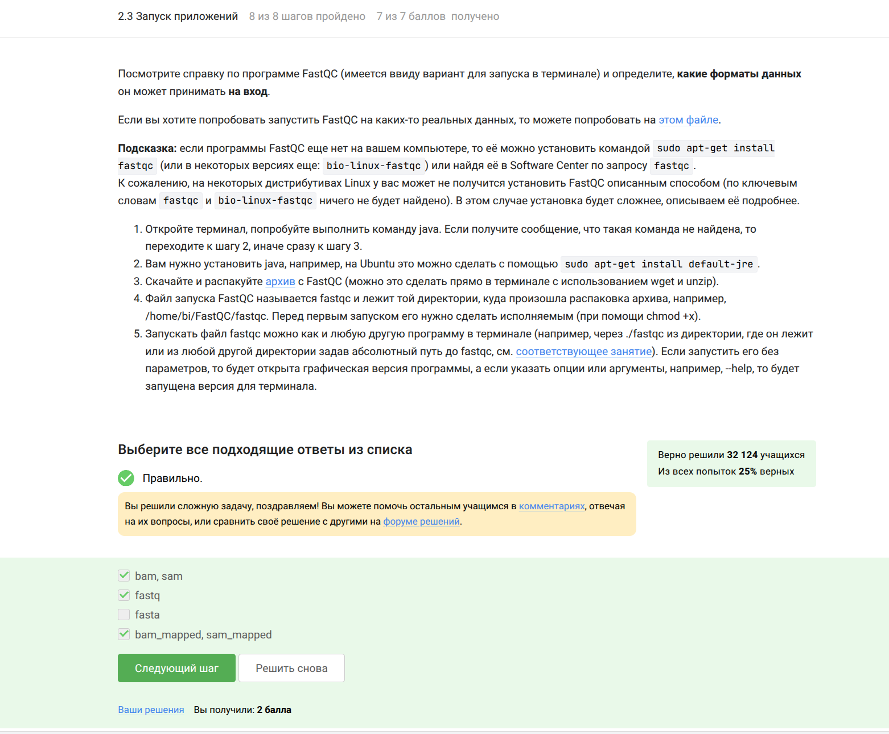
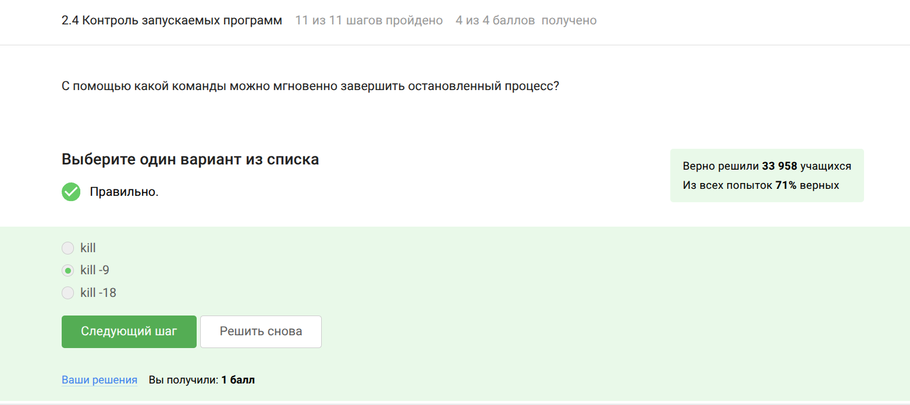
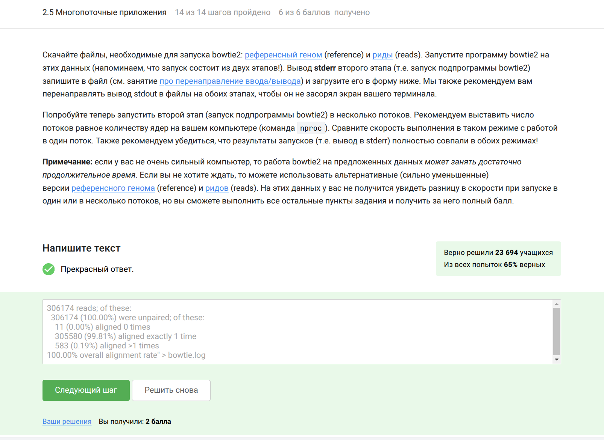
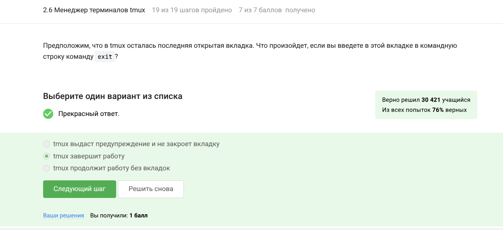
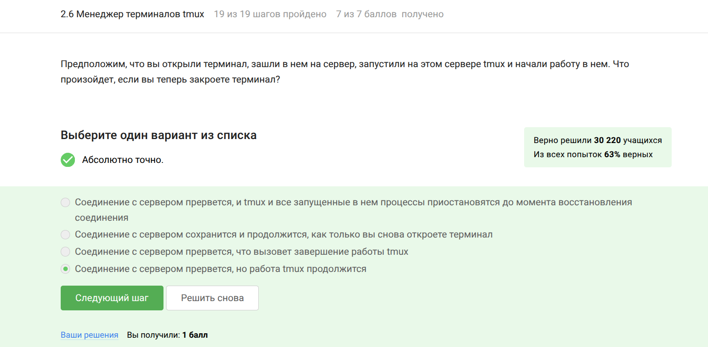
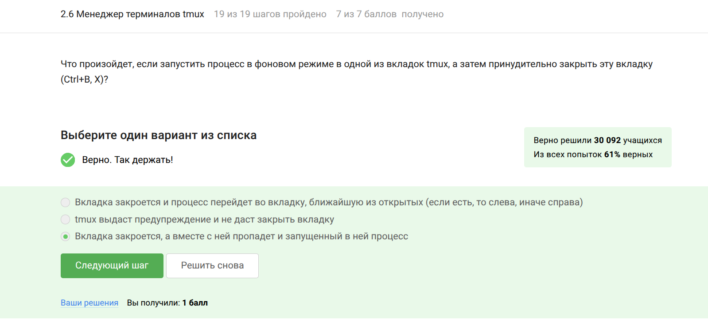

---
## Front matter
lang: ru-RU
title: Внешний курс 'Введение в Linux, 2 этап'
subtitle: Операционные системы
author:
  - Гасанова Ш. Ч.
institute:
  - Российский университет дружбы народов, Москва, Россия
date: 12 мая 2025

## i18n babel
babel-lang: russian
babel-otherlangs: english

## Formatting pdf
toc: false
toc-title: Содержание
slide_level: 2
aspectratio: 169
section-titles: true
theme: metropolis
header-includes:
 - \metroset{progressbar=frametitle,sectionpage=progressbar,numbering=fraction}
 - '\makeatletter'
 - '\beamer@ignorenonframefalse'
 - '\makeatother'
---

## Информация о докладчике

 - Гасанова Шакира Чингизовна
 - Компьютерные науки и информационные системы
 - НКАбд-05-24
 - Российский Университет Дужбы Народов
 - 1132246743@pfur.ru

## Цель 

Познакомиться с операционной системой Linux и изучить её базовые возможности.

## Задание

1. Знакомство с сервером
2. Обмен файлами
3. Запуск приложений
4. Контроль запускаемых программ
5. Многопоточные приложения
6. Менеджер треминалов tmux
7. Расширенное руководство по установке Linux

## Выполнение лабораторной работы

Я познакомилась с сервером и ответила на тестовые вопросы 

{#fig:001 width=70%}

## Выполнение лабораторной работы

{#fig:002 width=70%}

## Выполнение лабораторной работы

Рассмотрела обмен файлами и ответила на тестовые вопросы 

{#fig:003 width=70%}

## Выполнение лабораторной работы

{#fig:004 width=70%}

## Выполнение лабораторной работы

{#fig:005 width=70%}

## Выполнение лабораторной работы

Познакомилась с запуском приложений и ответила на тестовые вопросы 

{#fig:006 width=70%}

## Выполнение лабораторной работы

{#fig:007 width=70%}

## Выполнение лабораторной работы

{#fig:008 width=70%}

## Выполнение лабораторной работы

{#fig:009 width=70%}

## Выполнение лабораторной работы

Познакомилась с контролем запускаемых программ и ответила на тестовые вопросы 

{#fig:010 width=70%}

## Выполнение лабораторной работы

{#fig:011 width=70%}

## Выполнение лабораторной работы

{#fig:012 width=70%}

## Выполнение лабораторной работы

{#fig:013 width=70%}

## Выполнение лабораторной работы

Познакомилась с многопоточными приложениями и выполнила задания 

{#fig:014 width=70%}

## Выполнение лабораторной работы

{#fig:015 width=70%}

## Выполнение лабораторной работы

{#fig:016 width=70%}

## Выполнение лабораторной работы

{#fig:017 width=70%}

## Выполнение лабораторной работы

{#fig:018 width=70%}

## Выполнение лабораторной работы

Познакомилась с менеджером треминалов tmux и выполнила задания

{#fig:019 width=70%}

## Выполнение лабораторной работы

{#fig:020 width=70%}

## Выполнение лабораторной работы

{#fig:021 width=70%}

## Выполнение лабораторной работы

{#fig:022 width=70%}

## Выполнение лабораторной работы

{#fig:023 width=70%}

## Выполнение лабораторной работы

{#fig:024 width=70%}

## Выводы

При прохождении 2 этапа я познакомилась с операционной системой Linux и изучила её базовые возможности.

## Список литературы

1. http://lib.ru/LINUXGUIDE/torvalds_jast_for_fun.txt [Электронный ресурс]
2. https://ubuntu.com/ [Электронный ресурс]
3. https://ubuntu.com/tutorials/install-ubuntu-desktop#1-overview [Электронный ресурс]
4. http://rus-linux.net/ [Электронный ресурс]
