---
## Front matter
title: "Отчёт по внешнему курсу 'Введение в Linux', этап 2"
subtitle: "Операционные системы"
author: "Гасанова Шакира Чингизовна"

## Generic otions
lang: ru-RU
toc-title: "Содержание"

## Bibliography
bibliography: bib/cite.bib
csl: pandoc/csl/gost-r-7-0-5-2008-numeric.csl

## Pdf output format
toc: true # Table of contents
toc-depth: 2
lof: true # List of figures
lot: true # List of tables
fontsize: 12pt
linestretch: 1.5
papersize: a4
documentclass: scrreprt
## I18n polyglossia
polyglossia-lang:
  name: russian
  options:
	- spelling=modern
	- babelshorthands=true
polyglossia-otherlangs:
  name: english
## I18n babel
babel-lang: russian
babel-otherlangs: english
## Fonts
mainfont: PT Serif
romanfont: PT Serif
sansfont: PT Sans
monofont: PT Mono
mainfontoptions: Ligatures=TeX
romanfontoptions: Ligatures=TeX
sansfontoptions: Ligatures=TeX,Scale=MatchLowercase
monofontoptions: Scale=MatchLowercase,Scale=0.9
## Biblatex
biblatex: true
biblio-style: "gost-numeric"
biblatexoptions:
  - parentracker=true
  - backend=biber
  - hyperref=auto
  - language=auto
  - autolang=other*
  - citestyle=gost-numeric
## Pandoc-crossref LaTeX customization
figureTitle: "Рис."
tableTitle: "Таблица"
listingTitle: "Листинг"
lofTitle: "Список иллюстраций"
lotTitle: "Список таблиц"
lolTitle: "Листинги"
## Misc options
indent: true
header-includes:
  - \usepackage{indentfirst}
  - \usepackage{float} # keep figures where there are in the text
  - \floatplacement{figure}{H} # keep figures where there are in the text
---

# Цель 

Познакомиться с операционной системой Linux и изучить её базовые возможности.

# Задание

1. Знакомство с сервером
2. Обмен файлами
3. Запуск приложений
4. Контроль запускаемых программ
5. Многопоточные приложения
6. Менеджер треминалов tmux
7. Расширенное руководство по установке Linux

# Выполнение лабораторной работы

Я познакомилась с сервером и ответила на тестовые вопросы (рис. @fig:001, рис. @fig:002).

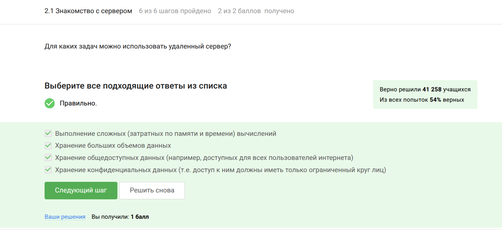{#fig:001 width=70%}

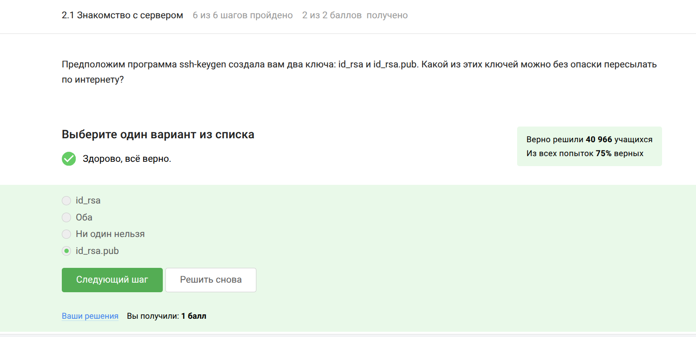{#fig:002 width=70%}

Рассмотрела обмен файлами и ответила на тестовые вопросы (рис. @fig:003, рис. @fig:004, рис. @fig:005).

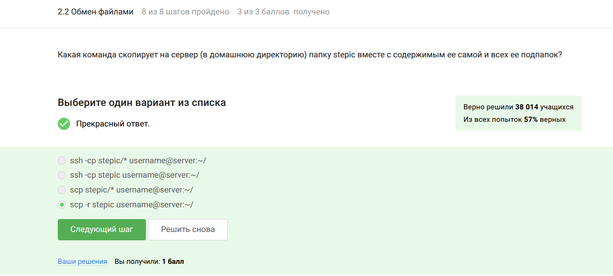{#fig:003 width=70%}

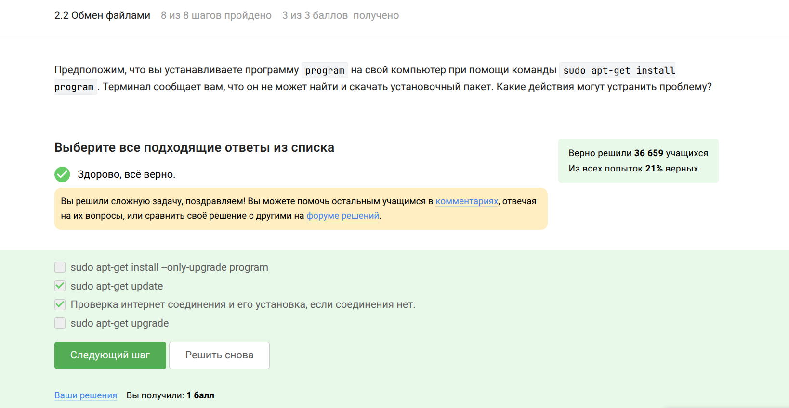{#fig:004 width=70%}

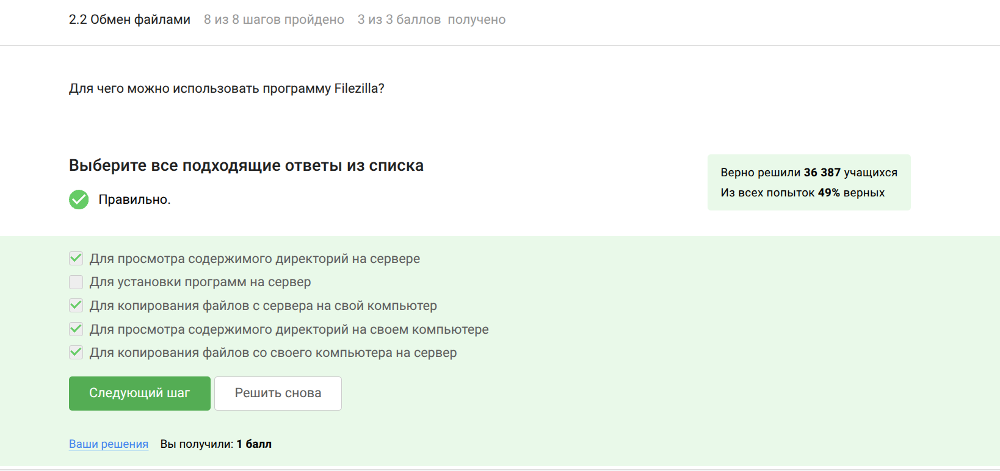{#fig:005 width=70%}

Познакомилась с запуском приложений и ответила на тестовые вопросы (рис. @fig:006, рис. @fig:007, рис. @fig:008, рис. @fig:009).

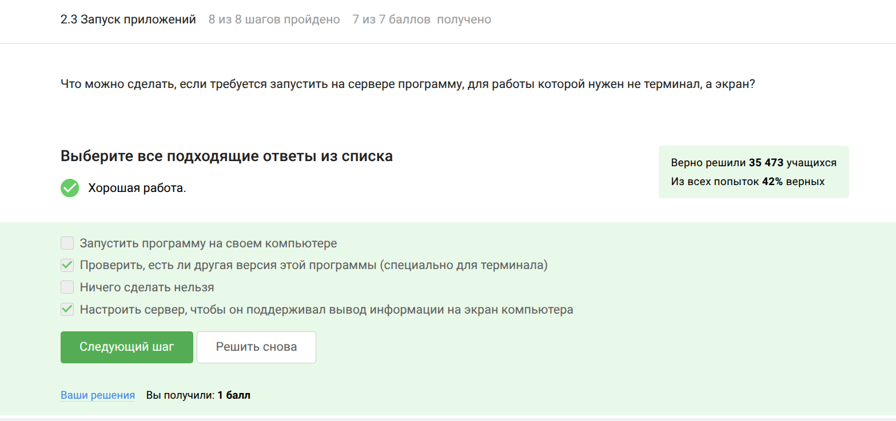{#fig:006 width=70%}

{#fig:007 width=70%}

{#fig:008 width=70%}

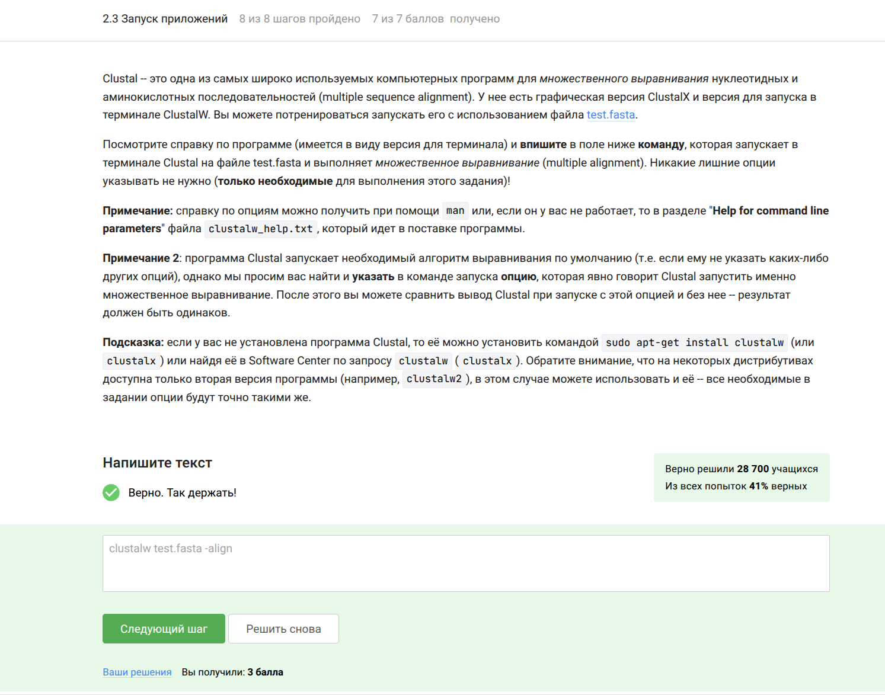{#fig:009 width=70%}

Познакомилась с контролем запускаемых программ и ответила на тестовые вопросы (рис. @fig:010, рис. @fig:011, рис. @fig:012, рис. @fig:013).

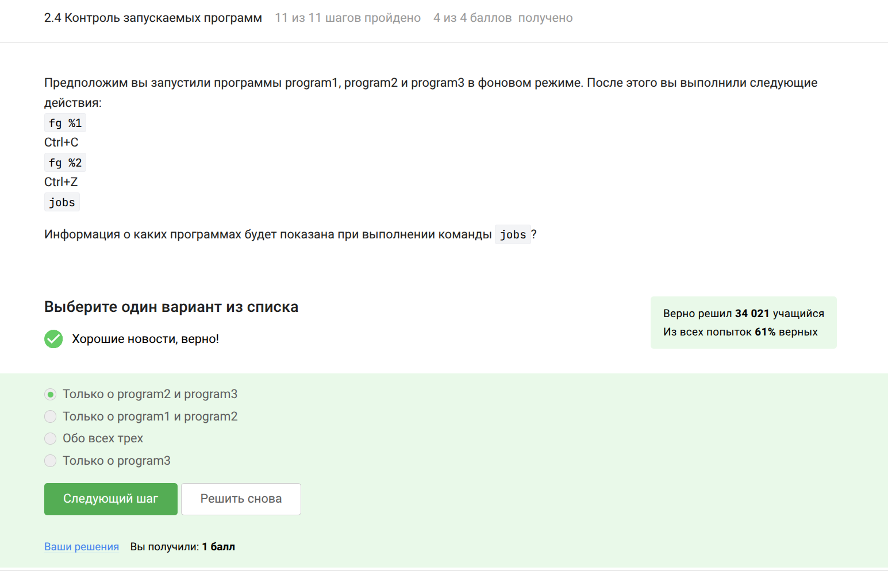{#fig:010 width=70%}

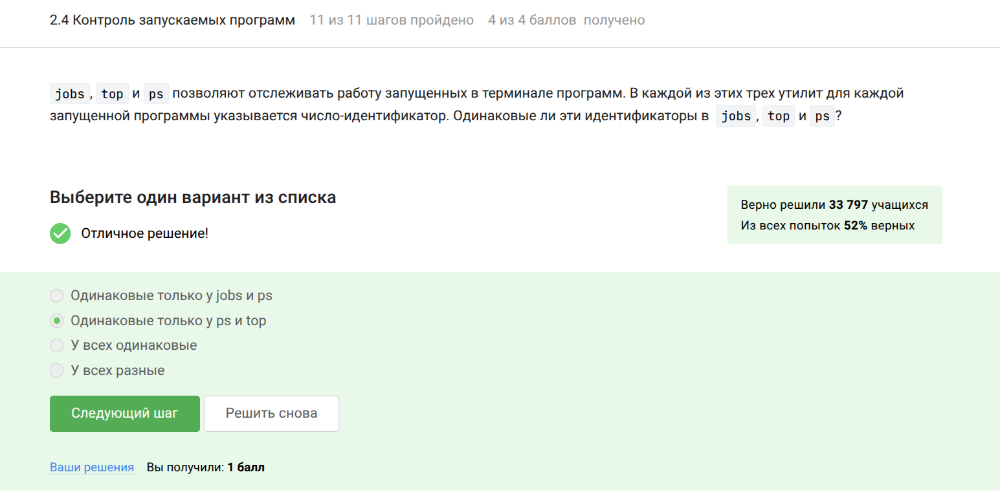{#fig:011 width=70%}

{#fig:012 width=70%}

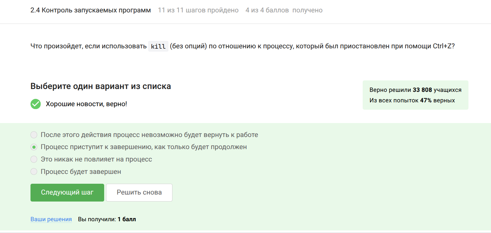{#fig:013 width=70%}

Познакомилась с многопоточными приложениями и выполнила задания (рис. @fig:014, рис. @fig:015, рис. @fig:016, рис. @fig:017, рис. @fig:018).

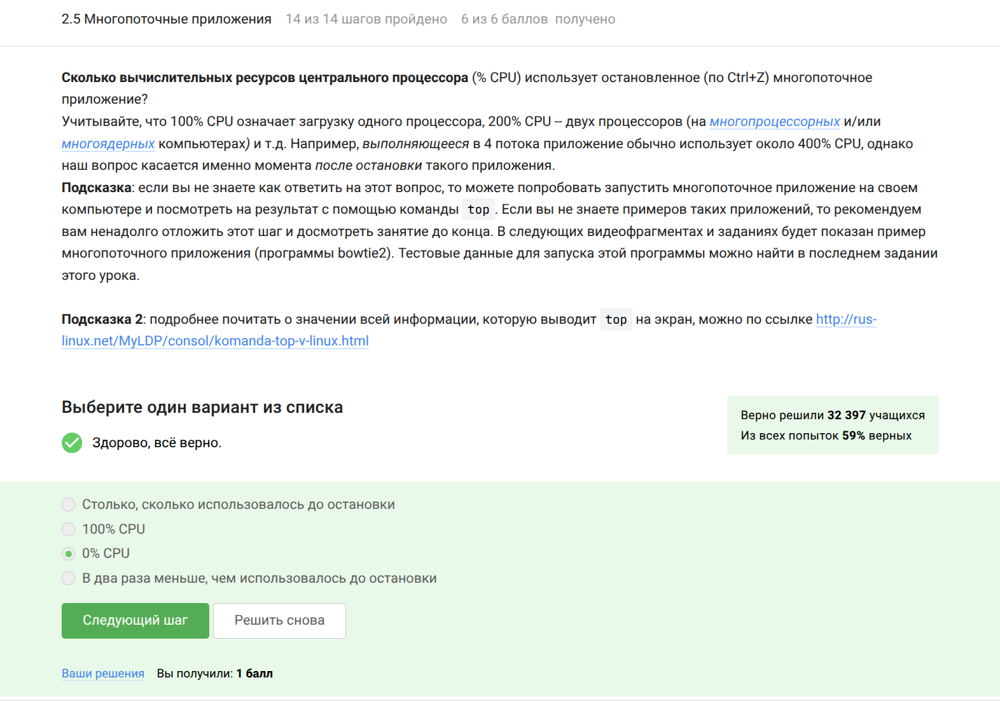{#fig:014 width=70%}

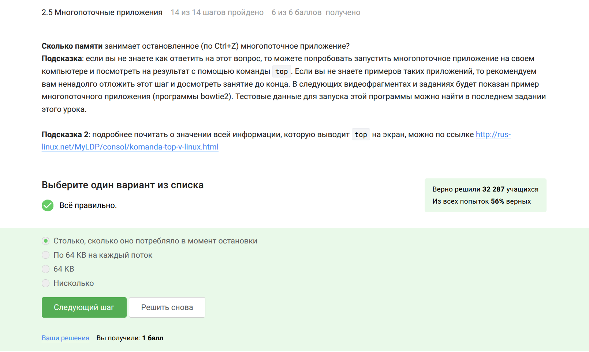{#fig:015 width=70%}

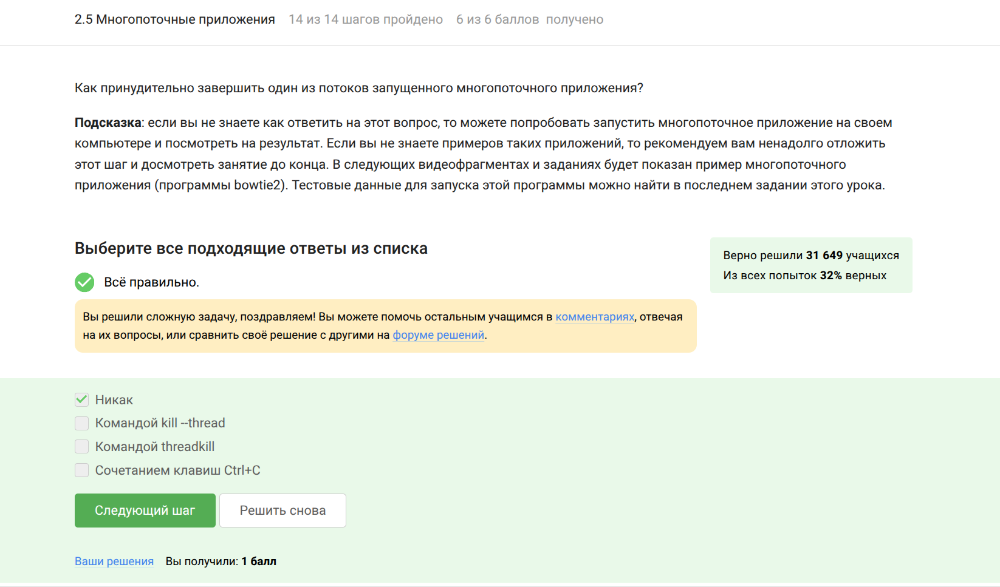{#fig:016 width=70%}

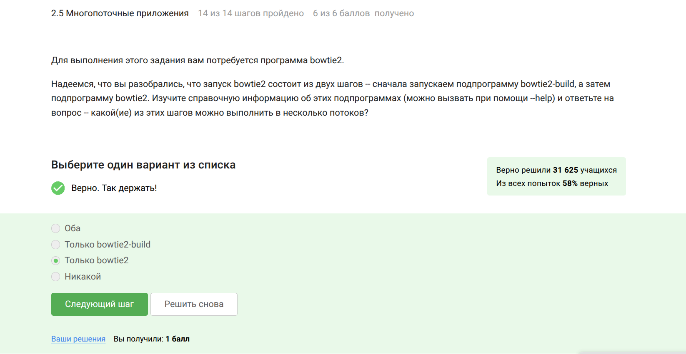{#fig:017 width=70%}

{#fig:018 width=70%}

Познакомилась с менеджером треминалов tmux и выполнила задания (рис. @fig:019, рис. @fig:020, рис. @fig:021, рис. @fig:022, рис. @fig:023, рис. @fig:024).

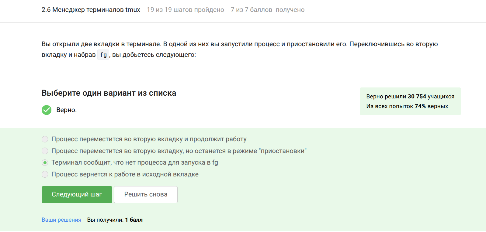{#fig:019 width=70%}

{#fig:020 width=70%}

{#fig:021 width=70%}

{#fig:022 width=70%}

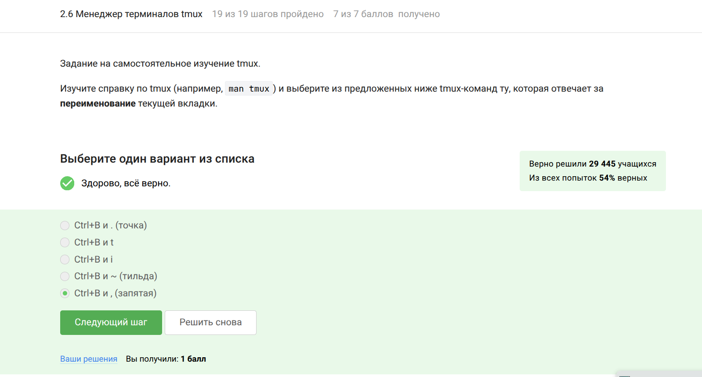{#fig:023 width=70%}

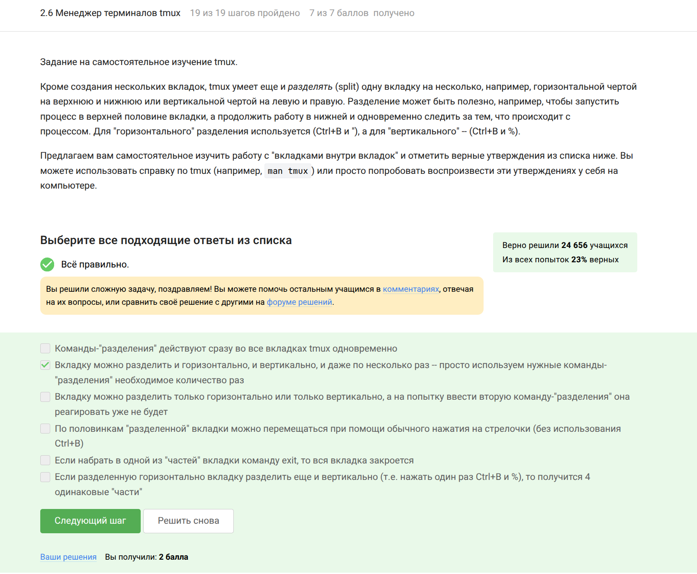{#fig:024 width=70%}

# Выводы

При прохождении 2 этапа я познакомилась с операционной системой Linux и изучила её базовые возможности.

# Список литературы

1. http://lib.ru/LINUXGUIDE/torvalds_jast_for_fun.txt
2. https://ubuntu.com/
3. https://ubuntu.com/tutorials/install-ubuntu-desktop#1-overview
4. http://rus-linux.net/
